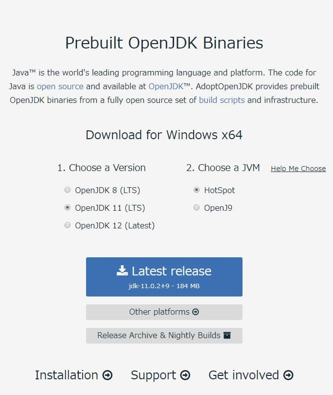
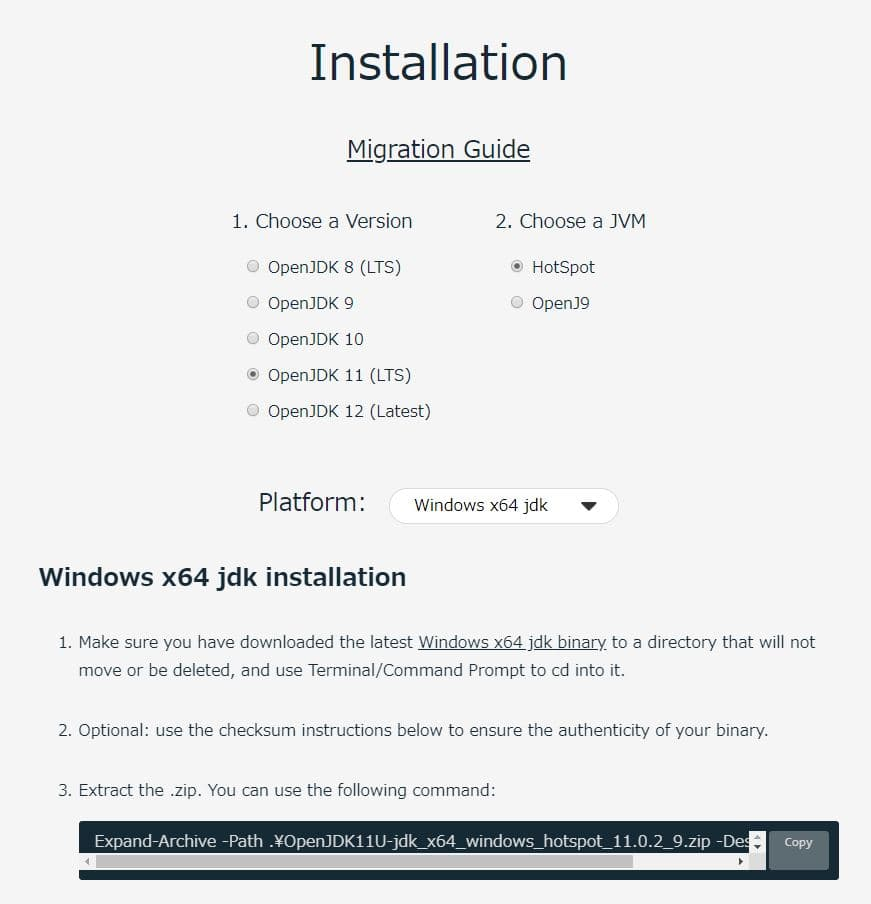
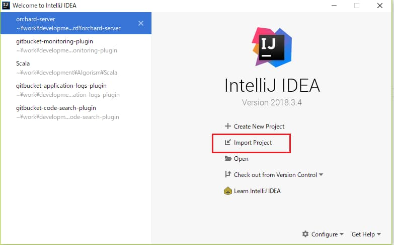
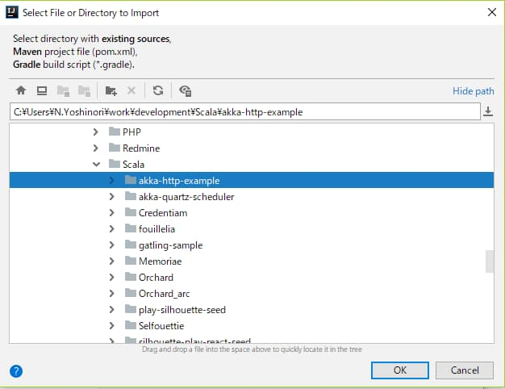
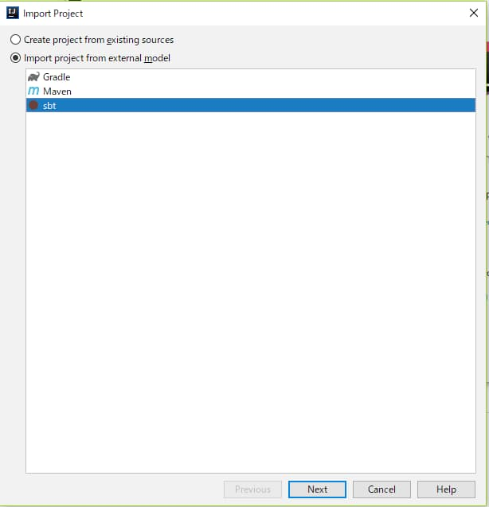
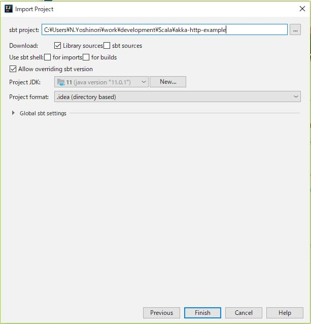
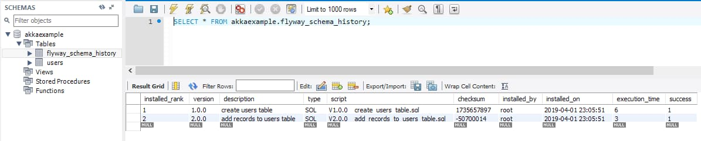
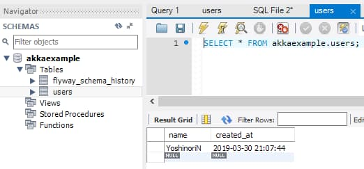

# 目標

Akka HTTPでWebサーバを立ち上げる

# 手順

今回のものでは下記の手順を取ります。

* JDK & sbtインストール
* サンプルプロジェクト準備
* 動かす

# JDKとsbtのインストール

JDKについてはこちらの[きしださんの記事](https://qiita.com/nowokay/items/edb5c5df4dbfc4a99ffb)が詳しいです。私はScala関西Summitでこの記事と同様のきしださんの講演を聞いてからAdoptOpenJDKを使うようにしています。

## AdoptOpenJDK

4年のLTS版があるOpenJDKの一種です。詳しい説明は前述のきしださんの記事をご参照ください。

### インストール

[AdoptOpenJDK](https://adoptopenjdk.net/index.html)にアクセスし、左下の`Installation`を選択します。



別ページに遷移するのでバージョンとJVMとOSを選択します。今回は現時点で最新のScala`2.12.8`を使うので`OpenJDK11`を選択してください。



以下、上記ページにコマンドが表示されるので割愛します。パスを通して、正常にインストールされたことを確認します。

なお、JVMのバージョンとScalaのバージョンの互換性については下記に記載されています。

> [Version compatibility table](https://docs.scala-lang.org/overviews/jdk-compatibility/overview.html)

## sbt

Scalaのビルドツールです。これでREPLとかもできます。下記からダウンロードしてください。

> [sbt DOWNLOAD](https://www.scala-sbt.org/download.html)

とりあえずコマンド実行してみます。

なにもディレクトリがないところで`sbt`コマンド実行すると`target`ディレクトリとかできるので一時ディレクトリを作成して、そこで`sbt`コマンドを実行することをお勧めします。

ビルド定義もプロジェクトディレクトリもない旨のメッセージが表示されますが、今回はそのまま`c`でcontinueしてください。

```scala
C:\Users\N.Yoshinori\tmp>sbt
[warn] Neither build.sbt nor a 'project' directory in the current directory: ...
c) continue
q) quit
? c
OpenJDK 64-Bit Server VM warning: Ignoring option MaxPermSize; support was removed in 8.0
OpenJDK 64-Bit Server VM warning: Ignoring option MaxPermSize; support was removed in 8.0
[warn] No sbt.version set in project/build.properties, base directory: C:\Users\N.Yoshinori\tmp
[info] Loading settings for project global-plugins from idea.sbt ...
[info] Loading global plugins from C:\Users\N.Yoshinori\.sbt\1.0\plugins
[info] Updating ProjectRef(uri("file:/C:/Users/N.Yoshinori/.sbt/1.0/plugins/"), "global-plugins")...
[info] Done updating.
[info] Set current project to tmp (in build file:/C:/Users/N.Yoshinori/tmp/)
[info] sbt server started at local:sbt-server-0b000747288a8c9b882e
sbt:tmp>
```

しばらくするとsbtシェルが起動します。

### REPL

これ以降の記事では使いませんが、とりあえずREPLを使ってみます。sbtシェルが起動した状態で`console`と入力して下さい。

```scala
sbt:tmp> console
[info] Updating ...
[info] Done updating.
[info] Starting scala interpreter...
Welcome to Scala 2.12.7 (OpenJDK 64-Bit Server VM, Java 11.0.1).
Type in expressions for evaluation. Or try :help.

scala>
```

これでREPLが立ち上がったのでHello worldと打ち込んでください。

```scala
scala> println("Hello world")
Hello world
```

REPLについてはここまでです。

## サンプルプロジェクトの準備

今回のハンズオンで動かすサンプルをクローンします。

### クローン

最終目標はAkkaHTTPのサンプルを動かすということで、まず、突貫で作り上げたサンプルをクローンします。

> [akka-http-mariadb-circe-example](https://gitlab.kingprinters.com/learning/ynagahiro/akka-http-mariadb-circe-example.git)

<br>

```sh
git clone https://gitlab.kingprinters.com/learning/ynagahiro/akka-http-mariadb-circe-example.git
```

### IntelliJ

次に、クローンしたサンプルプロジェクトをIntelliJで開きます。

「Import Project」を選択します。



クローンしたリポジトリを選択します。



sbtを選択してください。



設定を確認して完了してください。



### コンパイル

IntelliJが立ち上がったらターミナルでsbtシェルを起動してください。

```scala
C:\Users\N.Yoshinori\tmp\akka-http-mariadb-circe-example>sbt
OpenJDK 64-Bit Server VM warning: Ignoring option MaxPermSize; support was removed in 8.0
OpenJDK 64-Bit Server VM warning: Ignoring option MaxPermSize; support was removed in 8.0
[info] Loading settings for project global-plugins from idea.sbt ...
[info] Loading global plugins from C:\Users\N.Yoshinori\.sbt\1.0\plugins
[info] Loading settings for project akka-http-mariadb-circe-example-build from plugin.sbt ...
[info] Loading project definition from C:\Users\N.Yoshinori\tmp\akka-http-mariadb-circe-example\project
[info] Loading settings for project akka-http-mariadb-circe-example from build.sbt ...
[info] Set current project to akka-http-mariadb-circe-example (in build file:/C:/Users/N.Yoshinori/tmp/akka-http-mariadb-circe-example/)
[info] sbt server started at local:sbt-server-aa163069bc9de2a3d98c
```

sbtシェル起動後は続けて`compile`と入力して下さい。ソースコードがコンパイルされます。

```scala
sbt:akka-http-mariadb-circe-example> compile
[info] Compiling 8 Scala sources to C:\Users\N.Yoshinori\tmp\akka-http-mariadb-circe-example\target\scala-2.12\classes ...

...

java.nio.Buffer.address
WARNING: Please consider reporting this to the maintainers of com.google.protobuf.UnsafeUtil
WARNING: Use --illegal-access=warn to enable warnings of further illegal reflective access operations
WARNING: All illegal access operations will be denied in a future release
[success] Total time: 10 s, completed 2019/04/01 22:19:15
sbt:akka-http-mariadb-circe-example> 
```

## プロジェクト構成の解説

次にざっくりとプロジェクト構成の解説をします。

### build.sbtについて

プロジェクト直下にある`build.sbt`について説明します。これはビルドを定義するためのものです。例えばScalaのバージョンや依存ライブラリの指定などです。

```scala
val Organization = "net.yoshinorin"
val Name = "akkahttpexample"
val version = "0.0.1"

// Scalaのバージョン
scalaVersion := "2.12.8"

// コンパイラのオプションです
scalacOptions ++= Seq(
  "-deprecation",
  "-feature",
  "-unchecked"
)

// 依存ライブラリ
val circeVersion = "0.11.1"
val akkaVersion = "2.5.21"
val akkaHttpVersion = "10.1.8"
libraryDependencies ++= Seq(
  "ch.qos.logback" % "logback-classic" % "1.2.3",
  "com.typesafe.akka" %% "akka-http" % akkaHttpVersion,
  "com.typesafe.akka" %% "akka-actor" % akkaVersion,
  "com.typesafe.akka" %% "akka-stream" % akkaVersion,
  "com.typesafe" % "config" % "1.3.3",
  "io.circe" %% "circe-core" % circeVersion,
  "io.circe" %% "circe-generic" % circeVersion,
  "io.circe" %% "circe-parser" % circeVersion,
  "io.getquill" %% "quill-jdbc" % "3.1.0",
  "org.flywaydb" % "flyway-core" % "6.0.0-beta",
  "org.mariadb.jdbc" % "mariadb-java-client" % "2.4.1",
  "org.scalatest" %% "scalatest" % "3.0.5" % "test",
  "org.slf4j" % "slf4j-api" % "1.7.26"
)

// scalafmtというコードフォーマッタの設定
scalafmtOnCompile := true
```

マルチプロジェクトのビルドなどもできます。詳しくは[ドキュメント](https://www.scala-sbt.org/1.x/docs/ja/index.html)を見て下さい。

### ソースコードのディレクトリ構成について

ソースコードのディレクトリ構成は雑に書くと下記のような感じになります。[Mavenのディレクトリ構成](https://maven.apache.org/guides/introduction/introduction-to-the-standard-directory-layout.html)に従っています。

```
src
  ├── main
  │   ├── resources
  │   │   └── ...
  │   └── scala
  │       └── net
  │           └── yoshinorin
  │               └── akkahttpexample
  │                   └── ...
  └── test
      └── scala
          └── ...
```

Javaのパッケージの名前空間はドメインを逆順にしたものする（らしい）のでScala以下は私が保有する`yoshinorin.net`のドメインを逆順にしたもの`net.yoshinorin`でディレクトリを切っています。

test以下にはテストコードを書きますが、今回のサンプルは時間の都合上テストコードはありません。

### target以下について

ビルドの成果物が格納されます。たぶん一般的にgit管理対象外にしていると思います。

## サンプルを動かす

次に準備したサンプルプロジェクトを実際に動かしてみます。

### サンプル1: シンプルなJSONを返すサンプル

sbtシェルを起動してください。起動後に`runMain net.yoshinorin.akkahttpexample.http.AkkaExampleOne`と入力してください。その後に`localhost:9000`にアクセスすると下記のようなJSONが返ってくると思います。

```json
{"message": "Hello Akka HTTP!!"}
```

このHTTPサーバのコードは下記のようになっています。

```scala
object AkkaExampleOne extends App {

  implicit val actorSystem: ActorSystem = ActorSystem("akkahttpexample")
  implicit val materializer: ActorMaterializer = ActorMaterializer()
  implicit val executionContext: ExecutionContext = actorSystem.dispatcher

  val route = get {
    pathEndOrSingleSlash {
      complete(HttpEntity(ContentTypes.`application/json`, "{\"message\": \"Hello Akka HTTP!!\"}"))
    }
  }

  val bindingFuture: Future[Http.ServerBinding] = Http().bindAndHandle(route, "localhost", 9000)
  StdIn.readLine()
  bindingFuture
    .flatMap(_.unbind())
    .onComplete(_ => actorSystem.terminate())

}
```

* AkkaActorあたりの説明ができないので最初の3行は割愛させてください
    * 理解が怪しいですがAkka Actorを用いたストリーム処理のための準備とスレッドプール宣言だと思います
* `val route = get ...`のところはルーティングですがこれはDSLで書きます
* Enterの入力で停止するようにしています

### サンプル2: データベースから値を取得して返すサンプル

次にデータベースから値を取得して返すサンプルを動かしてみます。

#### dockerによるデータベースの準備

今回はサンプルリポジトリに含めているdockerでデータベースを作成します。3306ポートを使用するので、localhostの3306が未使用であることを確認してください。

次に`docker`ディレクトリに移動して、おもむろに`docker-compose up -d`してください。これでデータベース（MariaDB）が起動しました。

#### データベースマイグレーション

次にテーブルの作成とテストデータの投入を行ないます。[Flyway](https://flywaydb.org/)というデータベースマイグレーションライブラリを使用します。JVM言語界隈ではこれがたぶんメジャーだと思います。たぶん...

sbtシェルを起動して`runMain net.yoshinorin.akkahttpexample.db.Migration`と入力してください。データベースのマイグレーションが始まります。

```scala
sbt:akka-http-example> runMain net.yoshinorin.akkahttpexample.db.Migration

...

23:05:51.507 [run-main-1] INFO org.flywaydb.core.internal.command.DbMigrate - Successfully applied 2 migrations to schema `akkaexample` (execution time 00:00.080s)
23:05:51.512 [run-main-1] DEBUG org.flywaydb.core.Flyway - Memory usage: 130 of 272M
[success] Total time: 1 s, completed 2019/04/01 23:05:51
```

終わると`flyway_shema_history`というテーブルにマイグレーションの履歴ができているのが解ります。



`users`テーブルが出来上がり、テストデータが入っています。



#### HTTPサーバの起動

この`users`テーブルのレコードを返すHTTPサーバを起動してみます。

`runMain net.yoshinorin.akkahttpexample.http.AkkaExampleTwo`を実行してください。起動後に`localhost:9000/users/YoshinoriN`にアクセスすると下記のような結果が返ってくると思います。

```json
Users(1,YoshinoriN)
```

次に`localhost:9000/users/JhonDoe`にアクセスしてみましょう。すると、次のようなJSONが返ってきます。

```json
{"message": "Not Found"}
```

このサンプルのコードは下記のようになっています。

```scala
val route = get {
  pathEndOrSingleSlash {
    complete(HttpEntity(ContentTypes.`application/json`, "{\"message\": \"Hello Akka HTTP!!\"}"))
  } ~ pathPrefix("users") {
    pathPrefix(".+".r) { userName =>
      getUser(userName) match {
        case Some(u) => complete(HttpEntity(ContentTypes.`application/json`, s"$u"))
        case _ => complete(HttpEntity(ContentTypes.`application/json`, "{\"message\": \"Not Found\"}"))
      }
    }
  }
}
```

ルーティング部のみ抜粋しました。`getUser`のユーザ取得処理は`services.UsersService`に記述していますが、ここの説明は割愛します。match式で結果があればそれを返却し、なければ存在しない旨のJSONを返すようにしています。

### サンプル3: データベースから値を取得してJSONを返すサンプル

前述のサンプルでは取得したユーザのデータを（いちおうapplication/jsonを指定していますが）そのまま返しています。これをちゃんとJSONにエンコードして返したいと思います。

`runMain net.yoshinorin.akkahttpexample.http.AkkaExampleThree`を実行してください。起動後に`localhost:9000/users/YoshinoriN`にアクセスすると先ほどと異なりJSONで返ってきます。

```json
{
  "id" : 1,
  "name" : "YoshinoriN"
}
```

このサンプルのコードは下記のようになっています。

```scala
package net.yoshinorin.akkahttpexample.http

import scala.concurrent.{ExecutionContext, Future}
import scala.io.StdIn
import akka.actor.ActorSystem
import akka.http.scaladsl.Http
import akka.http.scaladsl.model._
import akka.http.scaladsl.server.Directives._
import akka.stream.ActorMaterializer
import io.circe.syntax._                          // asJsonつかうのにいる
import net.yoshinorin.akkahttpexample.services.UsersService

object AkkaExampleThree extends App with UsersService {

  implicit val actorSystem: ActorSystem = ActorSystem("akkahttpexample")
  implicit val materializer: ActorMaterializer = ActorMaterializer()
  implicit val executionContext: ExecutionContext = actorSystem.dispatcher

  val route = get {
    pathEndOrSingleSlash {
      complete(HttpEntity(ContentTypes.`application/json`, "{\"message\": \"Hello Akka HTTP!!\"}"))
    } ~ pathPrefix("users") {
      pathPrefix(".+".r) { userName =>
        val user = getUser(userName).asJson
        complete(HttpEntity(ContentTypes.`application/json`, s"$user"))
      }
    }
  }

  val bindingFuture: Future[Http.ServerBinding] = Http().bindAndHandle(route, "localhost", 9000)
  StdIn.readLine()
  bindingFuture
    .flatMap(_.unbind())
    .onComplete(_ => actorSystem.terminate())

}
```

先ほどと異なり`getUser`でユーザ取得後に`asJson`でJSONにエンコードしています。

JSONのエンコードの定義自体は`UsersService`というTraitに記述しています。（この設計が良いかどうかは誰か教えてくれ頼む）

circeというJSONライブラリの[Semi-automatic Derivation](https://circe.github.io/circe/codecs/semiauto-derivation.html)でエンコードするようにしています。下記のコードの9行目`implicit val endodeUser...`の箇所です。

```scala
package net.yoshinorin.akkahttpexample.services

import io.circe.Encoder
import io.circe.generic.semiauto.deriveEncoder
import net.yoshinorin.akkahttpexample.models.db.{Users, UsersRepository}

trait UsersService {

  implicit val encodeUser: Encoder[Users] = deriveEncoder[Users]

  /**
   * Get user
   *
   * @param userName user name
   * @return
   */
  def getUser(userName: String): Option[Users] = {
    UsersRepository.findByName(userName) // <-ちなみにここでDBからとってきてます
  }

}
```

この記述をすることで`net.yoshinorin.akkahttpexample.models.db`にテーブルと同じUsers の case classをエンコードできるようになります。

```scala
package net.yoshinorin.akkahttpexample.models.db

case class Users(
  id: Int,
  name: String
)
```

`asJson`を使用するには`import io.circe.syntax._`が必要です。

下記はcirceの[asJsonのところのコード](https://github.com/circe/circe/blob/686bb1043ec5b3250c63f059fa978f9560dd24a8/modules/core/shared/src/main/scala/io/circe/syntax/package.scala)です。`asJson`は`Encoder[A]`を暗黙のパラメータで受け取るようになっています。

```scala
package object syntax {
  implicit final class EncoderOps[A](val wrappedEncodeable: A) extends AnyVal {
    final def asJson(implicit encoder: Encoder[A]): Json = encoder(wrappedEncodeable)
    final def asJsonObject(implicit encoder: ObjectEncoder[A]): JsonObject =
      encoder.encodeObject(wrappedEncodeable)
  }
  implicit final class KeyOps[K](val key: K) extends AnyVal {
    final def :=[A: Encoder](a: A)(implicit keyEncoder: KeyEncoder[K]): (String, Json) = (keyEncoder(key), a.asJson)
  }
}
```

UsersService Traitで`Encoder[User]`の暗黙のパラメータを定義しており、サンプルのコードはそいつを継承しているので`io.circe.syntax._`をimportしておけば`asJson`が使えるという感じです。

おわり。

# まとめ

まあ、こんな感じだと思います。正確性に欠いてると思います。あと、設計が怪しいです。すみません...