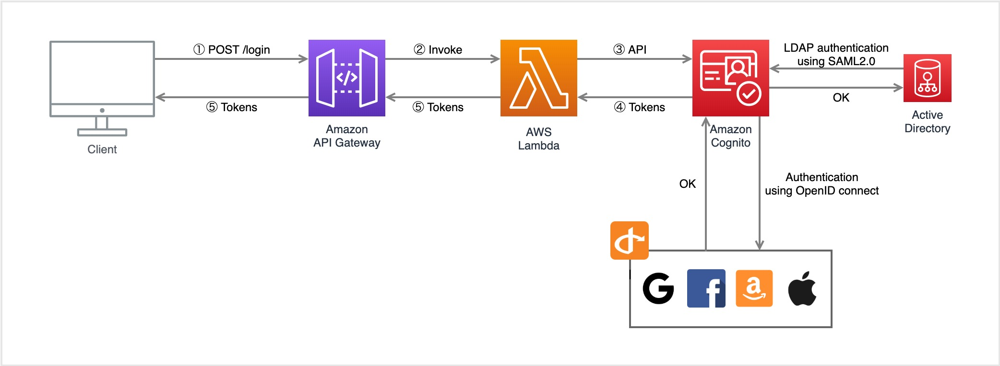
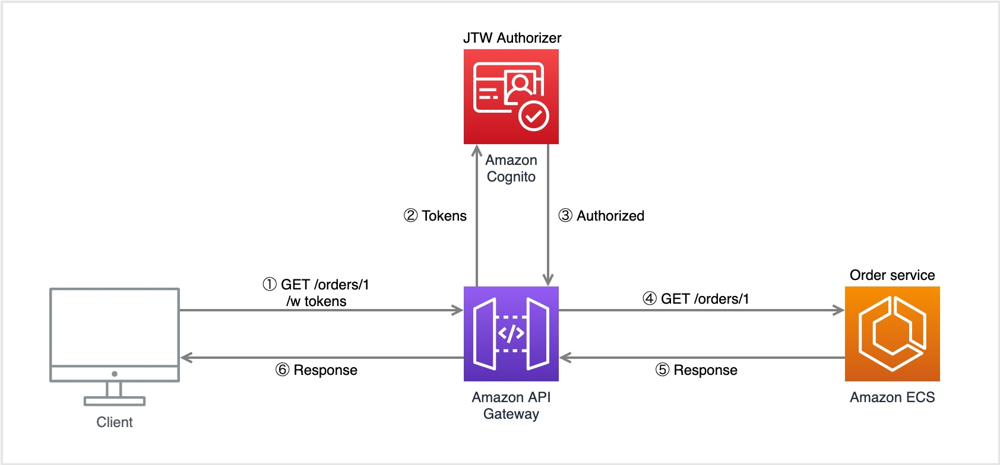

# アーキテクチャとフロー

## 認証

1. API Gateway のログインのエンドポイントに認証情報を POST する
1. API Gateway が認証を行う Lambda 関数を発火する
1. Lambda 関数が AWS SDK で Cognito API を呼び出す
1. ログイン OK なら Cognito がトークンを返す

なお Cognito から外部認証プロバイダを利用することもできる。

## リクエスト認可

1. トークンを付けてリクエストする
1. API Gateway が Cognito にトークンの検証を依頼する
1. Cognito が検証結果を返す
1. 検証結果が OK ならルート先のサービスにリクエストを通す
1. サービスがレスポンスを返す

ただしユーザーの属性ごとに認可を決める場合，サービス内で認可を行うべき。
