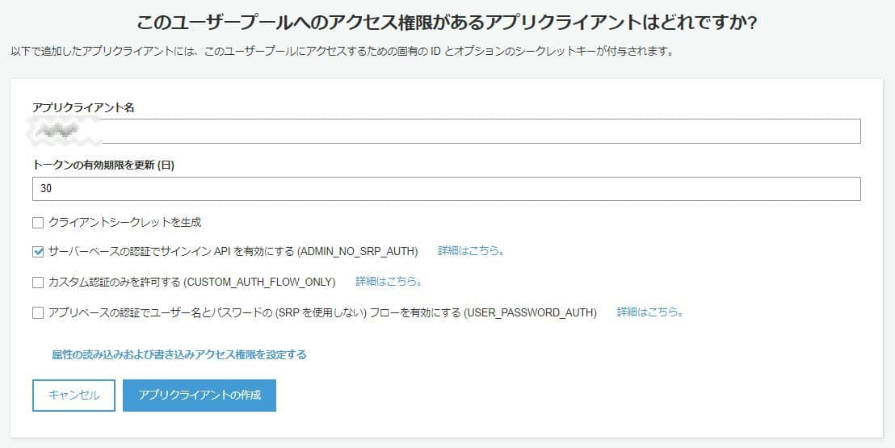

# はじめに

下記をセットアップしておいてください。

* aws cli configureで認証とリージョンの設定
* このリポジトリのクローン
* クローン後に`src`配下で`npm install`

環境は本環境、サブ環境のどちらでもよいです。私は本環境にセットアップしてます。Windowsの場合はWSLで行うことをお勧めします。

# AWS Cognitoについて

Webサービスやモバイルアプリのユーザー管理（認証・認可を含む）機能を提供するサービスです。

# IDプールとユーザプール

まず、AWS Cognitoには大きく分けてIDプールとユーザプールの2つがあります。

## IDプール

> Cognito ID プールを使用すると、アプリは匿名ゲストユーザーおよびサインインしたユーザー用に AWS のサービスにアクセスするための一時的な認証情報を取得できます。

とAWSのコンソールに記載してあるので要するにAWSのリソースにアクセスするためのサービスだと思います。今回は扱わないので省略。

## ユーザープール

今回取り扱うのはこちらですが、ディレクトリサービス（LDAP）やrealm（セキュリティの情報を格納するようなやつ）に近いという認識でよいと思います。もっと雑に書くと、一般的なシステムのユーザーテーブルにセキュリティのルールが加わったものぐらいの認識で良いと思います。

# ユーザープールの作成

実際にユーザープールを作成していきます。ステップに従ってをやるとハマるのでとりあえず「デフォルトを確認する」で変えたいところだけ変えていきます。


一般的にユーザを一意に認識するために`email`を必須にすることは多いと思いますが、今回は代わりに`name`を必須にします。


変更が終わると「プールの作成」を選択します。ユーザプールのIDとARNを控えます。（後でも確認できます）


次に左側のメニューからユーザを作成する（CLIでも可能ですがコンソールから実施します）


ここでのパスワードは後で強制変更させられるのでとりあえず適当でOKです。画像では電話番号とEメールにチェックが入っていますが、いらないので外して作成してください。


`test`ユーザが作成されましたが、ステータスは`FORCE_CHANGE_PASSWORD`で、実際にこのユーザーを使うにはこの後パスワードの変更が必要です。


# アプリクライアントの設定

次にこのユーザープールをアプリクライアントを作ります。この時に「クライアントシークレットを生成せず」かつ「ADMIN_NO_SRP_AUTH」を選択します。



# ユーザーのパスワード変更する

まず、初めにパスワードを変更しないといけないのでCLIで変更します。今までの内容を入力して下記のコマンドを実行します。（以降のAWS CLIコマンドは全て`scripts`以下にサンプルを置いているのでそちらを使用して頂いても大丈夫です）

```
$ aws cognito-idp admin-initiate-auth \
--user-pool-id <user_pool_id> \
--client-id <your_client_id> \
--auth-flow ADMIN_NO_SRP_AUTH \
--auth-parameters USERNAME=<username>,PASSWORD=<password>
```

これを実行すると、次のようなJSONが返ってくる

```json
{
    "ChallengeName": "NEW_PASSWORD_REQUIRED",
    "Session": "xxxxxxxxxxxxxxxxxxxxxxxxxxxxxxxxxxxxxx",
    "ChallengeParameters": {
        "USER_ID_FOR_SRP": "test",
        "requiredAttributes": "[\"userAttributes.name\"]",
        "userAttributes": "{\"name\":\"\"}",
        "USER_ID_FOR_SRP": "nagahiro"
    }
}
```

上記の`Session`を使って変更後のパスワードを設定します。

```sh
$ aws cognito-idp admin-respond-to-auth-challenge \
--user-pool-id <user_pool_id> \
--client-id <your_client_id> \
--session xxxxxxxxxxxxxxxxxxxxxxxxxx \
--challenge-name NEW_PASSWORD_REQUIRED \
--challenge-responses USERNAME=<username>,NEW_PASSWORD=<password>,userAttributes.name=<username>
```

結果が返ってきます。こちらの結果は漏らさないように控えます。

```json
{
    "ChallengeParameters": {},
    "AuthenticationResult": {
        "AccessToken": "xxxxxxxxxx",
        "ExpiresIn": 3600,
        "TokenType": "Bearer",
        "RefreshToken": "xxxxxxxxx",
        "IdToken": "xxxxxxxxxxx"
    }
}
```

ユーザーが`CONFIRMED`になってるのがわかります。


# トークンの有効期限について

Cognitoのアクセストークンの有効期限は1時間です。これは現状変更できないと思われます。再取得するにはリフレッシュトークンを使用して下記のコマンドを実行します。

```sh
aws cognito-idp admin-initiate-auth \
--user-pool-id <your-user-pool-id> \
--client-id <your-client-id> \
--auth-flow REFRESH_TOKEN_AUTH \
--auth-parameters \
REFRESH_TOKEN=<your-refresh-token>
```

# JWTについて

JSON Web Tokenの略です。[RFC7519](https://tools.ietf.org/html/rfc7519)で標準化されています。読み方は`jot`（ジョット）です。JWS形式でエンコードされたものかもしくはJWEにのっとって暗号化されたJSONを指す。という認識でよいはず。

OpenIDファウンデーションジャパンが翻訳している[日本語版](https://openid-foundation-japan.github.io/draft-ietf-oauth-json-web-token-11.ja.html)があるので、そちらを見るとだいたいわかるのではないかと[^1]思います。他には[Auth0のドキュメント](https://auth0.com/docs/jwt)がまとまっていてよいと思います。

# JWSについて

前述のとおりJWTを生成するための仕様で、署名してBase64でURLで使用できる文字のみでエンコードしたものという認識でよいと思います。だいたいJWTの話がでたときはJWSのケースが多いように見受けられるので、以降JWS前提で話を進めることにします。

[RFC7515](https://tools.ietf.org/html/rfc7515)で標準化されています。

# 構造

JWTは下記のの3つからなります。

* ヘッダー
* クレーム
* デジタル署名

これらを`.`でくっつけたものがJWTです。具体的には下記のようになります。（下記は見やすくするために改行していますが実際は改行されていません）

```
eyJhbGciOiJIUzI1NiIsInR5cCI6IkpXVCJ9.
eyJzdWIiOiIxMjM0NTY3ODkwIiwibmFtZSI6IkpvaG4gRG9lIiwiaWF0IjoxNTE2MjM5MDIyfQ.
SflKxwRJSMeKKF2QT4fwpMeJf36POk6yJV_adQssw5c
```

### ヘッダー

ヘッダーにはアルゴリズムとトークンのタイプが格納されています。JWTの場合は`typ`は全て`JWT`になるはずです。たぶん。

```json
{
  "alg": "HS256",
  "typ": "JWT"
}
```

### クレーム

予約済みの項目とカスタムの項目からなります。カスタムの項目は例えばユーザーの項目（名前など）になります

```json
{
  "sub": "AAAA-VVVV-CCCC",
  "event_id": "12345-5678-9000",
  "token_use": "access",
  "scope": "aws.cognito.signin.user",
  "auth_time": 1557655406,
  "iss": "https://cognito-idp.ap-northeast-1.amazonaws.com/ap-northeast-1_ABCDEFGHIJK",
  "exp": 1557655406,
  "iat": 1557651806,
  "jti": "0987654",
  "client_id": "clientId12345",
  "username": "test1"
}
```

予約済みクレームは[こちら](https://www.iana.org/assignments/jwt/jwt.xhtml#claims)で確認できます。

### 署名

JWTが改ざんされていないかといったことや本人かどうかといった認証に使用します。

# JWK

JWKは認証用のサーバから発行されたJWTを検証するための公開鍵情報を含むJSONという認識でたぶん良いです。[RFC7517](https://tools.ietf.org/html/rfc7517)で標準化されています。

AWS Cognitoであれば次のようなURLでjwks（JWKの複数形）が公開されています。`region`と`userPoolId`のとこを先ほど作成したユーザープールの値に書き換えてアクセスしてみてください。

* https://cognito-idp.{region}.amazonaws.com/{userPoolId}/.well-known/jwks.json

次のようなjwksが返ってきます。

```json
{
  "keys": [{
    "kid": "1234example=",
    "alg": "RS256",
    "kty": "RSA",
    "e": "AQAB",
    "n": "1234567890",
    "use": "sig"
  }, {
    "kid": "5678example=",
    "alg": "RS256",
    "kty": "RSA",
    "e": "AQAB",
    "n": "987654321",
    "use": "sig"
  }]
}
```

# JWT認証について

JWT認証はAPIの認証に使用されることが多いと思いますが、これは私の認識が正しければ下記のようなフローになるはずです。


1. クライアントはログイン（フォームなど）で認証を行う
2. サーバがJWTを返す。クライアントはなんらかの方法（Cookieなど）でローカルに保存する
3. クライアントはリクエスト時にヘッダー（Authorization）でJWTをサーバに送る
4. サーバはJWTを確認する
5. レスポンスを返す

`5`のレスポンスを返すですが、認証に成功すれば`200`系でしょうし、失敗すれば`401`という感じになると思います。

AWS Cognitoの場合は今回であれば `1, 2` の部分をAPIサーバの代わりに行うことになります。

# デコードする

[公式ドキュメント](https://docs.aws.amazon.com/ja_jp/cognito/latest/developerguide/amazon-cognito-user-pools-using-tokens-verifying-a-jwt.html)にNode.jsでのデコードのコードサンプルがありますが、若干使い辛いので雑なコードを書きました。

コードは`src`ディレクトリに格納しています。

サンプルコードは3つのライブラリを使用しています。

* AWS CognitoのJWKを取得するために`node-fetch`
* 取得したJWKをPEMに変換するために`jwk-to-pem`
* アクセストークンをデコードするための`jsonwebtoken`

下記のようにJWKのURLとアクセストークンを引数にわたして実行します。

```sh
$ node index.js <your jwk url> <jwt>
```

すると下記のような結果が得られると思います。クレーム情報はCognitoの設定によるので必ずしも下記と一致するわけではないです。

```json
{
  sub: 'aaaaaa-bbbbbbb',
  event_id: 'sssssssssssssssssssssssssssss',
  token_use: 'ddddd',
  scope: 'test.test.example',
  auth_time: 1568286190,
  iss: 'xxxxxxxxxxxxxxxxxxxxxxxxxxxxxxxxx',
  exp: 1568289123,
  iat: 1568286110,
  jti: 'ttt-ttt-ttt-ttt-ttt',
  client_id: 'aaaaaaaaaaa',
  username: 'testuser'
}
```

どのライブラリを使用するかは[jwt.io](https://jwt.io/)に言語ごとにまとまっています。また、jwt.ioでもデコードできますが、漏れたらマズイJWTを外部のサービスでデコードするのは好ましくないので、こちらのサイトでデコードするものはやっても問題ないものに留めてください。

※一般的に外部のサイト・サービスを使用してなにか行うというのはそのサービスが信用できない限りは行うべきではないです。

# JWTのバリデーション

最後にJWTのバリデーションですが、AWS Cognitoを例に説明すると公式ドキュメントでは下記を行うように記載されています。

> [ステップ 3: クレームを検証する](https://docs.aws.amazon.com/ja_jp/cognito/latest/developerguide/amazon-cognito-user-pools-using-tokens-verifying-a-jwt.html)

> 1. トークンの有効期限が切れていないことを確認します。
> 2. 対象者 (aud) のクレームが、Amazon Cognito ユーザープールで作成されたアプリクライアント ID と一致する必要があります。
> 3. 発行者 (iss) のクレームは、ユーザープールと一致する必要があります。
> 4. token_use クレームを確認します。

これに加えてJWTが改ざんされていないかどうかを確認しますが、一般的に改ざんの確認と有効期限のチェックはライブラリがやってくれることが多いと思います。

ライブラリがどこまでやってくれるかはそのライブラリのドキュメントで確認しましょう。例えば今回使用している`jsonwebtoken`の場合は下記の通りです。

> [auth0/node-jsonwebtoken](https://github.com/auth0/node-jsonwebtoken#jwtverifytoken-secretorpublickey-options-callback)

# 参考

> [RFC7519](https://tools.ietf.org/html/rfc7519)

> [JSON Web Tokens](https://auth0.com/docs/jwt)

> [JSON ウェブトークンの検証](https://docs.aws.amazon.com/ja_jp/cognito/latest/developerguide/amazon-cognito-user-pools-using-tokens-verifying-a-jwt.html)

> [JSON Web Token (JWT)draft-ietf-oauth-json-web-token-11](https://openid-foundation-japan.github.io/draft-ietf-oauth-json-web-token-11.ja.html)