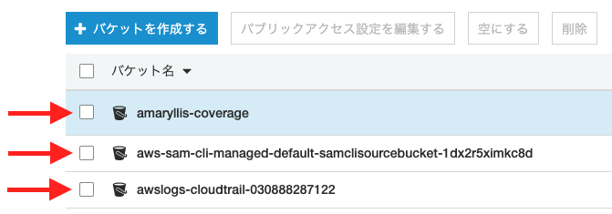
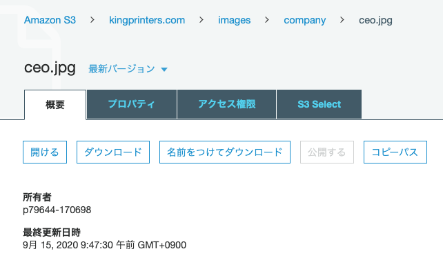

# Amazon S3 用語集

本リポジトリの理解に必要最低限の用語について記載しています。

## Amazon S3

https://docs.aws.amazon.com/ja_jp/AmazonS3/latest/dev/Welcome.html

> Amazon Simple Storage Service はインターネット用のストレージサービスです。

## バケット

https://docs.aws.amazon.com/ja_jp/AmazonS3/latest/dev/Introduction.html

> バケットとは、 Amazon S3 に格納されるオブジェクトのコンテナです。すべてのオブジェクトはバケット内に格納されます。

その名の通りデータを放り込む「バケツ」で，トップレベルの階層（的なもの）。

マネジメントコンソールの S3 トップ画面がバケット一覧（下図の矢印の一つひとつがバケット）。

## オブジェクト

https://docs.aws.amazon.com/ja_jp/AmazonS3/latest/dev/Introduction.html

> オブジェクトは、Amazon S3 に格納される基本エンティティです。オブジェクトは、オブジェクトデータとメタデータで構成されます。

S3 というストレージに保存されたデータファイル（下図は [Cart で使用されている画像ファイル](https://kingprinters.com/images/company/ceo.jpg)）。

## キー

https://docs.aws.amazon.com/ja_jp/AmazonS3/latest/dev/Introduction.html

> キーとは、バケット内のオブジェクトの固有の識別子です。
> ...
> バケット、キー、バージョン ID の組み合わせで、各オブジェクトを一意に識別します。

分かりやすく言うと，バケット内のオブジェクトのパスのこと。

:warning: ただし S3 には「フォルダ」の概念はないので厳密には「パス」とは異なる。

https://docs.aws.amazon.com/ja_jp/AmazonS3/latest/user-guide/using-folders.html

> Amazon S3 はフラットな構造であり、ファイルシステムに見られる階層はありません。ただし、構造を分かりやすくするため、Amazon S3 コンソールは、オブジェクトのグループ化の方法としてフォルダの概念をサポートしています。Amazon S3 ではそのために、オブジェクトに共通の名前プレフィックスが使用されます (つまり、共通の文字列で始まる名前が付けられます)。オブジェクト名はキー名とも呼ばれます。

## アクセスポリシー

https://docs.aws.amazon.com/ja_jp/AmazonS3/latest/dev/s3-access-control.html

> デフォルトでは、Amazon S3 のすべてのリソース — バケット、オブジェクト、関連サブリソース (lifecycle 設定や website 設定など) — はプライベートであり、リソースの所有者、すなわちそのリソースを作成した AWS アカウントだけがリソースにアクセスできます。 リソースの所有者は、アクセスポリシーを作成することにより、他のユーザーにアクセス許可を付与することもできます。

オブジェクトを操作（取得や保存）するための権限のこと。
