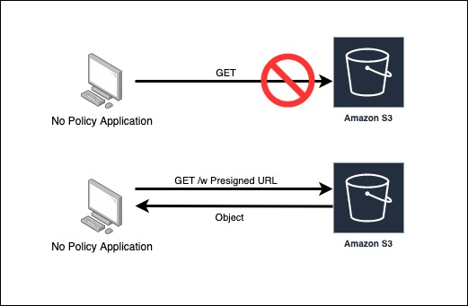
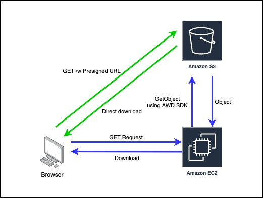
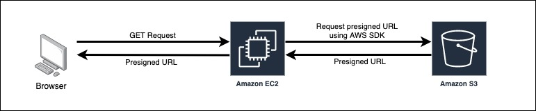

# Amazon S3 署名付き URL is 何？

## 用語集

各用語については[こちら](./glossary.md)。

## 署名付き URL って？

https://docs.aws.amazon.com/ja_jp/AmazonS3/latest/dev/ShareObjectPreSignedURL.html

> デフォルトでは、すべてのオブジェクトがプライベートです。オブジェクトの所有者のみがプライベートのオブジェクトにアクセスできます。ただし、オブジェクトの所有者はオプションで他ユーザーとオブジェクトを共有することができます。その場合は、署名付き URL を作成し、独自のセキュリティ証明書を使用して、オブジェクトをダウンロードするための期限付きの許可を相手に付与します。

簡単に言うと，対象のオブジェクトを操作（取得・保存）するための権限がない相手（ブラウザやアプリ）に，一時的に操作を許可できる URL のこと。オブジェクト単位で発行する。

## どんなときに使うの？

サーバーを経由せず，直接 S3 からダウンロードやアップロードすることができる。

## どうやって発行するの？

https://docs.aws.amazon.com/ja_jp/AmazonS3/latest/dev/ShareObjectPreSignedURL.html

> 署名付き URL は、REST API、AWS Command Line Interface、AWS SDK for Java、.NET、Ruby、PHP、Node.js、Python を使用してプログラムで生成できます。

