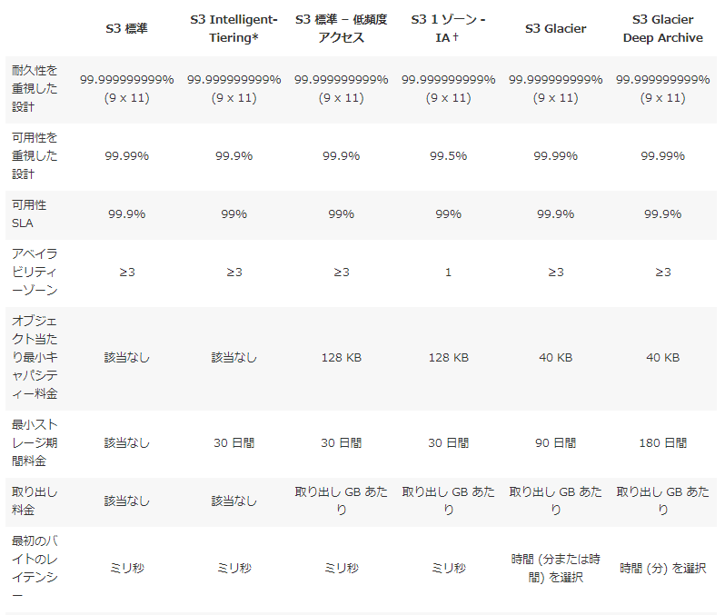
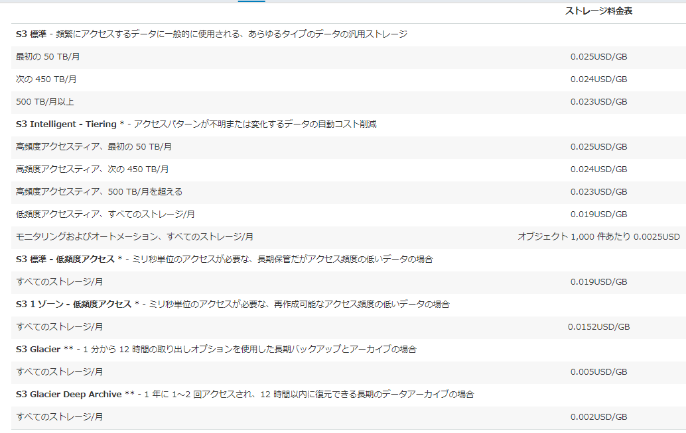
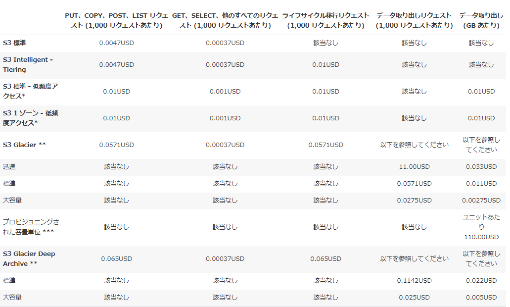
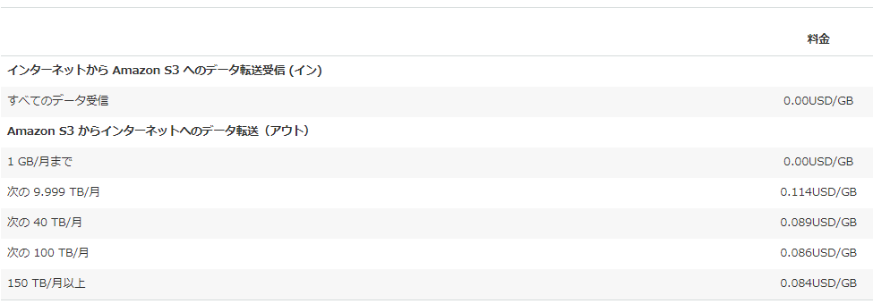
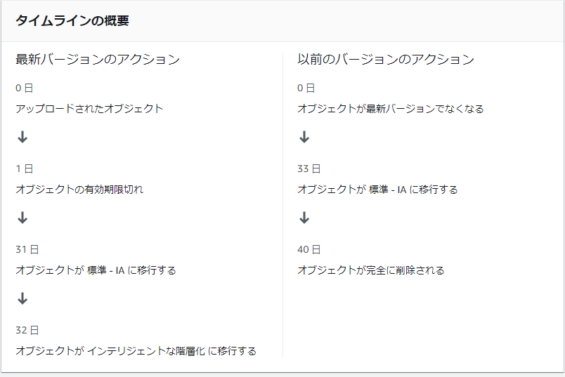

### 初めに
今回の発表はAWSのS3についてです。  
S3の機能を順番に発表していきます。  
ハンズオン等は特にないです。  

### S3とは

AWSのオブジェクトストレージサービス  
後述するストレージクラスによるのですが、標準だと99.99% の可用性になるよう設計しているそうです。すごい。※SLAだと99.9％  

|稼働率|払い戻し率|
|---|---|
|99.0%~99.9%|10%|
|95.0%~99.9%|25%|
|~95.0%|100%|

https://aws.amazon.com/jp/s3/sla/

### 用語整理

|用語|意味|
|---|---|
|S3|AWSのオブジェクトストレージサービス|
|オブジェクト|保存するデータ。作成日時やデータサイズ等も含まれる|
|バケット|オブジェクトを入れる為のコンテナ|
|タグ|オブジェクト・バケットどちらにも付けれる。タグ毎にライフサイクルを変えたり集計したりする|

### ストレージクラス

可用性・パフォーマンス・費用などに応じていくつか選択肢があります  
これらはオブジェクト毎に設定します  

* S3 標準
    * 何も指定せずにオブジェクトを入れるとこれになる
    * アクセス頻度の高いデータ向けに高い耐久性、可用性、パフォーマンス、色んなユースケースに合う
    * ライフサイクルポリシーでストレージクラス間でオブジェクトを自動的に移行する
* S3 Intelligent-Tiering
    * オブジェクトをアクセス頻度に応じて2つの階層へ保存する
    * 30日間アクセスが無いと低頻度層へ、アクセスがあると自動で高頻度層へ移動
    * 両方の階層とも、Standard(標準)ストレージクラスと同等の低レイテンシーを提供。可用性99.9%(SLAは99%)
    * ストレージ容量の料金は高頻度層は標準ストレージクラスと同じ、低頻度層は標準 - IAと同じ
* S3 標準 – IA(低頻度アクセス)
    * オブジェクトの保存費用が安い
    * オブジェクトの取り出しにお金がかかる
* S3 1 ゾーン - IA(低頻度アクセス)
    * 1つのAZにのみデータを保存
    * S3 標準 – IAよりも安い
    * 冗長性が低い
    * オブジェクトの取り出しにお金がかかる
* S3 Glacier
    * 安い
    * オブジェクトの取り出しに時間がかかる（数分～数時間）
    * オブジェクトの取り出しにお金がかかる
* S3 Glacier Deep Archive
    * Glacierよりもさらに安い（ストレージクラスの中で一番安い）
    * オブジェクトの取り出しに時間がかかる（～12時間）
* S3 Outposts
    * AWSからハードウェアが届いてその中でS3を構築

### 比較

### 料金
**ストレージ**

**リクエストとデータ取り出し**

**データ転送**

### バージョニング

バケットに対してバージョニングが設定できます(全オブジェクトに適用される)  
更新・削除した場合でも以前のバージョンは残ったままなので前の状態に戻すことができます  

### ライフサイクルポリシー

オブジェクトに対して以下のようなことができます  

* 作成して何日後に別のストレージクラスへ移行する
* オブジェクトが現行バージョンでは無くなったら別のストレージクラスへ移行する
* 作成して何日後にオブジェクトを削除(バージョニングが有効なら以前のバージョンとなる)
* 以前のバージョンになってから何日後に完全削除
* オブジェクトの名前のプレフィックスやタグに限定できる

ライフサイクルポリシー作成前にタイムラインが見えるのは分かりやすいですね  

### レプリケーション

別のバケットにオブジェクトをコピーする機能  
別のアカウントや別リージョンでも大丈夫らしい  

### オブジェクトロック

オブジェクトに対してロックを行うとそのバージョンが削除できなくなる  
バージョニングが有効の場合のみ設定可能  
オブジェクトロックにはリテンションモードとリーガルホールドの2種類ある  
リテンションモードは一定期間のみ削除できなくなる  
リーガルホールドは無期限に削除できなくなる。権限を持っていれば解除可能  

### バケットの通知

### CloudWatchメトリクス

### ロギング

### インベントリ

### 分析

### アクセラレート