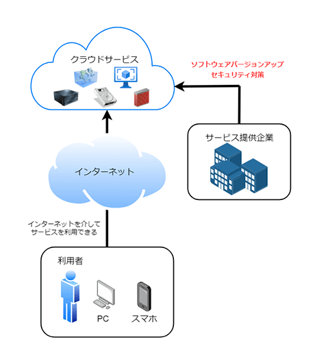
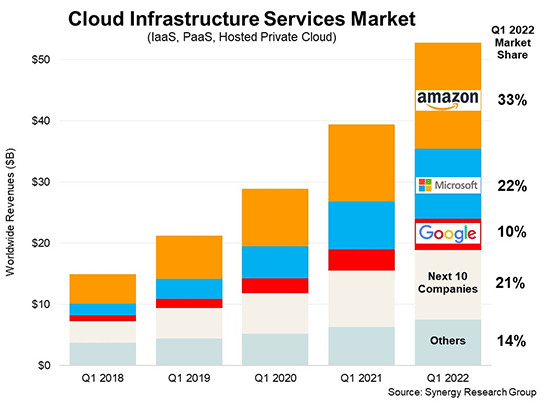
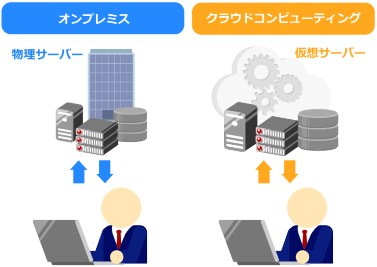
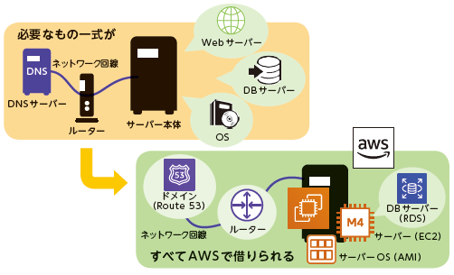
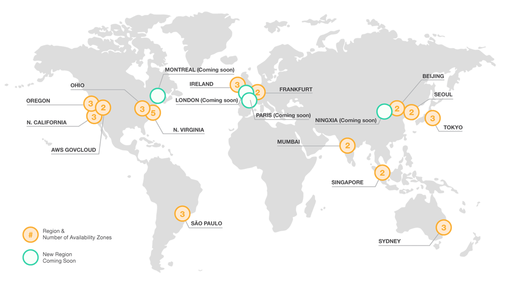
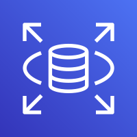

# AWSについて

本日は当社でも利用しているAWSというサービスについてお話しします。

AWSを開始するためのAWSアカウントは、メールアドレスとクレジットカードがあれば企業、個人問わず誰でも作成できます。

興味があれば個人でも契約してawsをご活用下さい。

## AWSとは？

**AWSとは「Amazon Web Services：アマゾンウェブサービス」の略称で、**
**米Amazon社が提供する様々なクラウドコンピューティングサービス**のことを指します。

200を超えるサービスがあり、ユーザーは必要なときに必要な量のリソースへ簡単にアクセスすることができ、ご利用料金は
実際に使った分(オンデマンド)のお支払いのみといった従量課金が一般的です。

  具体的には以下のようなサービスが利用できます。

  ・仮想サーバーの作成
  ・データのバックアップ保存
  ・データベース運用
  ・ウェブサイト運用
  ・システム開発環境の構築
  ・ビックデータの解析

  AWSの代表的なサービスについては後の項目でご紹介します。

といっても、クラウドコンピューティングとは何かがわからないと、AWSとはどんなサービスかも理解できません。

そこで、つぎにクラウドコンピューティングについて解説します。

## そもそもクラウドサービスって？

**クラウドコンピューティングとは、**
**インターネットを介してサーバー・ストレージ・データベース・ソフトウェアといった**
**コンピューターを使った様々なサービスを利用することを指します。**

クラウドコンピューティングでは、手元に1台のPCとインターネットに接続できる環境さえあれば、サーバーや大容量のストレージ、高速なデータベースなどを必要な分だけ利用できるわけです。

一般的に使われる「クラウド」という用語自体は、正式には「`クラウド・コンピューティング`」といいます。
そして、クラウド・コンピューティングを利用したサービスを、
呼称で「クラウド」あるいは「クラウドサービス」と表現しています。

クラウドサービスと聞いて具体的にイメージしにくい理由は、手元に物理的なコンピューターがなく、機器に触れることができないからでしょう。

目の前にあるパソコンならば、自分の手で電源ボタンを押して起動させるため、
「パソコンを使う」という実感が得られます。

しかし、クラウドサービスで利用するコンピューターは、
インターネットに接続された先の「どこか」で「だれか」がコンピューターを起動（管理）しているため、
コンピューターが動いていることを実感しにくいのです。

利用者から見て、インターネットの先にある自分が利用しているコンピュータの形態が実際にどうなっているのか見えづらいことを、雲に遮られ見えない場所からサービスが提供されるというイメージにつながり、「cloud＝雲」という名称がついたと言われています。

  ## AWSの成り立ち

  AWSはもともとECサイトのAmazonが膨大な商品管理やデータ分析など、
さまざまな課題を解決するために考え出されたITインフラの仕組みやノウハウの一部を
2006年一般向けにサービスとして公開したことからはじまりました。

まだ「クラウドコンピューティング」という言葉が世に広まる前のことです。

  #### 圧倒的な世界シェアを誇るAWS

  クラウドコンピューティングサービスの先駆けとなったAWSは、
現在、世界での売上でトップシェアクラスのユーザー数を誇ります。

AWSのほかには、マイクロソフトのMicrosoft Azureや、グーグルのGoogle Cloud Platform（GCP）などが
主要なパブリッククラウドとして存在します。

以下のグラフによると、米AWS、米Microsoft、米Googleの3社のシェアがそれぞれ33％、22％、10％となっており、3社の合計でクラウドインフラ市場のシェアは65％に到達していることが分かります。

  ## AWSと従来の物理サーバーとの違い

クラウドコンピューティングサービスが登場する前まで、
サーバーを利用する必要があれば自社の建物の中などにサーバー機器を設置して利用するのが一般的でした。
この運用形態のことを「`オンプレミス`」といいます。

オンプレミスでは、サーバー機器を購入し管理しなければならないのはもちろんのこと、
設置するスペースも確保しなければなりません。
サーバー機器を購入するのにお金がかかりますし、納期が長ければ使えるまで時間がかかることもあります。

対するクラウドコンピューティングでは、
「サーバー機器を購入する」「管理する」「スペースを確保する」「納期の間、待つ」といった必要は一切ありません。
インターネットからクラウドコンピューティングサービスに接続しさえすれば、すぐにでも必要なサーバーなどのリソースが使えるわけです。

## AWSのサーバーについて

これまでの説明でAWSはamazonが貸出しているサービス群であることが理解できたかと思います。

次にこのサービスを提供しているamazonのサーバーについて説明します。

#### AWSのリージョンとは

大まかに言うと「**地域**」のことです。
AWS は世界中にサーバーを持っており、**リージョンという大きな単位でまとまっています**。

東京リージョン、ソウルリージョン、北カリフォルニアリージョン、など多数存在します。

##### 各リージョンは分離されている

それぞれのリージョンは完全に分離されています。
アメリカのリージョンで障害が発生しても、東京リージョンには影響がありません。

**複数のリージョンにシステムを分散配置することで、障害耐性を高める**ことができます。

基本的には、利用場所に近いリージョンを使う方が良いと言えます。
2022現在、日本には東京と大阪リージョンがあります。

### アベイラビリティゾーン(AZ)とは

「**アベイラビリティゾーン(AZ)**」は、リージョンよりも**小さな区分け**です。
原則として、1リージョンの中に複数のアベイラビリティゾーンが存在しています。

概ねデータセンター単位で分離されており、物理的なデータセンターで構成され**電源・ネットワークなども別管理**となっています。
1つの AZ で障害が発生した場合でも、他の AZ には響かない設計となっています。

##### 複数のAZを活用して障害対策

リージョンと同様に、複数のアベイラビリティゾーンを併用することで、
仮に1つのデータセンターが使えなくなった場合でも、システムを継続することができます。

**東京リージョンでは4つの AZ** が存在しています。
最多はバージニア北部リージョンの 6AZ、最少は大阪ローカルリージョンの 1AZ です。

## 当社でも利用している代表的なサービス

一口にAWSといってもその中には100を超えるサービスがあり、それぞれできることが異なります。ここではその中でも代表的なサービス4つに絞って紹介します。

### サーバー環境構築

#### Amazon EC2 （Amazon Elastic Compute Cloud）

AmazonEC2は、AWSの仮想レンタルサーバです。大きな特徴は、利用する容量やアクセス量によって料金が自動的に変化することです。

自社サーバの場合、キャンペーンなどで一時的に自社Webサイトへのアクセスが急増するとサーバがパンクしてしまいます。かといって、ピーク時に合わせて容量を多く設定すると、平常時にコストが高くついてしまいます

AmazonEC2は利用料に応じて流動的に料金が変化するため、余分なコストの発生を抑えることができます。

### データ保存/コンテンツ配信

#### Amazon S3 （Amazon Simple Storage Service）

Amazon S3はAWSのストレージサービスです。

データをクラウド上に保管して、どこからでも閲覧や編集を行なうことができます。

保存できる容量やファイル数に制限がない上に、99.999999999％（イレブン・ナイン）という非常に高い耐久性を誇り、データ消失の可能性が限りなく0に近くなっています。（確率的には1,000万年に1度）またS3に保存したデータはインターネット経由でアクセスできるため、静的なコンテンツであれば配信が可能です。

### データベース利用

#### Amazon RDS（Amazon Relational Database Service）

RDSはAWSのデータベースサービス（顧客リストや商品リスト、従業員名簿などの情報を効率的に管理できるサービス）です。

自社のPCにデータベースを構築する場合は、データベースのソフトやバックアップなどのセットアップが必要ですが、RDSは契約後すぐにデータベースの機能を利用できます。

フルマネージドなので、もちろんデータベースサーバーを管理する手間もかかりません。パッチの適用もAmazon側で行ってくれます。「データベースを必要な時に作成して使うだけでよい」サービスです。

  ## AWSの料金体系

AWSは、サービスの集合体です。2022年1月現在、200以上のサービスがあります。先に説明したEC2は、その1つに過ぎません。

そのため、サービスによって料金体系が異なります。ただし、ほとんどのサービスで共通しているのは、従量制を導入しており、**「使うサービス1つあたりの金額＋使った分」の課金形態が多い**ということです。

そのため、「⁠将来増えるから、それに備えて多めに借りておこう」「⁠イベント時にアクセスが増えるから、それを見越して借りておこう」といった「将来必要だけれど、現在必要のない分」を借りる必要はありません。必要最低限で始めて、必要になったら増やせばよいのです。

これが、噂に聞く「クラウドは従量制だからコストダウン！！」というアレです。

  また、AWSには一定額の利用を超えるとアラートを発生させる機能があり、設定しておくと予期せぬ請求発生にも早めに気づけるのでおすすめです。

## AWSを利用するメリット、デメリット

AWSを利用する場合、どんな利点があってどんな注意点があるのでしょうか。この項では、AWSを利用する主なメリット・デメリットを表形式でまとめます。

### メリット

- 【コスト面】ハードウェア・ソフトウェアを購入する必要がないので初期費用が抑えられる。また従量制の課金となるため、定額制と比べて無駄なコストが発生しにくい
- 【セキュリティ面面】常に最新のセキュリティが施され、さまざまな第三者機関認証を取得したセキュアな環境を利用できる。サービス側で最新化の処理を行ってくれるため、管理者の手間がない。
- 【拡張性】スペック（CPU・メモリ・ストレージ容量などの拡張）が簡単かつスピーディーに行える
- 【管理者負担】ハードウェアの管理やソフトウェアのアップデートといった管理者の負担がかからない。その分、人的リソースを有効に活用できる
- 【セキュリティ面面】常に最新のセキュリティが施され、さまざまな第三者機関認証を取得したセキュアな環境を利用できる。サービス側で最新化の処理を行ってくれるため、管理者の手間がない。
- 【スピード】ハードウェアの購入などが不要なので、必要な環境をすぐに利用できる。スペックの変更にも時間がかからない。結果、ビジネスのスピードを高めることができる。
- 【スペース】サーバーを設置する物理的なスペースを用意する必要がない。その分、スペースを確保できる

### デメリット

- 【コスト】従量制の課金となるため、使い方によっては定額制のサービスと比べ高額になりやすい。また毎月の費用が読みにくく予算化しづらい。
- 【ノウハウ】サービスが200種類以上あり今後も増えると予想される。そのため「これをするにはどのサービスを利用するのが最適か」といった選択を適切に行うところから、相応のノウハウが必要。またAWSではサーバーなどの環境は用意してくれるが、その先の管理はユーザーが行うことが必要であるため、問題が発生した際のトラブルシュートなどの技術も必要となる。