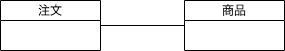
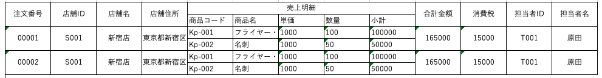
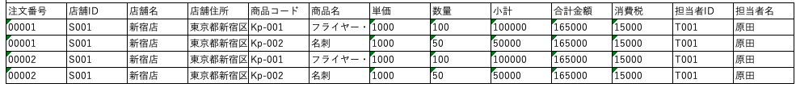
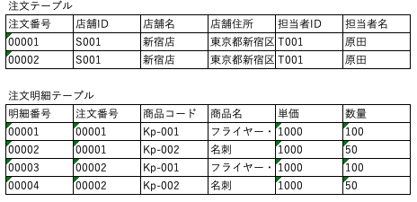
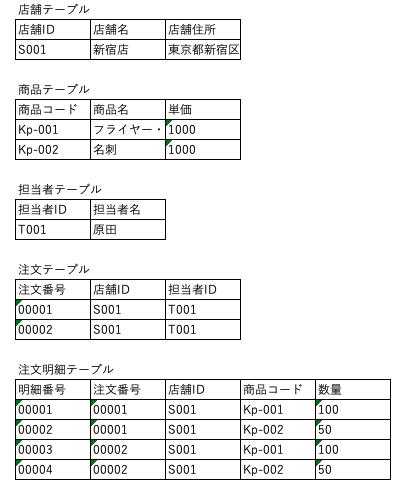
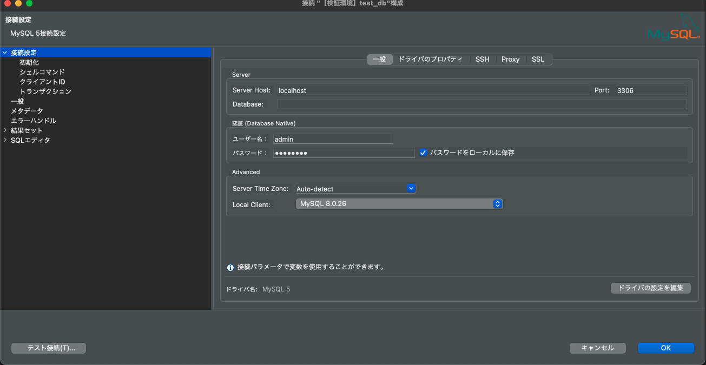
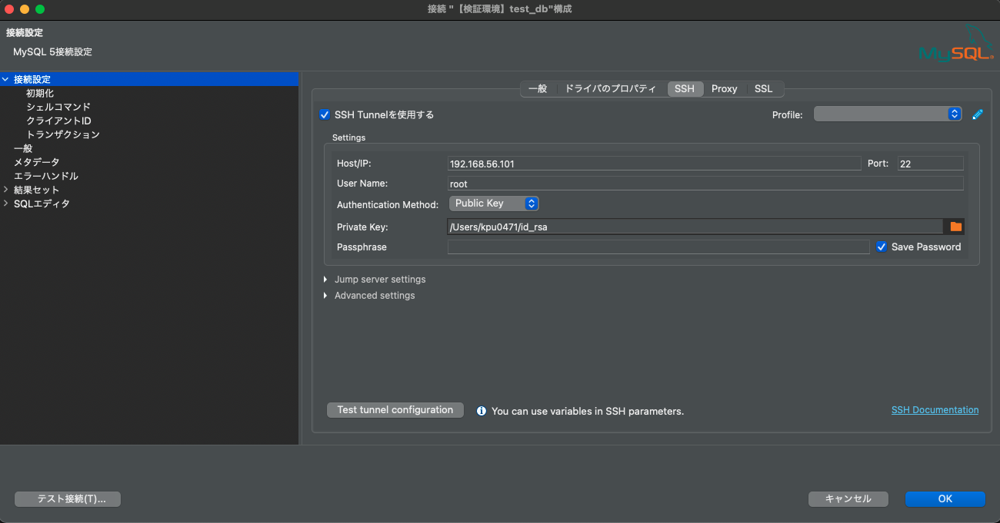
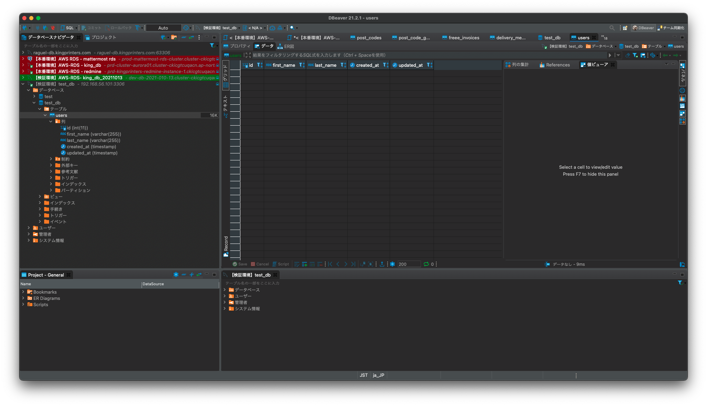

# データベース入門

[toc]

## データベースとは

### 概要

データベース(DataBase)とは、「多目的の利用共有を意図した組織的なデータの集まり」です。一方これらのデータを管理して利用するためのソフトウェアをデータベース管理システム(DataBase Management System, 以下DBMS)と呼びます。

現代の情報システムは、インターネットに代表される情報技術の高度化に伴い大量のデータを保存し高速に検索できる仕組みが重要となります。この要求を実現するためのソフトウェアが、DBMSになります。DBMSには用途によって、様々なタイプのソフトウェアがあります一般に広く使われているのは、__リレーショナルデータベース__（関係データベース）と呼ばれる表形式でデータを管理するタイプのデータベースです。これには、OracleのOracle DB、MySQL や Microsoft社のSQL Server、PostgreSQLなどがあります。

狭義ではデータベースは、データの集まりで保存・検索するソフトをデータベース管理システムと呼びますが、より一般化しデータベース管理システムのことをデータベースと呼ぶことも多いです。

### データベースシステムのメリット

データ管理の仕組みとして古典的な方法は、オペレーティングシステムが提供するファイルシステムを利用することが挙げられます。しかし、ファイルシステムを用いたデータ管理には次のような問題があります。

1. 不確実な同時アクセス
2. 整合性の欠如
3. 不十分な機密保護
4. データとアプリケーションの相互依存

データベースシステムを利用することで、上記の問題が解決できます。

`演習（１）上記の問題を1つ取り上げDBMSがどのように上記の問題を解決しているのか考察してください`

## データモデル

### データモデルとは

DBMSがサポートする代表的なデータモデル(データの表現)である、リレーショナルデータモデル・ネットワークデータモデル・階層データモデルについて俯瞰していきます。一般的に広く使われているのは、リレーショナルデータベースであり、実務上もリレーショナルデータベースを抑えておけば困ることはあまりありません。本資料でも、リレーショナルデータベースを中心に見ていきます。

#### リレーショナルデータモデル

リレーショナルデータモデル(Relational Data Model)は，Coddにより提案されたデータモデルで、単純さ・明解な数学基礎(集合論)が特徴です。データの集まりをリレーション(表)の集合として定義します。表には、社員番号・氏名などの情報があり、これを属性(attribute)と呼びます。

#### ネットワークデータモデル

ネットワークデータモデル(Network Data Model)は，次に述べる階層データベースシステムを木構造からグラフ構造へ汎化したデータモデルです。現在でもよく利用されており、OracleのSpatial and GraphやAmazon Neptuneなどがあります。

#### 階層データモデル

階層データモデル(Hierarchal DataModel)は、レコードを節とする木構造をデータベーススキーマの基本表現として用います．代表的なDBMSとしては、IBMのIMSなどが知られています。


### データモデリング

データベースにデータを保存するためにはDBMSがサポートするデータモデルへ実世界の情報を落とし込む必要があります。この実世界の情報からデータモデルを導出するプロセスをデータモデリングと呼びます。データモデリングには3つのプロセスがあり、それぞれ概念設計・論理設計・物理設計と呼ばれます。

概念設計では、実世界のどの情報を保存するかという概念を抽出する段階です。この段階で、データベース上にどの情報を保存するか保存する条件（制約）を定めます。概念設計では、ER図と呼ばれる記法がしばしば利用されます。ER図のように、データの意味を強く意識したモデルのことを __意味データモデル__ と呼びます。

論理設計では、概念設計で得られたモデルをDBMSが提供するデータモデルへを変換する作業です。開発時には、保存するデータを決めたらDBMSの定義を書くことが多いので、実務上はあまり意識しないかもしれません。

物理設計では、DBMSにどのような値を保存しどのような制約を設けるかといった、使用するDBMSを強く意識した設計段階です。

### キー属性と制約

データベースにデータを保存する際に、必須にしたい項目があったり、検索を容易にするためにレコードを特定できる条件があると便利です。このように、データを保存する条件を、制約と呼びます。代表的な制約としては、主キー制約・NOT NULL制約・UNIQUE制約・外部キー制約などがあります。

データベースに保存した値のうちレコードを特定できかつNULLとならないような属性のことを __主キー__ と呼びます。主キーには、NULLかつ一意に特定できるという制約が要求され、この制約を主キー制約（PRIMARY KEY 制約）と呼びます。また、主キーからNULL制約を省略したものを候補キーと呼びます。

非キー属性で値がNULLとならない制約をNOT NULL制約と呼びます。

### ER(Entity-Relation)図

ER図は、概念設計によく利用される記法で1976年にChenにより提案された表記法です。ER図では、データベースで表現すべき実世界の対象をモデル化するのに、__実体(Entity)__ と__関連(Relation)__ という2つの概念を用います。例えば、注文と商品が紐づく場合次のように書きます。（記法の詳細については省略します）



## 名詞抽出法によるモデリング技法

やり方はいくつかの流儀がありますが、手っ取り早く直感的な名詞抽出法を考えます。

1. 帳票類の用語をリストアップする
2. 帳票類の用語を分類・整理する
   1. トランザクション系
   2. マスタ系
3. 各単語のドメインと単語間のユースケースを考える

→どういうデータがどういう形式で必要かを観察する


`演習（２）配布したレシートに記載されている情報をもとに概念設計を行ってください。`

## データベースの正規化

### 正規化とは

データを効率よく正確に取り出すためには、DBMSに __データの重複をなく整合性を保ってデータを保存__ することが重要になります。このにデータベースを設計することを、__データベースの正規化__ と呼びます。正規化を行っておくと、データの追加・更新・削除などに伴うデータの不整合や喪失が起きるのを防ぎ、メンテナンスの効率を高めることができます。

正規化されたスキーマのことを、正規形と呼びます。正規形には、第一〜六正規形、およびボイス・コッド正規形があります。一般的に、第三正規形まで正規化がされていれば十分と言われており、本資料でも第三正規形までを扱います。

### 非正規形

正規化がまったく行われておらず、1行の中に複数の繰り返し項目が存在するようなテーブルは非正規形と呼びます。例として商品伝票を考えてみます。




### 第一正規形

リレーショナルデータベースでは行単位でデータの保存をするので、そのままでは非正規形のデータをデータベースに保存することができません。非正規系から繰り返し項目を排除し単一のレコードに変換した形式を第一正規形と呼びます。




### 第二正規形

第一正規形にすることでデータベースに格納できるようにはなりました。ここから更に管理しやすい形にします。第一正規形の表から、部分関数従属している列が切り出されたものを第二正規形と呼びます。

第二正規化の前に、第2正規形では関数従属と部分関数従属というのが関わってくるため、これらに触れていきます。__関数従属__は、主キーが決まると行が特定できる関係のことで、__部分関数従属__は、複合キーの一部の項目だけで、列の値が特定できる関係のことです。また、合計金額や消費税など他の項目から算出可能な属性（導出項目）もこの時点で削除します。第一正規形の商品伝票では、注文が決まれば明細が決まるので、注文テーブルと注文明細に分割します。




### 第三正規形

第二正規形から、さらに主キー以外の項目について項目同士で依存関係を持っているものも、別テーブルに切り分けます。こうすることで、テーブルの非キー属性はすべて主キーに関数従属します。この表操作を行った形を第三正規形と呼びます。




## MySQLサーバーの構築

前回構築したSSHサーバー上にMySQLサーバー(MariaDB)を構築していきます


### MariaDBのインストール

yum パッケージマネージャでインストールします。

```sh
#sudo -s
#yum install -y mariadb_x86_64
```


### MariaDBサービスの登録

systemctlコマンドで、mariadbをサービスに登録し、起動します。

```sh
#systemctl enable mariadb
#systemctl start mariadb
```

### 日本語設定

日本語が扱えるようにutf-8の設定を追加します。

```sh
$ vi /etc/my.cnf

[mysqld]
datadir=/var/lib/mysql
socket=/var/lib/mysql/mysql.sock
# Disabling symbolic-links is recommended to prevent assorted security risks
symbolic-links=0
# Settings user and group are ignored when systemd is used.
# If you need to run mysqld under a different user or group,
# customize your systemd unit file for mariadb according to the
# instructions in http://fedoraproject.org/wiki/Systemd
character-set-server=utf8 #mysqldセクションの末尾に追加:q


[client]
default-character-set=utf8 #clientセクションを追加

[mysqld_safe]
log-error=/var/log/mariadb/mariadb.log
pid-file=/var/run/mariadb/mariadb.pid

#
# include all files from the config directory
#
!includedir /etc/my.cnf.d

$systemctl restart mariadb #再起動
```


### セキュリティ設定

セキュリティ設定をしてくれる `mysql_secure_installation`を実行します。

```sh
# mysql_secure_installation

Securing the MySQL server deployment.

Enter password for user root: 初期パスワードを入力する

The existing password for the user account root has expired. Please set a new password.

New password: 新しいパスワードを入力する

Re-enter new password: 再度同じ新しいパスワードを入力する

VALIDATE PASSWORD PLUGIN can be used to test passwords
and improve security. It checks the strength of password
and allows the users to set only those passwords which are
secure enough. Would you like to setup VALIDATE PASSWORD plugin?

Press y|Y for Yes, any other key for No: y

There are three levels of password validation policy:

LOW Length >= 8
MEDIUM Length >= 8, numeric, mixed case, and special characters
STRONG Length >= 8, numeric, mixed case, special characters and dictionary file

Please enter 0 = LOW, 1 = MEDIUM and 2 = STRONG: 0
Using existing password for root.

Estimated strength of the password: 100
Change the password for root ? ((Press y|Y for Yes, any other key for No) : y

New password: ポリシーに沿った新しいパスワードを入力

Re-enter new password: 再度新しいパスワードを入力する

Estimated strength of the password: 50
Do you wish to continue with the password provided?(Press y|Y for Yes, any other key for No) : y
By default, a MySQL installation has an anonymous user, a user account created for them. This is intended only for
testing, and to make the installation go a bit smoother.
You should remove them before moving into a production
environment.

Remove anonymous users? (Press y|Y for Yes, any other key for No) : y
Success.


Normally, root should only be allowed to connect from
'localhost'. This ensures that someone cannot guess at
the root password from the network.

Disallow root login remotely? (Press y|Y for Yes, any other key for No) : y
Success.

By default, MySQL comes with a database named 'test' that
anyone can access. This is also intended only for testing,
and should be removed before moving into a production
environment.


Remove test database and access to it? (Press y|Y for Yes, any other key for No) : y Success.

- Removing privileges on test database...
Success.

Reloading the privilege tables will ensure that all changes
made so far will take effect immediately.

Reload privilege tables now? (Press y|Y for Yes, any other key for No) : y
Success.

All done!

```


### ユーザ作成

管理用ユーザの作成を行います。また作成ユーザに対して全機能が利用できるように権限を付与します。

```sh
$mysql -uroot -p
MariaDB [(none)]> CREATE USER  "admin"@"localhost" IDENTIFIED BY "password";
MariaDB [(none)]> CREATE USER  "admin"@"gateway" IDENTIFIED BY "password";
MariaDB [(none)]> GRANT ALL ON *.* TO admin;

```

### クライアントから接続

前回設定したSSHサーバーの機能を利用して、SSH経由でMySQLサーバーへ接続します。

1. MySQLサーバーへは、先ほど作成したユーザで接続設定をします。



2. MySQLサーバーへ接続するために、VirtualBoxへのSSHトンネリング設定をします。



3. 接続に成功すればデータベースが表示されます。



## 問い合わせ言語 SQL

### DDLとDML

SQLにはデータ定義言語(Data Definition Language, DDL)とデータ操作言語(Data Manupilation Language, DML)が含まれています。DDLはDBMS上のデータ構造を定義し、DMLはDBMS上に保存されているデータを取得・加工します。SQLの仕様は、使用しているデータベースとごとに異なるので、使用しているデータベースのリファレンスを参照するようにしてください。

#### 代表的なDDL

**CREATE [TABLE| DATABASE]文**

```sql
	CREATE TABLE [IF NOT EXISTS] db_name.tbl_name
    (col_name data_type, ...)
```


**ALTER [TABLE| DATABASE]文**

```sql
#テーブル名の変更
ALTER TABLE tbl_name
 RENAME [TO|AS] new_tbl_name

#インデックス名の変更
ALTER TABLE tbl_name
 RENAME INDEX old_index_name TO new_index_name

#カラム名の変更sel
ALTER TABLE tbl_name
 RENAME COLUMN old_col_name TO new_col_name

#カラム名と定義の変更
ALTER TABLE tbl_name
 CHANGE [COLUMN] old_col_name new_col_name column_definition

#カラム定義の変更
ALTER TABLE tbl_name
 MODIFY [COLUMN] col_name column_definition
```


#### 代表的なDML

**SELECT**

テーブルに格納されているデータを取得するには SELECT 文を使います。基本となる書式は次のとおりです。

```sql
 SELECT col_name1 [, col_name2 ...] FROM table_name 
```


**INSERT**

テーブルにデータを格納するには INSERT 文を使います。基本となる書式は次のとおりです。

```sql
INSERT INTO tbl_name (col_name1, col_name2, ...) VALUES (value1, value2, ...) 
```


**DELETE**

テーブルからデータを削除するには DELETE文を使います。基本となる書式は次のとおりです。

```sql
DELETE FROM tbl_name [WHERE where_condition]
```


**UPDATE**

テーブルのデータを更新するには DELETE文を使います。基本となる書式は次のとおりです。

```sql
UPDATE table_reference
    SET col_name1 = value1 [, col_name2 = value2, ...]
    [WHERE where_condition]
```

### MySQL ハンズオン

データモデリングで作成したサンプルをもとに実際にSQLを実行していきます。

- テーブル定義
- データの挿入・削除
- データの取得

では見ていきましょう。

**テーブル定義**
```sql
# レジマスタの作成
create table `registers`(
	id int primary key,
	created_at DATETIME default NULL,
	updated_at DATETIME default NULL,
	deleted_at DATETIME default NULL);

# 店舗マスタの作成
create table `shops`(
    id int primary key  COMMENT "PK",
    name varchar(255) default "" COMMENT "店舗名", 
    tel varchar(10) not null default "" COMMENT "電話番号", 
    address varchar(255) not null default "" COMMENT "住所", 
    register_id int not null default 0 COMMENT "レジ番号", 
    created_at DATETIME default NULL COMMENT "登録時刻", 
    updated_at DATETIME default NULL COMMENT "更新時刻",
    deleted_at DATETIME default NULL COMMENT "削除時刻",
    constraint `fk_register_id` foreign key (`register_id`) references `registers`(`id`)
    );

#注文テーブル
create table orders (
    id int primary key comment "ID",
    created_at DATETIME default NULL COMMENT "登録時刻", 
    updated_at DATETIME default NULL COMMENT "更新時刻",
    deleted_at DATETIME default NULL COMMENT "削除時刻"
);

#注明細テーブル
create table order_details (
    id int primary key comment "ID",
    order_id int not null COMMENT "注文ID",
    product_id int not null comment "商品ID",
    created_at DATETIME default NULL COMMENT "登録時刻", 
    updated_at DATETIME default NULL COMMENT "更新時刻",
    deleted_at DATETIME default NULL COMMENT "削除時刻"
    
);

# 商品マスタの作成
create table products (
    id int primary key comment "ID",
    name varchar(255) COMMENT "商品名",
    unit_price int not null default 0 COMMENT "商品単価",
    created_at DATETIME default NULL COMMENT "登録時刻", 
    updated_at DATETIME default NULL COMMENT "更新時刻",
    deleted_at DATETIME default NULL COMMENT "削除時刻"
);
```
**テーブル構造の変更**
```sql
alter table `products` add column `product_category` int COMMENT "商品カテゴリ";
```

**データの挿入・削除**
```sql
insert into `products`(
    id, 
    name, 
    unit_price, 
    created_at, 
    updated_at)
values (
    1, 
    "商品A", 100, 
    CURRENT_TIMESTAMP, 
    CURRENT_TIMESTAMP);
insert into `products`(
    id, 
    name, 
    unit_price, 
    created_at, 
    updated_at)
values (
    2, 
    "商品B", 500, 
    CURRENT_TIMESTAMP, 
    CURRENT_TIMESTAMP);

insert into `products`(
    id, 
    name, 
    unit_price, 
    created_at, 
    updated_at)
values (
    3, 
    "商品C", 400, 
    CURRENT_TIMESTAMP, 
    CURRENT_TIMESTAMP);
```
**データの更新**

```sql
# 商品Cの単価を500円に更新する
update `products` set unit_price=500, updated_at=CURRENT_TIMESTAMP where id=3;
```
**データの取得**

```sql
select * from `products` where id=3;
```

`演習（３）演習（２）で作成したレシートからテーブル設計を行い。データの挿入・削除を行ってください`

s
