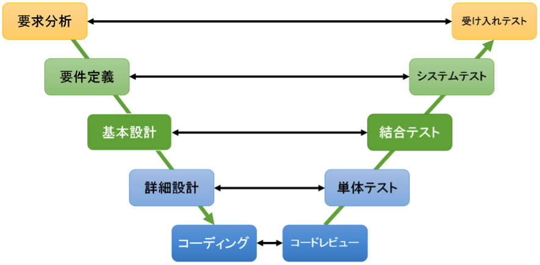
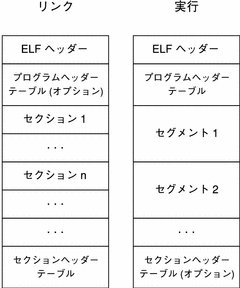

[toc]

## プログラマーの道具箱１ Debugger

### ソフトウェア開発のプロセス

プログラマ(Program-mer)は、一般的に __プログラムを書く人__ と認知されていますが、プログラマの仕事の多くは __プログラムを書くことではありません__ 。

プログラマとはもともと、Program(計画などの意味)を立案し実行する人のことを指します。これが転じ、現在ではプログラムの設計・実装・評価をする人のことをプログラマと呼びます。同種の用語に、コーダー(Coder)という用語もありますが、これは仕様に沿って実装するだけの人です。したがって、プログラマとは、プログラムを設計し実装するソフトウェア開発の専門家のことを指します。

さて、そのプログラマの仕事ですが、現代のソフトウェア開発においては非常に多岐にわたります。実際の現場では、役職ごとに細分化されていることが多いように思います。

ソフトウェア開発は一般的に、①要求分析②要件定義③基本設計④詳細設計⑤コーディング⑥単体テスト⑦結合テスト⑧システムテスト⑨受け入れテストとプロセスを経る __V字モデル__ を取ります。


図1 V字モデルの概念図[^3]

これは、伝統的なウォータフォール型であろうとアジャイル型であろうと変わりません。

企業や現場にもよると思いますが、プログラマが担当するのは__主に 基本設計〜結合テスト__ までのフェーズでの仕事になることが多いかと思います。一人親方なところだと全部担当するケースもあると思いますし、肩書プログラマだけど実際にはコーダーみたいなこともあると思います。

プログラマの成果物としては、実行可能なプログラムおよびソースコード、ドキュメント類、コンフィグ設定など多数に及びます。とくに、品質を担保するためにはデバッグた欠かせない作業となります。

### デバッグという作業

__デバッグ(Debug)__ は、和訳すると虫取りです。これは、リレー式プログラムだった時代にコンピュータの筐体内部に虫が入り込み誤動作を引き起こしたことが転じて、バグ＝不具合という意味になったと言われています[^1]。これを発見・修繕する作業を、デバッグと呼びます。


図2 リレー式プログラムに入り込んだ実際の虫[^2]

### デバッガの役割 [^4]

デバッグは、まず __不具合の発生条件__ を特定する必要があります。これに非常に役立つものが __デバッガー(Debugger)__ と呼ばれる特殊なソフトウェアになります。デバッグに必要な情報を出力した状態で、デバッガーを既存のプログラムやスクリプトに接続（これを __アタッチ__ といいます）し、プログラムをデバッガの制御下におくことで、デバッグを容易にします。

デバッガーには、動作モードによる分類で、ユーザーモードデバッガとカーネルモードデバッガに分類できます。ユーザーモードデバッガは、ユーザー空間で動作するデバッガで、一般的なデバッガはこちらに分類されます。カーネルモードデバッガは、カーネル空間で動作するデバッガーです。OSの一部のプログラムのデバッグなど特殊なプログラムをデバッグする際に使用します。

### デバッガを活用するための基礎知識

デバッガに対する理解を深めるため、少しだけプログラムの構造についてかいつまんで話をします。

#### オブジェクトファイル
通常、コンパイラでコンパイルした結果がオブジェクトファイルとなります。オブジェクトファイルは、再配置可能です。再配置可能とは、主記憶のどこにでも配置することができることを指します。オブジェクトファイルには参照されている共有ライブラリなどはリンクされていないので、オブジェクトファイル単体では実行することはできません。

#### リンカ
リンカは、コンパイラによって生成されたオブジェクトファイルを結合し、実行可能なプログラムへ変換します。プログラムで使用される変数や関数などのアドレス配置もリンカによって決定されます。

#### 実行可能プログラムの構造
リンカで出力されたコードは実行可能な形式です。実行可能なプログラムには、いくつかのフォーマットがあります。実行可能なプログラムのフォーマットはたくさんありますが、よく利用されているフォーマットは、`PE`・`ELF`・`Mach-O` の3つだと思います。PEはWindows用、Mach-O はmacOS用、ELFはLinux用だと思ってください。

例としてELFフォーマットは、次のような形式です。PE・Mach-Oも、フォーマットは異なりますが、似たような形式を取ります。


図3 elfフォーマット[^6]

- ELFヘッダ

  - ファイルの先頭に存在し、ELF識別子・アーキテクチャに関する情報のヘッダへの情報を持つ。

- プログラムヘッダ

  - ファイル上の`セグメント`がどのようなに取り扱うかが記述されている。

- セクションヘッダ

  - オブジェクトファイルの論理的な構造を記述する部分で、デバッガによって参照されることがある。


dockerを作ってあるので、あとでdockerコンテナにアタッチして`readelf`コマンドでelfフォーマットの構造を確認してみましょう。

### デバッガを使う

IDE付属のデバッグ機能でもいいのですが、より深く理解してもらうために今回は`GDB`（GNU DeBugger）を使います。

#### デバッガでできること

ソフトウェアにデバッガを接続することで、以下のような操作ができるようになります。

- データの調査
- ソースの調査
- スタックの調査
- シンボルテーブルの調査
- ステップ実行
  - ステップイン・ステップアウト・ステップオーバー

以下、それぞれを見ていきます。

#### 下準備
`docker`イメージを用意したので、docker buildを行ってください。

##### macOSネイティブ環境での補足 - コード署名について

macOSネイティブでGDBを実行する場合、`GDB`にコード署名をしていないとエラーが発生します。そのため、gdbにコード署名を行う必要があります。 以下の手順を参考に、GDBに署名を行ってください。

キーチェーンアクセスを開き、[このあたりを参考に](https://qiita.com/kaityo256/items/d2f7ac7acc42cf2098b2#fn1) 証明書アシスタントからコード署名の証明書を作成します。

作成したコード署名からgdbにcodesignで署名をします。

```sh
sudo codesign -s gdb-sign /usr/local/bin/gdb
```

システムを再起動します。

#### ビルド
src配下にサンプルコードを配置してます。このコードを、次の`Makefile`を使ってビルドをします。

```Makefile
CC            = gcc
CFLAGS        = -O0 -g -v -Wall -I/usr/local/include
LDFLAGS       = -lm
OBJS          = main.o
PROGRAM       = main

# make all
all: $(PROGRAM)
$(PROGRAM): $(OBJS)
	$(CC) $(OBJS) $(LDFLAGS) $(LIBS) -o $(PROGRAM)

# clean
clean:
	rm -f *.o $(PROGRAM)
```

#### GDBを起動する

__プログラム起動時からアタッチする__
```sh
gdb プログラム名
```

__起動済みのプログラムにアタッチ__
```sh
gdb -p PID
```

- GDBを起動すると、インタラクティブモードに入ります。
  - 基本的にはここで作業することになります。

```sh
sh-4.4# gdb ./main
GNU gdb (GDB) Red Hat Enterprise Linux 8.2-12.el8
Copyright (C) 2018 Free Software Foundation, Inc.
License GPLv3+: GNU GPL version 3 or later <http://gnu.org/licenses/gpl.html>
This is free software: you are free to change and redistribute it.
There is NO WARRANTY, to the extent permitted by law.
Type "show copying" and "show warranty" for details.
This GDB was configured as "x86_64-redhat-linux-gnu".
Type "show configuration" for configuration details.
For bug reporting instructions, please see:
<http://www.gnu.org/software/gdb/bugs/>.
Find the GDB manual and other documentation resources online at:
    <http://www.gnu.org/software/gdb/documentation/>.

For help, type "help".
--Type <RET> for more, q to quit, c to continue without paging--
Type "apropos word" to search for commands related to "word"...
Reading symbols from ./main...done.
(gdb) 
```
#### GDBからプログラムを実行する

gdbからプログラムを実行するには、`r(run)`コマンドを実行します。

```sh
(gdb) r
```

#### GDBを終了する

gdbを終了するには、`q(quit)`コマンドを使います。


```sh
(gdb) q
```


#### ステップ実行
__ブレークポイントを指定する__
次にステップ実行を確認します。

再度、src/mainをアタッチして、gdbを立ち上げます。

```sh
sh-4.4# gdb ./main
```

ステップ実行をするには、`ブレークポイント`と呼ぶプログラムの停止位置を指定します。ブレークポイントは、関数・行番号が指定できます。breakポイントを貼るには、`b(break)`コマンドを使います。

```sh
(gdb) b main
(gdb) b 20
(gdb) b main.c:20
```

__ブレークポイントの一覧表示__
設定したブレークポイントを確認するには、ステップ実行中に`i(info)`コマンドに`b(break)`を指定します。

```sh
(gdb) i b
```

__ブレークポイントの削除__
設定したブレークポイントを削除するには、ステップ実行中に`d(delete)`コマンドを指定します。

```sh
(gdb) d
```

__ステップオーバー__
ステップ実行中に、`n(next)`コマンドを実行すると、１つ次の行へステップします。

```sh
(gdb) n
```
__ステップイン__
ステップ実行中に、関数呼び出しがあった場合、`s(step)`コマンドを実行すると関数の内部へステップします。

```sh
(gdb) s
```

__ステップアウト__
ステップ実行中に、ステップインしたあと呼び出し元まで戻るには`fin`コマンドを実行します。

```sh
(gdb) fin
```

__ブレークポイントの継続__
ステップ実行中に、次のブレークポイントまで継続するには`c(conitnue)`コマンドを使います。

```sh
(gdb) c
```

#### ウォッチポイント
特定の変数に値が変化したかどうかをチェックする手段です。エディタ付属のデバッガでは値を閲覧する操作をWatchとしてることが多いですが、異なるものです。

ウォッチポイントを設定するには、`watch`コマンドを使います。

```
(gdb) b main
(gdb) watch a
(gdb) c
```

#### 変数の閲覧
変数の内容を確認するには、ステップ実行中に`p(print)`コマンドに変数名やアドレスなどを指定します。

```sh
(gdb) p 変数名
```

#### スタックの調査
スタックを確認するには、ステップ実行中に`i(info)`コマンドに`s(stack)`を指定します。

```sh
(gdb) info stack
```

#### シンボルテーブルの調査 
シンボルテーブルを確認するには、`i(info)`コマンドで`functions`や`variables`などを指定すると各シンボルの一覧が取れます。

```sh
(gdb) i functions
```

#### 例

以下の手順で、`src/main.c`の処理の流れを追ってみます。

1. プログラム`main`をアタッチして、gdbを立ち上げます。

```sh
cd ./src
gdb ./main
```

2. `main.c`の21行目にブレークポイントを貼り、`square_sum`関数に与える変数aと変数bの値を確認します。

```sh
(gdb) b main.c:21
Breakpoint 2 at 0x40069b: file main.c, line 21.
(gdb) r
Starting program: /home/src/main 
warning: Error disabling address space randomization: Operation not permitted

Breakpoint 2, main () at main.c:21
21          printf("pow(%f, 2) + pow(%f, 2)=%f", a, b, square_sum(a, b) );
(gdb) p a
$3 = 10
(gdb) p b
$4 = 5
```

3. printf関数に与えるsquare_sum関数がどのような値を返すのか、ステップ実行で確認します。

  main.cの11行目と14行目にブレークポイントを貼ります。

```sh
(gdb) b main.c:11
Breakpoint 3 at 0x400647: file main.c, line 11.
(gdb) b main.c:14
Breakpoint 4 at 0x40066d: file main.c, line 14.
(gdb) c
```

ここでいったん貼ったブレークポイントの一覧を確認してみます

```sh
(gdb) info b
Num     Type           Disp Enb Address            What
2       breakpoint     keep y   0x000000000040069b in main at main.c:21
        breakpoint already hit 1 time
3       breakpoint     keep y   0x0000000000400647 in square_sum at main.c:11
        breakpoint already hit 1 time
4       breakpoint     keep y   0x000000000040066d in square_sum at main.c:14
        breakpoint already hit 1 time
```

square_sum関数をステップ実行で動作を確認します。

21行目で止まるはずなのでそこで止まったら、cで11行目へジャンプしステップインでsquare関数にジャンプ、ステップオーバーでsquare関数の計算内容を読んでいきます。return resultまできたらステップアウトします。あとは同様にステップオーバーで進めていき、a1とa2の値を確認します。

```sh
(gdb) r 
Starting program: /home/src/main 
warning: Error disabling address space randomization: Operation not permitted

Breakpoint 2, main () at main.c:21
21          printf("pow(%f, 2) + pow(%f, 2)=%f", a, b, square_sum(a, b) );

Breakpoint 3, square_sum (a=10, b=5) at main.c:11
11          const double a1 = square(a);
(gdb) s
square (n=10) at main.c:5
5           double result = pow(n, 2);
(gdb) n
6           return result;
(gdb) p result
$9 = 100
(gdb) fin
Run till exit from #0  square (n=10) at main.c:6
0x0000000000400651 in square_sum (a=10, b=5) at main.c:11
11          const double a1 = square(a);
Value returned is $10 = 100
(gdb) n
12          const double a2 = square(b);
(gdb) n

Breakpoint 4, square_sum (a=10, b=5) at main.c:14
14          return a1 + a2;
(gdb) p a1
$11 = 100
(gdb) p a2
$12 = 25
(gdb) 
```


### まとめ

- プログラマはコードを書くだけが仕事ではありません
- デバッグをするためにはバグの発生条件などを特定する必要があります。これを便利にするのがデバッガです
- デバッガでは、ステップ実行や変数の閲覧、特定条件下でのブレークの実行などができます。
- 基本的な内容は以上ですが、これを抑えていたらXDebugだろうがIDE組み込みのデバッガだろうが、`こういう操作`でデバッグできるなと理解できるようになると思います。

[^1]: 諸説あります。バグという言葉は、チャールズ・バベッジの機械解析機まで遡ることができます。
[^2]: [Wikipedia - バグ](https://upload.wikimedia.org/wikipedia/commons/f/ff/First_Computer_Bug%2C_1945.jpg)
[^3]: [WRブログ - V字モデルとは？](https://webrage.jp/techblog/v_shaped_mode/)
[^4]: Digital Travesia管理人 うさぴょん(2014/10/22) デバッガによるx86プログラム解析入門  秀和システム
[^6]: [Oracle 第 7 章 オブジェクトファイル形式](https://docs.oracle.com/cd/E19683-01/817-4912/6mkdg542u/index.html)

