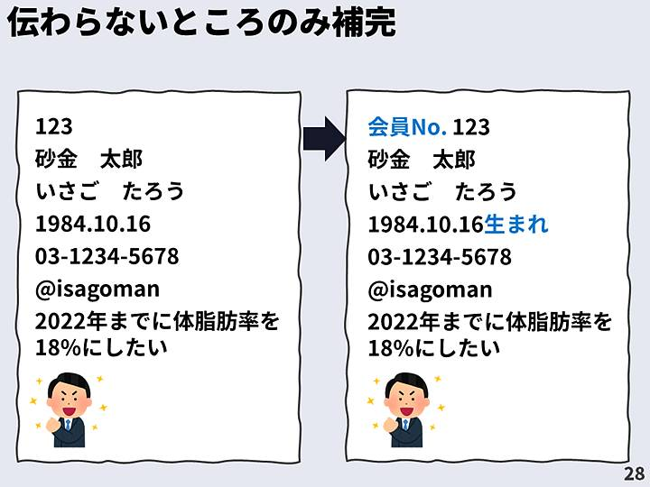
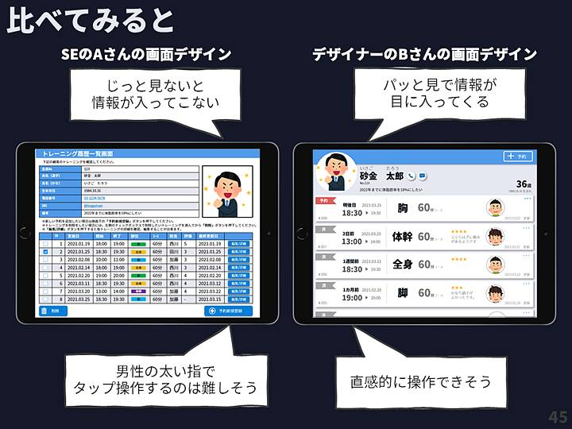

# エンジニアとデザイナーの思考の違いについて

## ① はじめに

大袈裟なタイトルになってしまいましたが

知り合いのエンジニアからqiitaで参考になったというエンジニアとデザイナーが設計するときにどういった視点で進めていくかが個人的にも面白かったので記事から抜粋と追記してまとめてみました。

デザイナーすごい！とかいう話ではないのでダラっと聞いていただけるとありがたいです。

また元の記事をご存知の方は優しい目で見守ってください。

## ② エンジニアとデザイナーの「思考」の違い

まず、こんなアプリを考えてみてください。

- トレーニングルームでお客様とお話しながら使います。
- 端末はタブレットを使用します。

そして以下のことが行えます。

- 会員の個人情報確認

- 前回までのトレーニング状況の確認

- 次回の予約受付
  
  

使える情報はこんな感じ。

> ※ **思考の違いを整理した内容なので、上記の情報しか使えない前提でお願いします**。
>
> デザインはデザイナーにさせろ、要件定義もっとちゃんとしろとかあるかと思いますが、話が広がりすぎるのでご容赦ください。

さてあなたならどう画面デザインをどうしますか？

今回の勉強会では、

- SEのAさん
- デザイナーのBさん

この二人が画面デザインをする際の過程を比べながら、その思考の違いを整理してみます。

※ 何度もお伝えしますが、**どちらが良い悪いの話ではありません**。

---

### SEのAさんの場合

#### （１）Aさんがはじめにしたこと

Aさんは、まずこのように、情報を表にまとめてきれいに整理しました。

#### （２）機能追加

次に、以下の機能を追加しました。

- 電話番号をクリックで電話アプリが立ち上がるリンク
- SNSもクリックでアプリが開くリンクの設定
- 予約の新規登録ボタンをタブレット画面の右下に配置
- 編集/詳細ボタンの追加、削除ボタンの追加
- 丁寧な説明文も追加

画面の設計がある程度できたので、ここから「**画面デザイン**」に入ります。

#### （３）デザイン装飾

デザインと装飾の主な内容

- 重要な「画面タイトル」や「ラベル」「ボタン名」などを目立たせる
  - 見出しの背景変更、白抜き文字
- ボタンをわかりやすくする（予約・編集・削除ボタン）
  - カラーも同系色。アイコンの追加
- 「トレーニングする部位」は情報を区別しやすいように
  - 部位の情報を色で識別
- 表の前後をわかりやすくするために行を縞々にする

デザイン作成した画面が以下になります。

いかがでしょう。

みなさんの考えた画面と比べて似ているところ、ありましたか?

---

### デザイナーのBさんの場合

一方で、デザイナーのBさんがどのように画面デザインをしたかご紹介します。

#### （１）Bさんがはじめにしたこと

次に、画面をシンプルにわかりやすくするため情報の取捨選択を行います。

たとえば、個人情報のラベルを全て削除して、ラベルがないとわからない部分のみ保管します。

次に、会員の個人情報をグループ分けし優先順位を設定します。

---

**Q.上記の個人情報、みなさんならどうやってグループ分けをして優先順位を決めますか？**

グループ

- 

優先順位

- 

---

今回の勉強会では仮で以下のように分類してみます。

> 優先順位 1： 個人の識別　（会員NO、氏名、ふりがな、顔写真）
>
> 優先順位 2： 連絡に使う　（電話番号、SNS）
>
> 優先順位 3： その他　コミュニケーション用　（生年月日、備考）

次にグループ内でも優先順位を設定します。

**Q.優先順位 1： 個人の識別グループで優先度をつけるならどうしますか？**

- (4) 会員NO

- (3) 氏名

- (2) ふりがな

- (1) 顔写真

今回の勉強会では仮で以下のように優先順位をつけてみます。

優先順位の決定に正解はありません。

しかし、ターゲットや利用状況を想定することで道筋は決めやすくなります。

グループの中で優先順位をつける過程で、

> 「連絡に使う電話番号やSNSは、直接アクセスできるようにするならそれっぽくアイコンのリンクとかにした方がいいよね。」
>
> 「生年月日より、何歳っていう表現の方が会話につながりやすいよね。」

と加工もあわせて行いました。

こちらも利用端末を今回はタブレットと仮定しているのでタップしやすいアイコンにしています。

そしていよいよ、レイアウトです。

> 「優先順位が高いものを上か左に配置」していくのが基本です。

先程の優先順位をもとに、情報に強弱つけながら以下の配置しました。

トレーニング履歴・予約情報も同様にグループ分けを行い、
グループの優先度、グループ内の優先順位を設定します。

わかりやすくするためにアイコン化できるかも考える。

#### （２）画面設計

レイアウトの候補としては

- 「表形式」…柔軟なソートや絞り込み、その場での編集が得意
- 「グリッド式」…ビジュアル要素がメインの場合を得意
- 「リスト形式」…順番が重要でかつ、ビジュアル要素もテキスト要素もまとめやすい
- 「カード形式」…「リスト形式」に似ているけど、さらに機能を追加しやすい

などいくつかの候補の中から、今回はビジュアル要素もテキスト要素も使え、機能も追加しやすい
「**カード形式**」を選択することにしました。

カードレイアウトに先程のデータを優先度順に配置。

#### （３）機能追加

そして、ここでやっと機能の追加を始めます。

- 「電話」と「SNS」のアクセス機能
- 「予約ボタン」
- 「編集・削除」機能へのメニュー表示
- カード選択による詳細表示

を追加しました。

そして最後に、どういう部品として認識して欲しいかで装飾をして、完成です!!

表示する内容をグループ分けし、優先度を設定して情報に強弱をつけることができました。

## ③ 2人の画面デザインを比べてみます。

同じ情報をもらっているのに結構違いがありますね。

ここでは二人の画面デザインの手順を復習してみましょう。

SEのAさんは、

> 1. ｢情報を表にまとめ」「機能を追加」しました。
> 2. わかりやすいように丁寧な説明をつけくわえました。
> 2. そこからデザインを始めて、「色付け」「装飾」を施しました。

つまり、Aさんの中で、画面デザインのことを画面設計の後にやる「＋α」「お化粧」と考えていました。

次に、デザイナーのBさんですが、

> 1. ｢どう使うかを考え」「情報のグループ化や優先順位付け、加工など」をしました。
> 2. ｢優先順位の順に情報を強弱をつけながら配置」して、「機能を追加」しました。
> 3. 画面全体の中でどういう部品であると認識してもらいたいかを意識して装飾をしました。

つまり、Bさんは「ここから設計」「ここからデザイン」という意識は全くなく、

`設計そのものがデザインであるという認識`でした。

このように、SEとデザイナーでは「思考」、具体的にいうと

「画面デザインの考え方」や「手順」、意識する「ポイント」が大きく違うことが理解できたと思います。

ただし、今回の前提条件ではこうなりましたが、デザインはお洒落さやかっこよさが目的ではなく、

あくまでターゲットユーザーにしっかりと伝わるか、使いやすいかどうかなので
`Aのデザインが悪い。良くないというわけではないです`。

このあたりで元記事では色々炎上してました。。。

## ④ 画面デザインの心得6箇条

### 1. いきなり表からつくりはじめない

誤解をしないでいただきたいのですが、これは表が悪いということではありません。

一度表を作ってしまうと、思考がどうしても固まってしまい、もしかしたら「グリッド形式」や「リスト形式」などがいい場合でも、それになかなか気づけなくなってしまいます。

なので、とりあえずいきなり表を作るのは我慢して、ジックリ比較して考えてみるというのが重要だということです。

### 2. なくてもいいものは削る

例えば、ラベル、情報の間を区切る線など絶対に必要なものだと思ってないでしょうか?

今回の例のように、場合によってはなくてもよかったりすることがあります。

「Simple is BEST」という有名な言葉がありますが、デザインではなくても伝わるものは

極力削っていくことが成功のカギと言われています。

是非、全てのものについて「絶対に必要だ」という固定観念にとらわれずに

一度立ち止まって考えてみるということをしてみてください。

### 3.情報は強弱をつける

全ての情報を同じサイズ、同じ色、同じ調子、で並べてしまうと、やはりどうしても左のように単調で、つまらない感じになってしまいます。

それを右のように優先順位順に強弱をつけて表現すると、パット見で情報が目に飛び込んできて、かつ魅力的に見せることが出来ます。

これを一般に「メリハリ」があると言います。

### 4.データの加工を厭わない

どうしても、データベースの値と画面の表示が同じにしてしまいがちだと思いますが、

ユーザーの使うシーンなどをイメージしながら、面倒でもデータの加工をしてあげるだけで、これだけ変わってきます。

出来る範囲で構いませんが、是非加工という意識をしてくれるとよいと思います。

### 5.装飾で「どういうものか」を表現する

装飾は「今風」とか「おしゃれ感」を演出するのではなく、
「ここは押せますよ」「選択していますよ」「ここは重要ですよ」「ここを押すとメニューがありますよ」ということを表現することに力をいれましょう。

そうすることで、丁寧な説明などがなくても直感的にユーザが理解してくれるようになり、わかりやすい画面となり、説明文でごちゃつくことがなくなります。

### 6.設計とデザインを線引きして区別しない

最後は、Aさんがやってしまっていたような、そもそも「設計」と「デザイン」という線引きをしないようにしましょう。ということです。

例えば、Aさんが作った画面設計をどんなに優秀なデザイナーさんに装飾してもらったところで、下の画面にはならないのはお分かりいただけますよね。

このように、限界値を決めてしまうことはとてももったいないです。

「`画面デザインとは画面設計`」であるという意識ができると違いが出てくると思います。

## ⑤ さいごに

最後に、誤解を与えないよう補足しておくと、

この記事では、「具体例を通して思考の違いを説明」しただけですので、必ずしも全ての状況でBさんの画面の方がよいと言っているものではありません。

また、エンジニアでもBの思考をお持ちの方もたくさんいらっしゃるとも思いますし、
実装がスピーディに手軽に出来るのは完全にAさんの画面です。

また、登場人物の考え方、手順、完成した画面についても、初級者にわかりやすくするためにつくられたフィクションです。

実際の考え方や最適なものとは異なる場合がございます。ご了承ください。

ありがとうございました。

引用元：[なぜエンジニアが作る画面はダサいのか…? 「理由」と「対策」を徹底解説](https://qiita.com/mskmiki/items/544149987475719e417b)

