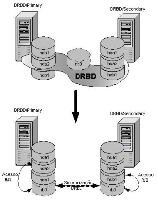
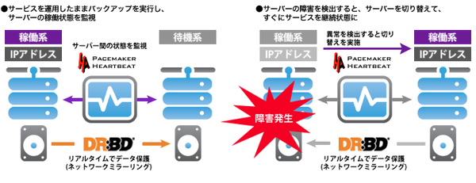
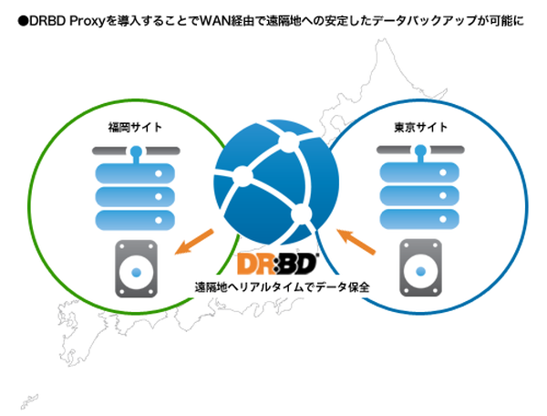
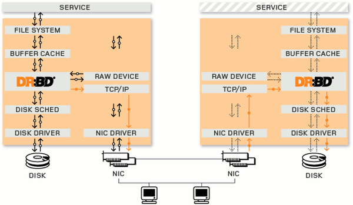

# 勉強会用DRBD資料

# 1. 概要
## 1.1 DRBDとは
DRBD(Distributed Replicated Block Device)は、  
TCP/IPネットワークを通じて複数のサーバ間のHDD（パーティション）をミラーリング（複製）するソフトウェアである。  
ネットワークを使ったRAID1環境がイメージとしては近い。  



## 1.2 メリット
* データ保護と同時にサービスのダウンタイムを最小化
* ネットワーク経由でデータをリアルタイムで同期
* 10Gigabit、InfiniBandの高速ネットワーク対応
* 障害発生時にサーバを切り替えてサービスを継続



* 災害に備えた遠隔地へのリアルタイムバックアップ  
（DRBD Proxyというオプションソフト使用。30日間無償）


## 1.3 採用事例
* 米国Midland 911
* ドイツ連邦共和国外務省
* 株式会社アイル
* 岐阜女子大学
* シチズン時計株式会社
* 岐阜女子大学

## 1.4 要件
## 1.4.1 ソフトウェア
* Linux OS  
Linuxのカーネルモジュールを必要とするため、Unix系OSででは動作しない。（OpenSolarisやFreeBSD等）  
ライセンス：GPLv2

## 1.4.2 ハードウェア
* 同様スペックのサーバが２台以上  
複数台サーバ間のパーティションを、ネットワーク越しにレプリケーションする為

---

# 2. 特徴
## 2.1 ネットワークレプリケーション
DRBDの最大の特徴は、HDD（パーティション）の複製を通常のTCP/IPネットワークを利用して実現することである。  
通常のネットワークを利用することで、特別なハードウェアを必要としない。  
Linux環境とミラーリングで使用するためのNICさえあれば、DRBDの構築は可能である。

## 2.2 ブロックデバイスで動作
DRBDはファイルシステムよりも低いレイヤーで動作し、  レプリケーションされたHDDをブロックデバイスとして使用可。  
端的に言えば、複製されているDRBDデバイスを通常のHDDと同じような感覚で使用することが出来る。  
それ故、データを保存するアプリケーションがミラーリングに対応する必要が無い。  
ほとんど全てのアプリケーションがDRBDによってリアルタイムにデータを複製しながら動作させることが出来る。

## 2.3 シェアードナッシング
多くのHAクラスタ環境は、データ領域を複数のサーバで共有する「共有ストレージ」を利用して実現されている。  
これは共有ストレージに障害が発生した場合にサービスが継続できないだけでなく、重要なデータの損失につながる可能性を持つ。  
DRBDは複数のサーバにネットワークを通じてミラーリングを実現しているため、共有ストレージを使用しない。  
これがDRBDで実現する「シェアードナッシング」のHAクラスタ環境である。  
共有ストレージという単一障害点の排除が可能な、HAクラスタ環境をDRBDで構築する事が出来る

---

# 3. DRBDの基本構成
## 3.1 構成概要
２台のサーバ間において、ハードディスク（パーティション）を複製する環境がDRBDの基本構成である。  
サーバは、DRBD専用を用途としたNICをクロスLANケーブルで直結させる。  
DRBDでミラーリングされたデバイスは通常のHDDと同様に扱うことが出来る。  
依って、DRBDデバイス（/dev/drbd0等）にファイルシステムを作成してマウントして使用する。  
DRBDデバイスの管理は、管理ツールで全て行い、接続の制御やデバイスのステータスの制御を行う。

## 3.2 ハードウェア構成
* サーバ２台（複数台可）
* ミラーリングに使用するネットワークカード
* クロスLANケーブル（直結用）
* ハードディスク（空きパーティション）

## 3.3 ソフトウェア構成
* Linux系 OS
* DRBDカーネルモジュール
* DRBDユーティリティ群（管理ツール）



---

# 4. 構築
## 4.1 前提となるソフトウェア設定
1. カーネルアップデート  
（古いとufwでエラーとなる）
```
$ sudo apt install linux-generic-hwe-16.04
```

2. ファイアウォールを無効化  
（作業簡易化・問題切り分けの為）

```
$ sudo ufw disable
```

3. apparmor無効化  
*DRBDではSELinuxは無効が推奨されている  
依って、redhat系でのSELinuxに該当する、apparmorとファイアウォールを無効化する*
```
$ sudo service apparmor stop
```

4. drdb8インストール  
ユーティリティインストールで本体も同時に入る
```
$ sudo apt-get -y install drbd8-utils
```


## 4.2 DRBD設定
*＊サーバ2台をそれぞれprimary（メイン）、secondary（待機）とする*  
*＊下記は特に記載が無ければ、primary / secondaryの両方で行うものとする*

1. 設定ファイル作成  

/etc/drbd.d/nyx.res

```
resource nyx { # リソース名
    net {
        protocol        C; #書き込みに使うプロトコル。A,B,CがありCが最も堅牢
    }
    volume 0 {
        device          minor 0; # DRBDブロック名 {名前 minor 番号} 省略した場合は勝手に割り当てられる（この場合だとdrbd0となる)
        disk            /dev/mapper/vg_nyx_storage-lv_nyx_storage; # 使用する実デバイスブロック名
        meta-disk       internal; # メタデータの保存場所。この場合はdrbd0の末尾に作成される
    }

    # それぞれのノード。ホスト名は uname -n で一致するものでなければならない
    on nyx-primary { #プライマリ
        address 10.0.1.1:7788;
    }
    on nyx-secondary { # セカンダリ
        address 10.0.1.2:7788;
    }
}
```

2. メタデータ作成  
指定する名前は上記のリソース名である

```
$ sudo drbdadm create-md nyx
```

3. DRBD起動
```
$ sudo drbdadm up nyx
```

4. 接続確認

primary
```bash
$ cat /proc/drbd

version: 8.4.10 (api:1/proto:86-101)
srcversion: 17A0C3A0AF9492ED4B9A418 
 0: cs:Connected ro:Primary/Secondary ds:UpToDate/UpToDate C r-----
    ns:1391104988 nr:8 dw:1391104996 dr:17621645 al:28523 bm:0 lo:0 pe:0 ua:0 ap:0 ep:1 wo:f oos:0
```

secondary
```bash
version: 8.4.10 (api:1/proto:86-101)
srcversion: 17A0C3A0AF9492ED4B9A418 
 0: cs:Connected ro:Secondary/Primary ds:UpToDate/UpToDate C r-----
    ns:0 nr:1391104988 dw:1391104988 dr:0 al:0 bm:0 lo:0 pe:0 ua:0 ap:0 ep:1 wo:f oos:0
```

5. 初期化
このサーバをprimaryとして認識させる  
データの同期が始まる（時間が大分掛かる）

```bash
$ sudo drbdadm --force primary nyx
```

6. DRBDデータ領域をフォーマット  
初期化完了後に行う  
primaryのみで行う  

```
$ sudo mkfs.ext4 /dev/drbd0
```

7. DRBD領域マウント  
primaryのみで実行（secondaryでは出来ない)

```
$ sudo mount /dev/drbd0 /storage
```
８. 終了  
アンマウント、secondaryに降格（スプリッドブレイン防止、下記の「代表的な障害」参照）、停止

```
$ sudo umount /storage
$ sudo drbdadm secondary nyx
$ sudo drbdadm down nyx
```

---

### 補足

同期処理の手順としては

* 片方のサーバをprimary指定
* DRBDブロックをマウント
* primaryにて書き込み

となる

secondaryはDRBDブロックがread onlyになるため、マウント出来ない  
（DRBD8以降ではactive/activeにする事も可能だが、現状では必要としていない為設定していない）  
secondary機をprimaryに昇格させ、ブロックをマウントするとprimary機で書き込まれていた内容が同期されていることが確認出来る

---

### 代表的な障害
#### スプリットブレイン
クラスタが分断された時にprimary機が複数存在してしまう状態の事  
この状態でデータ更新が掛かると、データの不整合が発生してしまう

case1. DRBD接続が切れている状態  

primary
```bash
# cat /proc/drbd

version: 8.4.8-1 (api:1/proto:86-101)
GIT-hash: 22b4c802192646e433d3f7399d578ec7fecc6272 build by mockbuild@, 2016-10-13 19:58:26
 0: cs:WFConnection ro:Primary/Unknown ds:UpToDate/Outdated C r-----
    ns:2048 nr:2058 dw:20542 dr:45063 al:2 bm:0 lo:0 pe:0 ua:0 ap:0 ep:1 wo:f oos:0
```

secondary
```bash
# cat /proc/drbd

version: 8.4.8-1 (api:1/proto:86-101)
GIT-hash: 22b4c802192646e433d3f7399d578ec7fecc6272 build by mockbuild@, 2016-10-13 19:58:26
 0: cs:WFConnection ro:Primary/Unknown ds:UpToDate/Outdated C r-----
    ns:2058 nr:2048 dw:30740 dr:65878 al:2 bm:0 lo:0 pe:0 ua:0 ap:0 ep:1 wo:f 
```

出力結果の**ro:Primary**と**cs:WFConnection**が確認ポイント。  
**ro:Primary**は、そのリソースがprimary機であることを示す値。  
両リソースが**ro:Primary**となっていたら、両方ともprimaryである = スプリットブレインが発生している。  
また、接続待ち状態であることを示す**cs:WFConnection**となっていたら、DRBDの接続も切れてしまっている。
（相手リソースを認識出来ていない）

case2. DRBDとして接続していないが、相手リソースを認識している

primary
```bash
# cat /proc/drbd 

version: 8.4.8-1 (api:1/proto:86-101)
GIT-hash: 22b4c802192646e433d3f7399d578ec7fecc6272 build by mockbuild@, 2016-10-13 19:58:26
 0: cs:StandAlone ro:Primary/Unknown ds:UpToDate/Outdated   r-----
    ns:2058 nr:2048 dw:32790 dr:71664 al:2 bm:0 lo:0 pe:0 ua:0 ap:0 ep:1 wo:f oos:2056
```

secondary
```bash
# cat /proc/drbd

version: 8.4.8-1 (api:1/proto:86-101)
GIT-hash: 22b4c802192646e433d3f7399d578ec7fecc6272 build by mockbuild@, 2016-10-13 19:58:26
 0: cs:StandAlone ro:Secondary/Unknown ds:UpToDate/Outdated   r-----
    ns:2048 nr:2058 dw:20545 dr:45063 al:2 bm:0 lo:0 pe:0 ua:0 ap:0 ep:1 wo:f oos:8
```
両リソースとも**cs:StandAlone**となっており、認識はしているが単独で動作している状態。  
**ro:Primary/Unknown**、**ro:Secondary/Unknown**と、それぞれprimary / secodaryとしての役割は認識出来ている。

#### スプリットブレインからの復旧
1. リソース接続切断  
（**cs:WFConnection**になってしまっている場合。該当サーバで行う）
```bash
# drbdadm disconnect nyx
```
両機とも**cs:StandAlone**となった事を確認する


2. nyx-secondaryのデータを破棄
（nyx-primaryのデータを真とする）
```bash
# drbdadm -- --discard-my-data connect nyx
```

3. 接続
（この場合はprimary機のみで行う）
```bash
# drbdadm  connect
```
---

## DRBDを使ってクラスタシステムを構築する際に使うソフトウェア
### 動作概要
Corosyncがノード死活監視を行う。
ノードがダウンした場合にはPacemakerへ通知し、リソース制御(ノード切り離し＋待機系ノードへのリソース引継ぎ)が実行される。

### Pacemaker
HAクラスタソフト(リソースマネージャクラスタ)。
Corosyncから障害通知を受け取って、praimary機 / secondary機の切り替えを制御する。

#### 主な特徴
* マシン/アプリケーションレベルの障害検出と回復
* 任意の冗長構成サポート
* 複数マシン障害に対応
* 複数マシンでアクティブにする必要があるアプリケーションをサポート
* 複数モードアプリケーション(マスター/スレーブ)をサポート等

*Pacemakerの役割は、あくまでもリソース（アプリケーション）の管理であり、  
実際の各アプリケーションの起動、停止などの制御は「リソースエージェント」が実施する。*

* リソースエージェント  
アプリケーションの起動、停止などを行います。(シェルスクリプト）

### Corosync
HAクラスタ構成の中でクラスタ通信層制御を担当するクラスタ基盤ソフトウェア。  
クラスタ通信フレームワークを提供し、クラスタ構成サーバ間でノードの死活監視を行う。

#### 主な特徴
* 仮想同期保証を備えた閉鎖プロセスグループ通信モデル(複製された状態マシンを作成)
* シンプルアベイラビリティマネージャ(アプリケーションプロセスが失敗した場合にアプリケーションプロセスを再起動)
* 構成および統計インメモリデータベース(情報の変更通知を設定/取得/受信)等

##### Pacemaker連携
Corosyncはクラスタ通信層制御機能は持つが、リソース監視/制御機能を持っていない。  
その為、リソース監視/制御機能を持つPacemakerと連携させて、クラスタシステムを構成する。

