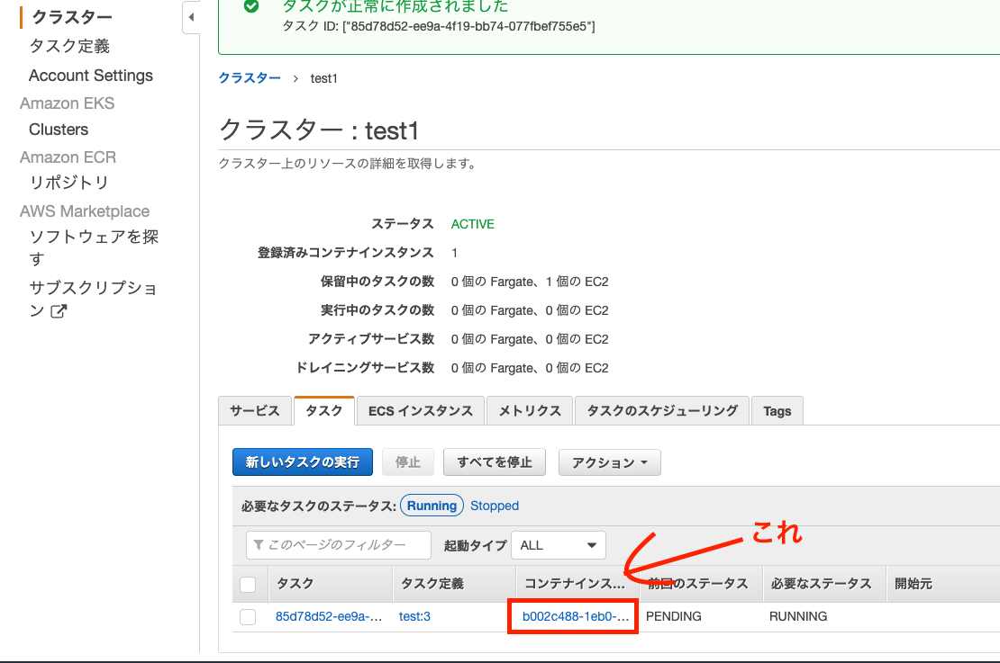

## 前提
今回のハンズオンを進めるにあたって、事前に以下の準備をお願いします。  

- ecs-cliのインストール  
2019年6月に導入された機能を使用するため、最新版(1.15.1)を導入してください。   
->[参考サイト](https://docs.aws.amazon.com/ja_jp/AmazonECS/latest/developerguide/ECS_CLI_installation.html) 
- AWS CLI認証情報の設定(サブアカウント)
- マネジメントコンソールへのログイン(サブアカウント)


## 勉強会の概要
- ECSの概要
- ECSコンソールを用いたコンテナの起動
- ecs-cliを用いたcomposeファイルとタスク定義の相互変換

## ECS概要
### ECSとは？ 
ECSはコンテナのオーケストレーションサービスです。  
ECSを使用することで、クラスターでDockerコンテナを簡単に実行、停止、管理することができます。
類似サービスにKubernetesなどが存在しています。


## EKS(Elastic Kubernetes Service)との違い
### ECSの特徴
- シンプル
- Fargate(後述)が便利
- AWS独自仕様

### EKSの特徴(らしい)
- 学習コストが高い
- 自由度が高い
- AWS以外への移行が容易(Kubernetesなので)


ECSで間に合うならECSを使う。  
複雑な設定が必要な場合はEKSを使う。  
らしいです。


## Fargate
サーバーやクラスターの管理をマネージドしてくれるサービスです。  
Fargateを使わない場合、ECSはEC2上でコンテナを管理することになりますがこれは少しめんどくさいです。  
しかしFargateを用いることで、EC2の管理を行わずにコンテナを操作することが可能になります。


特徴としては以下のとおりです。
- インフラ部分の管理が不要
- 勝手にスケーリングしてくれる
- リソースを有効活用できる

要するにコンテナの大きさに合わせてFargateが自動でリソースを設定してくれます。  
そのため後でコンテナを追加することになってもFargateが勝手にリソースを増やしてくれますし、（オートスケーリング）  
コンテナに対してそんなにリソースが必要ないのにクラスターを大きく設定してしまった！みたいなこともありません。(リソースの有効活用)

Fargateの方がEC2より少し値段は高いですが、スケーリングを勝手にやってくれるため、リソースに対する費用は安くなることが多いようです。  
2019年1月に大幅な値下げがあり、かなり安くなっている(らしいです)。

## 仕組み


引用: http://www.mpon.me/entry/2017/11/19/200000

概略図はこんな感じです。  
この画像を使って、ECSの仕組みを説明していきたいと思います。

このECSインスタンスでは
- 2つのEC2インスタンスから成る『クラスター』の上で、
- 4つの『タスク』(ここではnginxコンテナ)が動いており、
- そのタスクの数とロードバランサーを『サービス』が管理している

という構成になっています。  
この**タスク**、**クラスター**、**サービス**についてそれぞれ見ていきたいと思います。

### タスク
タスク定義を元に生成された個々のコンテナグループです。  
dockerでいうとcompose upで起動した各コンテナ郡です。  
今回の例では1タスクに1個のnginxコンテナが動いているだけですが、もちろんdocker-composeと同じように1タスク内に複数のコンテナを含むこともできます。

### タスク定義
上述したタスクを定義するもので、コンテナの詳細を記述するテキストファイルです。  
dockerにおけるdocker-composeファイルのような概念です。
- どんなコンテナを立ち上げるか(= build, from)
- コンテナ間の通信(= ports)
- マウント(= volumes)

などを定義することができます。  
dockerのようにymlではなく、JSONで管理されます(AWS独自仕様です)。

### クラスター
ECSではクラスター上にタスクを配置してコンテナを動かします。  
クラスターはリソースの論理グループであり、EC2インスタンス(またはFargate)が1つまたは複数集まってできています。

### サービス
ECSにはサービスという概念があり、以下の2つのことを管理する仕組みを提供しています。
- クラスター上のタスクの数を監視する  
上の図であればコンテナの数を4つと指定しています。(desire_count = 4)  
サービスでコンテナの数を定義しておくことで、コンテナが落ちてしまったときに自動で新しくコンテナを立ち上げてくれます。  
- ロードバランサー  
ロードバランサーで負荷分散してくれます。

今回のハンズオンでは、これらの機能は使わないためサービスは作成しません。  
ただし、実際の運用では確実に使用することになると思います。

### 仕組みまとめ
タスク＝コンテナグループ  
クラスター＝この上でタスクが動く  
サービス＝タスク管理とロードバランサー  

こんな感じです。

## ECSのコンソール画面でDockerを動かす（ハンズオン）
それでは実際にECSを使ってDockerを動かしていきたいと思います。  
まずクラスターを生成し、次にnginxのタスク定義を作成します。  
その後タスク定義から生成したタスクをクラスター上で動かしてみたいと思います。

### クラスターの作成
ブラウザからECSのコンソール画面にアクセスしてください。  
クラスター→クラスターの作成と押すとクラスターテンプレートの選択画面に移ります。


テンプレートはFargate、EC2 Linux、EC2 Windowsの3つから選ぶことができます。
EC2 Windowsに関してはサポートされていない項目が多いようなので、ほとんどの場合FargateかEC2 Linuxを選ぶことになると思います。  
今回は料金の関係からEC2 Linuxを使ってクラスターを作成しておきますが、先にFargateの設定もさらっと見ておきましょう。  

Fargateを選択して次に進みます。


後でEC2のクラスターを作成するときに比べていただくとよくわかるのですが、設定する項目がとても少ないです。  
通常EC2で必要なインスタンスタイプなどの設定がないため、名前だけ設定してやればクラスターを作成することができます。  

ここではFargateは使用しないため、キャンセルで前の画面に戻ってください。
今度はEC2インスタンスを選択し、次に進みます。


先程のFargateと比較すると項目が増えているのがわかります。  
EC2を選択した場合、クラスターを構成するEC2の設定をしてやる必要があるため、その分項目が長くなっています。

それでは実際にクラスターを作成していきましょう。

以下のように設定を入力します。
```
クラスター名: (他の人とかぶらない)適当な名前を入力
EC2インスタンスタイプ: t2.micro
インスタンス数: 2
コンテナインスタンスIAMロール: ecsInstanceRole
```
入力したら最下部の作成ボタンを押してクラスターを作成します。  
作成処理完了後、クラスター一覧画面からクラスターが作成されていることを確認できます。

今回はインスタンスの数を2に設定しています。  
ECSインスタンスのタブをクリックすると、このクラスターがEC2インスタンス2つから構成されていることを確認できます。


### タスク定義の作成
次に、タスク定義を作成していきます。  
メニューのタスク定義->新しいタスク定義の作成と押すと起動タイプの選択画面に移ります。


EC2を選択して次に進みます。


以下のように情報を入力します。
```
タスク定義名: 適当な名前を入力
タスクロール: ecsTaskExceutionRole
タスク実行ロール: ecsTaskExceutionRole
```
次にコンテナの追加から起動するコンテナの情報を入力していきます。  
今回はnginxを立ち上げていきたいので以下のように設定を入力します。
```
コンテナ名: nginx
イメージ: nginx:alpine
ハード制限: 128
ポートマッピング: 
    ホストポート: 80 コンテナポート: 80
```
入力後、追加ボタンを押してnginxのコンテナを追加します。  
最後に作成ボタンを押してタスク定義の作成は終了です。

### タスク定義からタスクを作成する
先程作成したタスク定義からクラスターにタスクを追加していきます。  
クラスター一覧画面から先程自分が作成したクラスターを選択します。


その後タブのタスク->新しいタスクの実行を選択するとタスクの実行画面に移ります。  
以下のように設定を入力します。
```
起動タイプ: EC2
タスク定義: 先程作成したタスクを選択
```
設定を入力したらタスクの実行ボタンを押してください。  
「タスクが正常に作成されました」と表示され、タスク一覧に先程作成したタスクが表示されます。

ステータスがPENDINGからRUNNINGに変わったらコンテナにアクセスすることが可能になります。  
コンテナインスタンスの文字列をクリックし、表示されたパブリックIPにアクセスするとnginxの初期画面が表示されるかと思います。



これで、コンソールを使用したコンテナの起動が完了しました。

## ecs-cliを用いたcomposeファイル->タスク定義の変換（ハンズオン2）
先程行ったようにコンソールを操作してもいいのですが、タスク定義≒composeファイルなので、できればcomposeファイルからタスク定義を自動で生成したいところです。  
ecs-cliにその機能があるため、実際にハンズオンでタスク定義の生成を行ってみたいと思います。  
ちなみに2019年6月にアップデートされた機能らしいです。

/handson/2を参照してください。  
nginxとfpmを立ち上げるシンプルなcomposeファイルを用意しました。
```
version: '3'

services:
  nginx:
    image: nginx:alpine
    volumes:
      - ./nginx/:/etc/nginx/conf.d
    ports:
      - 9090:80
    links:
      - php-fpm
    depends_on:
      - php-fpm
    command: ["nginx", "-g", "daemon off;"]

  php-fpm:
    image: php:7.3.4-fpm-alpine3.9
    volumes: 
      - ./php-fpm/:/var/www/test
```
9090番にアクセスすると「test」と表示されるだけの簡単なプログラムです。  
このcomposeファイルからタスク定義を生成していきます。

/handson/2内で以下のコマンドを実行してください。
```
ecs-cli compose --project-name かぶらない名前 create 
```
実行した後ECSのコンソールに入ってタスク定義を見ると、タスク定義が生成されていると思います。  
ちなみにコマンド実行時WARNINGが出て、depends_onがサポートされていないと怒られたと思います。  
こんなふうにサポートされていないオプションは結構あります。  
そのため、最終的には手動で設定してやる必要が出てくる場合が多いです。  
詳細についてはREADEM.appendix.mdに書いています。（あんまり整ってないです）

## ecs-cliを用いたタスク定義→composeファイルの変換（ハンズオン3）
ecs-cliを使って、逆にタスク定義からcomposeファイルを生成することもできます。  
先程作成したタスク定義のJSONからcomposeファイルを作成してみます。  
コンソール画面から先程作成したJSONをコピーし、task-definition.jsonという名前をつけて保存します。


その後以下のコマンドを実行します。
```
ecs-cli local create
```
カレントディレクトリにcomposeファイルが作成されたと思います。  
composeファイルの他にoverrideというファイルが作成されていますが、これについては後で説明します。

作成したcomposeファイルの起動にはecs-cli local upコマンドを使います。  
起動後はecs-cli local psコマンドでコンテナが動いていることを確認してください。
```
ecs-cli local up --task-def-compose docker-compose.ecs-local.yml

ecs-cli local ps

//見えない場合
ecs-cli local ps -f task-definition.json
```
localhost:9090に接続するとページもちゃんと表示されます。  
ちなみにこのときdocker psするとnginxとfpm以外にecs-local-container-endpointsというコンテナが動いています。  
これがエンドポイントを提供しているらしいです（エンドポイントが何かはよくわかってないです）。

立ち上げたコンテナは
```
ecs-cli local down
```
で消せます。

### overrideファイルについて
名前のままですが、このファイルに書いた内容でdocker-compose.ecs-local.ymlの内容を上書きしてコンテナを起動してくれます。  
元々のymlを変更しないでコンテナの情報を書き換えられるため、ymlの内容を追加・変更したい場合は基本的にoverride.ymlを変更する方がよいでしょう。

使い方は、
```
ecs-cli local up --override docker-compose.ecs-local.override.yml
```
としてやるとoverrideの内容を反映して起動できます。

## composeファイルとタスク定義を別々に管理しなくてよくなる！（かも）
このようにecs-cliでcomposeファイルとタスク定義を相互変換してやることで、別々に管理する手間を省くことができます。

ただし現状では完全な相互変換が行えないため、結局は変換したファイルや定義を更に編集してやる必要が多くの場合出てきます。  
特にvolume関連でエラーが出やすいです。

またesc-cliを用いてクラスターを作成したり、直接ARNを利用してローカルでコンテナを起動できる（？）らしいです。  
(ARNが何なのかよくわからなかったのですが便利らしいです。)   
https://dev.classmethod.jp/cloud/aws/ecs-local/


## まとめ
- ECSでコンテナをオーケストレーションできる
- ecs-cliを用いてタスク定義とcomposeファイルの相互変換が行える
- しかし相互変換は完全ではない

## 参考にした資料
- https://docs.aws.amazon.com/ja_jp/AmazonECS/latest/developerguide/ECS_CLI_reference.html
- https://dev.classmethod.jp/cloud/aws/ecs-local/
- https://qiita.com/HiromuMasuda0228/items/2170032142ae1c33adcc#service

ちなみにecs-cli local createの日本語ドキュメントは間違っていて説明が逆になっているので注意です。(2019/08/28時点)  
(本当はタスク定義->composeファイルなのに説明はcomposeファイル->タスク定義になっている)
