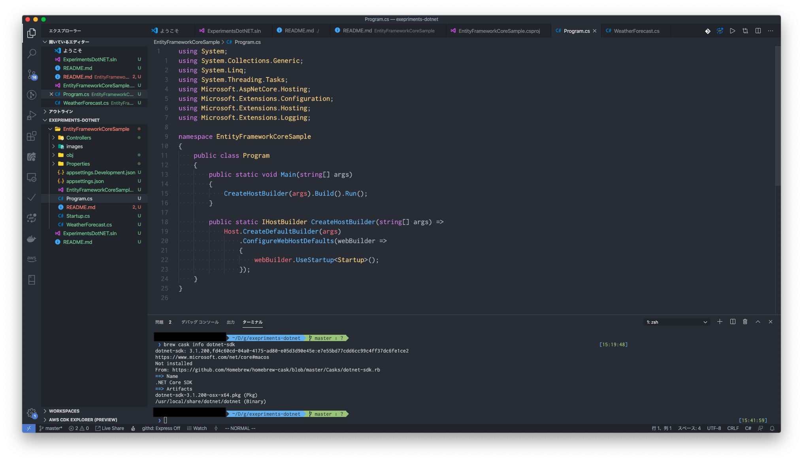
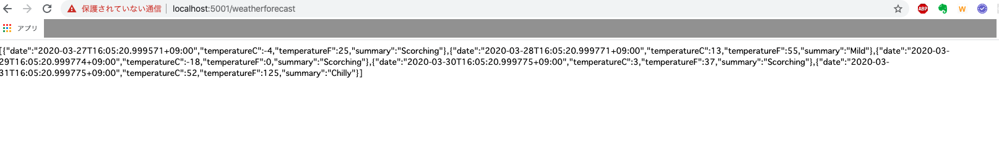
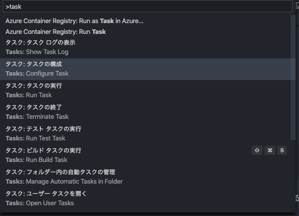
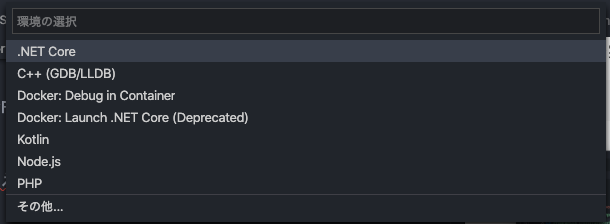
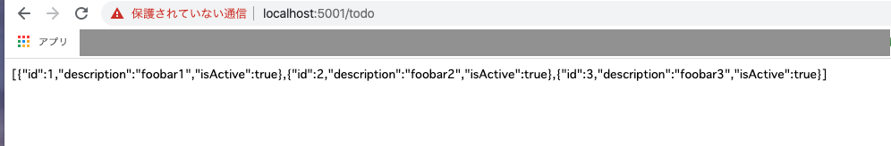

EntityFrameworkCoreSample
====

EntityFrameworkSample

## 開発環境の準備
### .NET Core SDKのインストール
#### インストーラーによるインストール
[.NET Core](https://dotnet.microsoft.com/download)からインストーラーをダウンロードして、インストールする

#### コマンドラインからのインストール
- コマンドラインからのインストールは、各環境のパッケージマネージャーを利用する。

__macOS__
```sh
$ brew cask install dotnet-sdk
```

__Windows__
```sh
scoop install dotnet-sdk
```

__Linux__
```sh
wget -q https://packages.microsoft.com/config/ubuntu/18.04/packages-microsoft-prod.deb -O packages-microsoft-prod.deb
sudo dpkg -i packages-microsoft-prod.deb

sudo add-apt-repository universe
sudo apt-get update
sudo apt-get install apt-transport-https
sudo apt-get update
sudo apt-get install dotnet-sdk-3.1
```

#### EntityFrameworkCoreツールのインストール
.NET Core SDKにはEntityFrameworkCoreのツールがインストールされないので、`dotnet tool`コマンドよりインストールをする
```sh
dotnet tool install --global dotnet-ef
```

### VSCodeの設定
- Visual Studio Codeを利用してる場合、`C#`拡張をインストールしておくとよい
- Visual Studioが使えるのならそちらの方がよい

## プロジェクトのセットアップ
- プロジェクトをセットアップする前にdotnetコマンドのヘルプを確認する

```sh
dotnet help
.NET Core SDK (3.1.200)
使用法: dotnet [runtime-options] [path-to-application] [arguments]

.NET Core アプリケーションを実行します。

runtime-options:
  --additionalprobingpath <path>   調査ポリシーと調査対象アセンブリを含むパス。
  --additional-deps <path>         追加の deps.json ファイルへのパス。
  --fx-version <version>           アプリケーションを実行するために使用するインストール済み Shared Framework のバージョン。
  --roll-forward <setting>         フレームワーク バージョン (LatestPatch、Minor、LatestMinor、Major、LatestMajor、Disable) にロールフォワードします。

path-to-application:
  実行するアプリケーション .dll ファイルへのパス。

使用法: dotnet [sdk-options] [command] [command-options] [arguments]

.NET Core SDK コマンドを実行します。

sdk-options:
  -d|--diagnostics  診断出力を有効にします。
  -h|--help         コマンド ラインのヘルプを表示します。
  --info            .NET Core 情報を表示します。
  --list-runtimes   インストール済みランタイムを表示します。
  --list-sdks       インストール済み SDK を表示します。
  --version         使用中の .NET Core SDK バージョンを表示します。

SDK コマンド:
  add               .NET プロジェクトにパッケージまたは参照を追加します。
  build             .NET プロジェクトをビルドします。
  build-server      ビルドによって開始されたサーバーとやり取りします。
  clean             .NET プロジェクトのビルド出力をクリーンします。
  help              コマンド ラインのヘルプを表示します。
  list              .NET プロジェクトのプロジェクト参照を一覧表示します。
  msbuild           Microsoft Build Engine (MSBuild) コマンドを実行します。
  new               新しい .NET プロジェクトまたはファイルを作成します。
  nuget             追加の NuGet コマンドを提供します。
  pack              NuGet パッケージを作成します。
  publish           .NET プロジェクトを配置のために公開します。
  remove            .NET プロジェクトからパッケージまたは参照を削除します。
  restore           .NET プロジェクトに指定されている依存関係を復元します。
  run               .NET プロジェクトの出力をビルドして実行します。
  sln               Visual Studio ソリューション ファイルを変更します。
  store             指定されたアセンブリをランタイム パッケージ ストアに格納します。
  test              .NET プロジェクトに指定されているテスト ランナーを使用して、単体テストを実行します。
  tool              .NET のエクスペリエンスを向上するツールをインストールまたは管理します。
  vstest            Microsoft Test Engine (VSTest) コマンドを実行します。

バンドルされたツールからの追加コマンド:
  dev-certs         開発証明書を作成し、管理します。
  fsi               F# Interactive を開始するか、F# スクリプトを実行します。
  sql-cache         SQL Server キャッシュ コマンドライン ツール。
  user-secrets      開発ユーザーのシークレットを管理します。
  watch             ファイルが変更されたときにコマンドを実行するファイル ウォッチャーを起動します。

コマンドに関する詳細情報については、'dotnet [command] --help' を実行します。
```

dotnet sdkコマンドの内、`build`, `new`, `add`, `clean`はよく使用するので覚えておくとはかどる。

- 次に、ソリューションファイルを作成する
```sh
mkdir ExperimentsDotNet
cd ExperimentsDotNet
dotnet new sln
```

- そして、プロジェクトを作成する
```sh
dotnet new webapi -o EntityFrameworkCoreSample
```

- ここまでを実行した状態でとりあえずひな形ができているので、Visual Studio Codeで開く
```sh
code .
```



### テスト実行する
- プロジェクトのセットアップが終わったので、いったんここまでの内容で実行をする

- ターミナルから実行するには、以下のコマンドを実行する。

```sh
cd EntityFrameworkCoreSample
dotnet build
dotnet run
```

- 実行してブラウザから`https://localhost:5001/weatherforecast`にアクセすると次の結果が表示される。



- 同様にGUIから実行するには以下の手順を実行する
- コマンドパレットから、タスクの構成を選択し`tasks.json`を作成する



- アクティビティバーからデバッグを選択し、`create a launch.json file`をクリックして、launch.jsonを作成する



- `launch.json`を作成すると、デバッグパネルのRUNメニューが有効になるので、`.NET Core Launch`が選択された状態で実行ボタンを押すとデバッグ実行される。

## EntityFramworkCoreを利用する
### EntityFrameworkCoreパッケージのインストール
- EntityFrameworkのパッケージをプロジェクトにインストールするために以下のコマンドを実行する

```sh
dotnet add package Microsoft.EntityFrameworkCore.SQLite
dotnet add package Microsoft.EntityFrameworkCore.Design
```

### モデルを作成する
- モデル層のディレクトリを作成し、`TodoEntity.cs`と`TodoContext.cs`を作成する

```sh
mkdir Models
touch Models/Todo.cs
touch Models/TodoContext.cs
```

__【Models/Todo.cs】__
```cs
using System.Collections.Generic;

namespace EntityFrameworkCoreSample.Models
{
    /// <summary>
    /// Todoエンティティ
    /// </summary>
    public class Todo
    {
       /// <summary>
       /// Id
       /// </summary>
       /// <value></value>
       public int Id { get; set; }
       
       /// <summary>
       /// Description
       /// </summary>
       /// <value></value>
       public string Description { get; set; }


       /// <summary>
       /// isActive
       /// </summary>
       /// <value></value>
       public bool isActive { get; set; }

    }
}
```

__【Models/TodoContext.cs】__
```cs
using Microsoft.EntityFrameworkCore;

namespace EntityFrameworkCoreSample.Models
{   

    /// <summary>
    /// TodoContext
    /// </summary>
    public class TodoContext: DbContext
    {
        /// <summary>
        /// コンストラクタ
        /// </summary>
        /// <param name="options"></param>
        public TodoContext(DbContextOptions<TodoContext> options)
            :   base(options) 
        {

        }

        ///<summary>
        /// モデル生成時に呼ばれるライフサイクルメソッド
        ///</summary>
        ///<param name="modelBuilder"></param>
        protected override void OnModelCreating(ModelBuilder modelBuilder)
        {
            // データのシードを定義
            modelBuilder.Entity<Todo>().HasData(
                new {Id = 1, Description="foobar1", isActive=true},
                new {Id = 2, Description="foobar2", isActive=true},
                new {Id = 3, Description="foobar3", isActive=true}
            );
            
        }

        /// <summary>
        /// DbSet
        /// </summary>
        /// <value></value>
        public DbSet<Todo> Todo {get; set;}
    }   
}
```

- モデルを定義したら、`Startup.cs`に初期化処理を追加する

__【Startup.cs】__
```cs
using System;
using System.Collections.Generic;
using System.Linq;
using System.Threading.Tasks;
using Microsoft.AspNetCore.Builder;
using Microsoft.AspNetCore.Hosting;
using Microsoft.AspNetCore.HttpsPolicy;
using Microsoft.AspNetCore.Mvc;
using Microsoft.Extensions.Configuration;
using Microsoft.Extensions.DependencyInjection;
using Microsoft.Extensions.Hosting;
using Microsoft.Extensions.Logging;
using EntityFrameworkCoreSample.Models;
using Microsoft.EntityFrameworkCore;

namespace EntityFrameworkCoreSample
{
    public class Startup
    {
        public Startup(IConfiguration configuration)
        {
            Configuration = configuration;
        }

        public IConfiguration Configuration { get; }

        // This method gets called by the runtime. Use this method to add services to the container.
        public void ConfigureServices(IServiceCollection services)
        {
            services.AddControllers();
            //この行を追加
            services.AddDbContext<TodoContext>(options=> options.UseSqlite(
                Configuration.GetConnectionString("TodoContext")
            ));
        }

        // This method gets called by the runtime. Use this method to configure the HTTP request pipeline.
        public void Configure(IApplicationBuilder app, IWebHostEnvironment env)
        {
            if (env.IsDevelopment())
            {
                app.UseDeveloperExceptionPage();
            }

            app.UseHttpsRedirection();

            app.UseRouting();

            app.UseAuthorization();

            app.UseEndpoints(endpoints =>
            {
                endpoints.MapControllers();
            });
        }
    }
}

```

- データベースへの接続情報をappsetting.jsonに記載する
```js
{
  "Logging": {
    "LogLevel": {
      "Default": "Information",
      "Microsoft": "Warning",
      "Microsoft.Hosting.Lifetime": "Information"
    }
  },
  "AllowedHosts": "*",
  "ConnectionStrings": {
    "TodoContext": "Data Source=./WebApplication.db"
  }
}
```

### マイグレーションを実行する
- モデルの定義、初期化、接続情報の設定ができればマイグレーションができる。
- 以下のコマンドでマイグレーションが実行できる。

```sh
$ dotnet efnmigraions add InitialCreate
Build started...
Build succeeded.
The EF Core tools version '3.1.2' is older than that of the runtime '3.1.3'. Update the tools for the latest features and bug fixes.
Done. To undo this action, use 'ef migrations remove'
```

- マイグレーションした結果はMigraionsディレクトリに配置される

- このマイグレーションファイルを、データベース（今回はSQLite）に反映するには、以下のコマンドを実行する。

```sh
dotnet ef database update
Build started...
Build succeeded.
The EF Core tools version '3.1.2' is older than that of the runtime '3.1.3'. Update the tools for the latest features and bug fixes.
Done.
```

- プロジェクト直下に、WebApplication.dbが作成されていれば成功。

### コントローラーを修正する
- マイグレーションができたら、コントローラーを修正してコントローラー経由でデータを取得できるよう変更を加える。
  - ディレクトリ直下の`WeatherForecast.cs`は不要なので削除する。
  - `Controllers/WeathreForecastController.cs`を改修し、`TodoController`とします。

 

 - 以上でデータの取得まで出来ました。 
