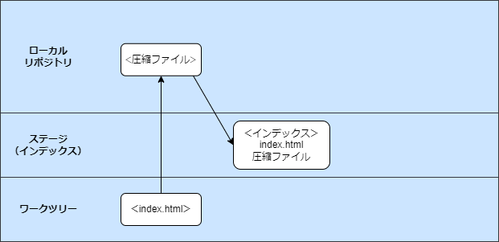
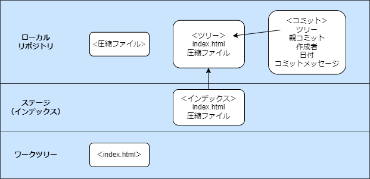
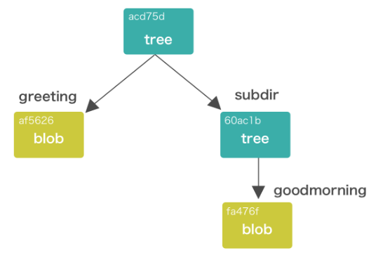
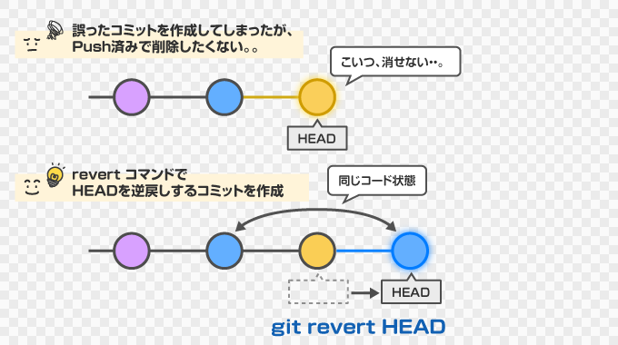
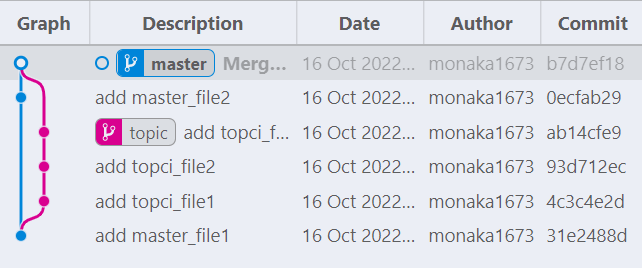

# Git

仕組みと修正コマンド

<style type="text/css">
  .reveal h1,
  .reveal h2,
  .reveal h3,
  .reveal h4,
  .reveal h5,
  .reveal h6 {
    text-transform: none;
  }
</style>


---

## 目次

1. Git の仕組み
   1. Gitのデータ
   2. Gitオブジェクト
   3. Gitオブジェクトの管理
2. 修正コマンド
   1. git revert
   2. git reset

note:目次はこのようになっています。最初にGitの仕組みについて触れてから、修正コマンドについてお話します。

---

## 1.Git の仕組み

---

## 1-1.Gitのデータ

--

### Git はスナップショット？差分？

--

### Git はデータをスナップショット<br>として保存する

note:git graph などで差分を確認していると、差分だけ登録しているのかなと思ってしまいました

--

### スナップショットで<br>保存するメリット

- 操作の高速化
  - ブランチをきったりマージする際に、差分計算が不要
- 堅牢なデータ管理の実現
  - コミット同士が疎結合になる
  - 前のコミットが消えてしまっているからあるコミットが復元できない、ということが起きない

---

## 1-2.Gitオブジェクト

--

### ローカルの３つのエリア


--

### Git が変更履歴を保存するときに<br>記録しているスナップショット

- 圧縮ファイル
- ツリーファイル
- コミットファイル

--

# ?　

note:言葉ではわかりづらいので図や実際の動作と一緒に確認します

--

### コミットまでの流れを<br>イメージで確認

1. index.html を作成
2. git add
3. git commit

note:厳密に全ての処理を網羅できていない説明です

--

### git add



1. index.html のファイルの中身を圧縮したファイルを作成し、ローカルリポジトリに保存
2. ファイル名「index.html」と、内容にあたる「圧縮ファイル」をマッピングした情報をインデックスに追加

note:【1 の捕捉】このとき保存されるファイル名は、ファイル の 中身 に ヘッダ を 付け加え た文字 列 を ハッシュ 関数で 暗号 化 し た 文字 列 になります

--

### git commit



1. インデックスのファイル構成を元にツリーファイルを新規作成
2. コミットファイルの作成

note:この関係性を理解することが、Gitの理解に役立ちます

--

### 「Gitオブジェクト」

- 圧縮ファイル
- ツリーファイル
- コミットファイル

保存場所：「.git/objects」フォルダ配下

---

## 1-3.Gitオブジェクトの<br>管理

--

### まとめ

- blobオブジェクト
  - ファイルの中身そのものを圧縮したもの
- treeオブジェクト
  - ファイル名とファイルの中身の組み合わせ<br>（ファイル構造）を保存しているもの
  - ディレクトリに対応している



--

### まとめ

- ソースコードその他の管理対象は、ファイルごとに圧縮され、ファイル中身に（ほぼ）固有の数値（ハッシュ値）で管理される。
- ある時点でのスナップショット（gitで言うコミット）はディレクトリ構造を反映した木構造とハッシュ値で管理される。

note:【メモ】HEAD：最新のコミット／HEAD~1つ前の履歴を参照【参考】https://kftamang.github.io/post/git/

--

#### データ構造を知ることが<br>コマンドの理解に役立ちます🙈

---

## 2.修正コマンド

---

## 2-1.git revert

--

### イメージで理解



1つ以上の既存のコミットがある場合、関連するパッチが導入した変更を元に戻し、それらを記録するいくつかの新しいコミットを記録する

note:公式より

--

### git revertコマンド

使い方
```
$ git revert <対象のcommit>
```
例
```
# 現在のコミットの打ち消しコミットを作成
$ git revert HEAD
$ git revert

# commitのハッシュ値を指定して打ち消しコミットを作成
$ git revert dd9f2940

# 過去２つ前のコミットの打ち消しコミットを作成
$ git revert HEAD~2

# 範囲指定して打ち消しコミットを作成
$ git revert master~5..master~2
```

note:ハッシュ値の指定について、Githubの中の人がリポジトリ内なら4桁でも検索可能だとお話している記事がありました。プロジェクトの大きさによって、特定に必要なハッシュ値はもっと大きくなりますが、キングでは今のところ何桁でした

--

### git graph で操作を確認

--

### ⚠️マージコミットの打ち消しには<br>気を付けろ！

--

### マージコミットに対して<br>普通にrevertすると…

```
$ git revert b7d7ef1
error: commit b7d7ef182809ce32ea1251e90dd75de5932d9518 is a merge but no -m option was given.
fatal: revert failed
```

「-m オプションが指定されていません」😤

--

### なぜマージコミットは通常の<br>コマンドでは実行できないのか？

--

### マージコミットは<br>parent(親)を２つ持つ！



- 問題点：親コミットが複数あるとどの歴史が<br>「正（mainline）」か分からないため、<br>Gitが実行に移れない
- 解決策：親を指定する

note:実際のVSCODEを立ち上げて、Synergyとかでマージされてるブランチを確認すれば、親コミットが２つあることがわかる

--

### 親の確認

```sh
# 使い方
$ git show <打ち消したいcommit>
# 例
$ git show b7d7ef182809ce32ea1251e90dd75de5932d9518
commit b7d7ef182809ce32ea1251e90dd75de5932d9518 (HEAD -> master)
Merge: 0ecfab2 ab14cfe
Author: monaka1673 <ukkari9683@outlook.jp>
Date:   Sun Oct 16 11:42:01 2022 +0900

    Merge branch 'topic'

```
  
親番号1：0ecfab2  
親番号2：ab14cfe

note:【先に準備しておく】https://qiita.com/shyamahira/items/22c4a2423c21c288cb8e

--

### マージコミットの打ち消し

使い方
```
$ git revert -m <親番号> <打ち消したいcommit>
```
例
```
$ git revert -m 1 b7d7ef
```

note:https://www-creators.com/archives/2111
note:https://www-creators.com/git-command/git-revert

--

### マージコミットの打ち消し

git graph での操作も確認

---

## 2-2.git reset

--

### 例）以下のようなリポジトリが<br>あったとします


--

### git reset --soft


note:HEADが指し示すブランチが移動します。今回の場合、HEADはmasterブランチを指し示しているため、masterブランチが移動し、結果としてHEADが１個前のコミットを指し示すようになります。この状態でgit logコマンドを実行してコミットログを確認すると、V３のコミットは消えています。Git　revertは過去のコミットを残したまま、打ち消したコミットを作成していましたが、GIT　RESETではコミットを削除してしまいます。

--

### git reset --mixed


note:まず先程と同様にコミットが取り消され、かつ、HEADが指し示すコミットのスナップショットでインデックスを置き換えます。ここでも、インデックスの内容は取り消されます

--

### git reset --hard


note:1.コミットの取消、2.インデックスの内容の取消、3.さらに作業ディレクトリの状態も巻き戻します
かなり危険なコマンドですが、コミットさえしてあればV3のファイルの復元は可能になります。最後に、git resetの取消方法を紹介して終わります

--

### resetの取消

```
# HEAD の移動履歴一覧を表示
$ git reflog

# 特定の時点までファイルを巻き戻す（n:戻りたい地点の数字）
$ git reset --hard HEAD@{n}
```

note:【参考】https://www.r-staffing.co.jp/engineer/entry/20191227_1

---

## おまけ

--

### git restore

使い方
```
$ git restore <復元場所の指定> <file>
```
例
```
# ワークツリー(git add前)の変更取消
$ git restore --worktree <file>
$ git restore <file>

# ステージ(git add後)の変更取消
$ git restore --staged <file>  
```

--

### git restore

- ワークツリーとステージ両方の変更取消
  - --source=<tree>
    - 指定されたツリーのコンテンツを使用してワークツリーファイルを復元
    - 指定しなかった場合
      - --stagedが指定されている場合：HEAD
      - 上記以外の場合：インデックスから内容が復元される

```
$ git restore --source=HEAD --staged --worktree <file> 
```

---

## おわり

ありがとうございました 🙉

note:コマンドを調べたら動かせるけど、どんな処理がされているのかよく分かっていなかった部分が非常に多かったので、Gitの操作に対して不安を持っていました。まだまだ不安はありますが、今回勉強したことを今後の理解に役立てていきたいです。
