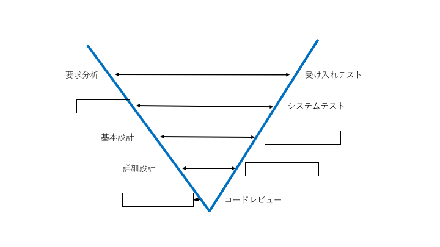

ミニテスト
====
### 【１】
次の図は、V字モデルの略図である。図の空欄に当てはまる工程を記入せよ。



### 【２】
次は、PHPで書かれたFizzBuzzの関数である。

```javascript
function fizzbuzz($value) {
    if ($value % 3 == 0) {
        echo 'Fizz';
    }
    if ($value % 5 == 0) {
        echo 'Buzz';
    }
    if (!($value % 3 == 0) && !($value % 5 == 0)) {
        echo $value;
    }
}
```

上記のFizzBuzz関数に対して、条件網羅となるテストケースを作成せよ。

```


```
#### 【３】
次は、PHPで書かれたFizzBuzzの関数である（再掲）

```php
function fizzbuzz($value) {
    if ($value % 3 == 0) {
        echo 'Fizz';
    }
    if ($value % 5 == 0) {
        echo 'Buzz';
    }
    if (!($value % 3 == 0) && !($value % 5 == 0)) {
        echo $value;
    }
}

$value = trim(fgets(STDIN));
fizzbuzz($value);
```

与えられたFizzBuzzの関数に対して

（１）同値分割を行い同じ出力が得られる条件をグループ化せよ。
```


```

（２）（１）で得られた同値グループに対して、境界値分析を行いテストケースを作成せよ
```


```
### 【４】
単体テストで、疑似オブジェクトを使用する利点を述べよ。

```


```


