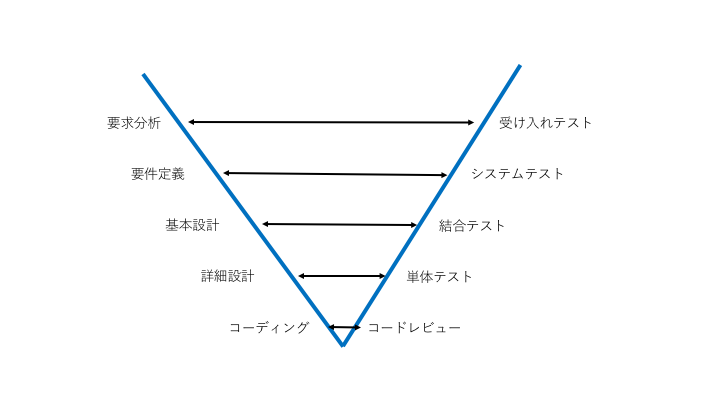

ソフトウェアテスト
====

## 1. ソフトウェアテストとは
１章では、ソフトウェア開発におけるソフトウェアテストの役割と種類など、基本的な事柄について述べる。
### 1.1 ソフトウェアテストと品質
ソフトウェアテスト(以下、テストと省略する。とくに断りがない場合ソフトウェアテストを指す）は、ソフトウェアの品質を確保するためのプロセスである。

テストでは、開発した機能について正しく機能が実装されていることを確認するためだけでなく、リファクタリングなどの過程ですでに実装されている機能について影響が発生していないことなどを確認するためにも使用される。

テストを実施すれば必ずしも品質が上がるわけではなく、メリットの大きいレイヤーや有効なテストを作成する必要があり、これらには知識と経験が求められる。

### 1.2 ソフトウェアテストの工程
テストは、ウォーターフォール型のソフトウェア開発の各フェーズにおいてそれぞれ行われる。V字モデルは、ウォータフォール型のプロセス


|種類|役割|
|-----|------|
|コードレビュー|コードが規約に則っているか、バグを含みやすいコードになっていないかなどをチェックする。あるいはLint系ツールやメトリクス分析を行って複雑度が高くないかをなどをチェックする|
|単体テスト|関数やメソッドといった単位で実装された機能が正しく機能することを検証する|
|結合テスト|モジュール間のつながりが正しいことを確認する|
|システムテスト|ソフトウェアで実装されている機能が仕様どおりに動くことを確認する|
|受け入れテスト|実装された機能がユーザの要求に合致していることを確認する|
|回帰テスト|リファクタリングや不具合対応で修正を行った際に影響が出ていないことを確認する。|

### 1.3 ソフトウェアテストの観点
テストには大きく分けて２つの観点がある。内部構造に着目した __ホワイトボックステスト__ と、入出力に着目した __ブラックボックステスト__ である。
#### 1.3.1 ホワイトボックステスト
ホワイトボックテストは、ソフトウェアの内部構造に着目してテストを行う。汎用のプログラミング言語は、順次・反復・分岐等の構造に着目してテストを行う。

```c
void bubbleSort(int *array, int size) {
  for (int i=0; i < size; i++) { ← ① （反復）
    for (int j = i; j < size; j++) {← ②（反復）
	if (array[i] < array[j]) {← ③（分岐）
		int tmp = array[i];← ④（順次）
		array[i] = array[j];
		array[j] = tmp;
　　　　}
　　　}
　　}
}
```

上記は、C言語によるバブルソートの実装例であるが、①〜③の構造に着目してテストを用意する。この注目した構造に対してどれだけの割合の部分を実行できたかを示す指標が __網羅率(Coverage)__ である。主な網羅率には命令網羅・分岐網羅・条件網羅の3つがある。

|種類|内容|
|:-----|:------|
|命令網羅（C0）|すべての命令が実行されることを確認する。|
|分岐網羅（C1）|すべての分岐に対して実行されることを確認する。|
|条件網羅（C2）|個別の条件がすべて通るようにテストを実行する|

#### 1.3.2 ブラックボックステスト
ブラックボックテストは、ソフトウェアの入出力に着目してテストを行う。次は、C言語で実装された abs 関数である。

```c
int abs(int a) {
    if (a >= 0) {
        return a;
    }

    return -a;
}
```

abs関数は、引数aの絶対値 |a| を返す関数である。abs関数の入出力は次の表のようになる。

|入力|出力|
|:-----|:-----|
|a>=0|a|
|a<0|-a|


ブラックボックステストでは 同じ出力が得られる条件をグループ化する。 これを __同値分割__　と呼び テストの際には、条件の中から代表値を選びその代表値を使ってテストを実施することでテストケースを削減することができる。
また、同値分割と関連が深いテスト技法に、__境界値分析__ がある。境界値分析では、同値分割で得られた条件の境界にあたる値に着目しテストケースを選択する。

## 2. 単体テスト
2章では、テストの中でも開発者が主体となる単体テストに取り上げる。

### 2.1 単体テストの役割
単体テスト（Unit Test）は、開発者が実装した関数やクラスが正しく機能していることを確認するためのテストである。単体テストは、新しく実装されたモジュールが正しく機能していることを確認する他に、リファクタリングなどの修正で既存のモジュールに影響を与えていないことを検証するためにも用いられる。

### 2.2 テストダブル
単体テストは、実装した関数やクラスが正しく動作することを検証するテストである。そのため、外部サーバーへの連携や他のモジュールからの呼び出しは検証する必要がなく与えられた入力で期待通りの処理を行うことを検証するのが肝要となる。

たとえば、RESTfulAPIのテストについて考えみる。

```plantuml
hide footbox
actor browser
control controller
control dao
entity database

activate browser
    browser->>controller: AJAX リクエストで何らかのAPIを呼び出す
    activate controller
        controller->dao
        activate dao
            dao->database
            activate database
                database-->dao
            deactivate database
        dao-->controller
        deactivate dao
    controller-->>browser
    deactivate controller
deactivate browser

```

ここでテストしたいのは、APIのテストなので外部からどのように呼ばれるか、DAOがどのように処理するのかは関係がないため実際のオブジェクトを利用する必要はない。

また、テスト対象が依存しているコンポーネントを使えなかったり、テストに実行のかかるといった問題を問題が起こる場合がある。

このようなときに、実際のオブジェクトを利用するのではなく代用品のオブジェクトに置き換えることでテストを実施する。この代替品のオブジェクトを __テストダブル__ 呼ぶ。


テストダブルに用いられるオブジェクトには以下のパターンがある。

|名称|役割|
|:-----|:-----|
|スタブ|間接的な入力を検証する場合に使用する|
|スパイ|間接的な出力を検証する場合に使用する（期待値がわかっている）|
|モック|間接的な出力を検証する場合に使用する（期待値がわかっていない）|
|フェイクオブジェクト|コードが依存しているコンポーネントと似た機能を持ち、似たような挙動をするオブジェクト|
|ダミーオブジェクト|テスト対象に必要なパラメーターだが <br/> 実際には使用されないパラメーターを指定する場合に使用する|

次に実例を記載する。

__（1）Reactコンポーネントのテスト__
```typescript
const Adapter = require("enzyme-adapter-react-16")

Enzyme.configure({ adapter: new Adapter() })

it('CopyButton', () => {
	const component = Enzyme
		.shallow(<CopyButton
			onClick={MockUtil.emptyHandler}
			classes={{ icon: "", iconButton: "" }}
		/>);
	expect(component).toMatchSnapshot();
});
```

__（2）RESTful API のテスト__
```typescript
const MockAdapter = require('axios-mock-adapter');
const mockData = [{
	id: 1,
	title: "Some Data"
}];

beforeEach(() => {
	Synergy.boot()
	adapter = new MockAdapter(Synergy.AjaxRequest.client);
});
it("ログインAPIメソッド　成功(200)", () => {
	adapter.onPost(Synergy.LOGIN_API).reply(200, mockData);
	Synergy.login(loginParam).then((res) => {
		expect(res.data).toEqual(mockData);
	});
})
```
## 補遺
今回はソフトウェアテストの基本的な技法について取り上げた。テストおよび品質に関連する領域としては、静的解析ツールを用いたメトリクス分析や、CI/CDといったデプロイパイプラインとの連携などがあるが取り上げていないのでぜひ調べてみてほしい。