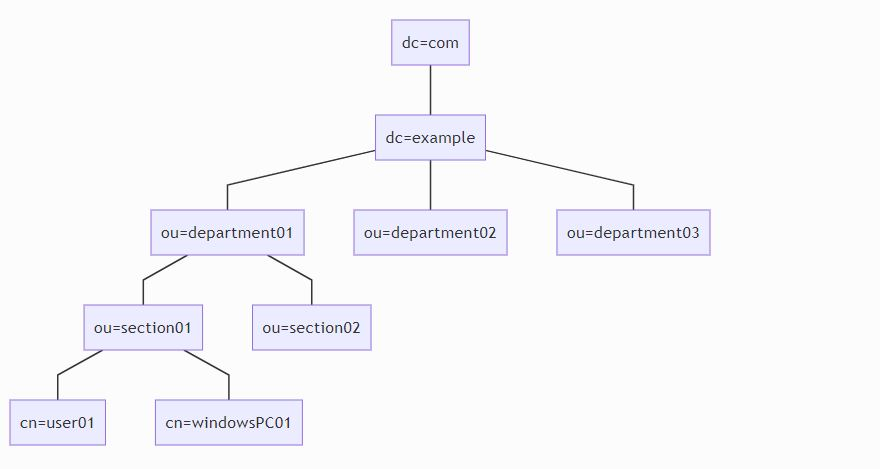

# LDAPとは

Lightweight Directory Access Protocolの略です。ディレクトリサービスというユーザやコンピュータといった情報を管理するサービスにアクセスするためのプロトコルです。LDAP自体はプロトコルであってなにかのサービスやシステムを指すものではありません。

> [RFC4511](https://tools.ietf.org/html/rfc4511)

通常、389番ポートを使用します。LDAPS（LDAP OverSSL）の場合は636番を使用します。

# LDAPサーバ

LDAPを実装したデータベースです。一般的にはそれらを実装した製品やサービスを指すことが多いと思います。

# LDAPを実装した製品やサービス

LDAPサーバを実装した製品やサービスは下記のようなものがあります。

* OpenLDAP
* 389DS
* ActiveDirectory

前者2つはLinux向けです。おそらく389DSよりもOpenLDAPの方が有名（だと思う）のですが、LedHatLinuxとSUSEがOpenLDAPから389DSに置き換えるようです。

# LDAPとActiveDirectory

ActiveDirectoryはMicrosoft社製品です。こちらもRFCにほぼ準拠して実装されているらしいです。Windowsのログオンの統合のしやすさなどでエンプラ系の企業では最も利用されていると思われます。ちなみにADに対してプログラムで何かやろうとした場合は.NET系が最も楽です。

Windowsの監査ログに記録したりできます。また、構築はWindowsServerがあれば特別なソフトウェア等も必要ありません。ただし、実際に使用するにはユーザ数に応じたCAL（クライアント・アクセス・ライセンス）が必要になります。

# LDAPサービスでできること

LDAPが実装されているサービスを利用すると下記のようなことができます。

### 1. リソースの一元管理

ユーザやパスワード、コンピューティングリソースの一元管理が可能になります。ActiveDirectoryの場合では前述のとおりWindowsPCのログオン統合などもできます。

### 2. リソースのアクセス制御

例えば特定のディレクトリに対しては特定の部署に属しているユーザしかアクセスできないというような制御ができます。

### 3. 各種サービスとの連携

そこそこ大きめのサービスやアプリケーション（OSSなど）になってくるとだいたい連携ができます。詳しくは別途記述しますが、初期のユーザ情報作成をLDAPデータベースから行い、認証をLDAPサーバに委譲することができます。これにより、全ての認証をLDAPサーバで行うことができるようになります。これはユーザにとってはサービス（OSS）ごとにユーザ名とパスワードを記憶しなくてもよい。管理者側にとっては一か所で管理できるというメリットになります。

# LDAPデータベースの構造

LDAPデータベースはRDSとは異なり階層型のデータベースです。



それぞれの要素をエントリーといいます。エントリーは`dc`,`ou`,`cn`の3つがあります。

|エントリー||
|---|---|
|dc|Domain Component|
|ou|Organization Unit|
|cn|Common Name|

OUに対して組織を割り当てます。CNに対して人やコンピュータやプリンターといったリソースを割り当てます。

この階層に応じてアクセス権限を付与したりすることができます。例えば`section01`に所属する人のみ特定のフォルダにアクセス可能にするといったようなことです。

# Distinguished Name

LDAPを触っているとDNという用語をよくみかけますが、これはDistinguished Name（識別名）というもので、LDAPサーバ内でリソースを一意に識別するものになります。

DNは前述のエントリーをリーフからルートまで順番にカンマでつなぎます。例えば前述の図の`user01`であればDNは下記のようになります。

```
cn=user01,ou=section01,ou=department01,dc=example,dc=com
```

# 属性

それぞれのエントリに対して属性を定義することができます。LDAPでは代表的な属性はに下記のようなものがあります。

|属性||
|---|---|
|c|国|
|company|会社|
|department|部署|
|description|概要|
|displayName|表示名|
|gn|名前|
|l|地域名|
|mail|メールアドレス|
|name|名|
|postalCode|郵便番号|
|sn|姓|
|st|州（日本だと県相当）|
|uid|User ID|

結構省略されているものが多くて、例えば`sn`は`sur name`の略など、なかなか日本人には分かりづらいものがあったりします。また、説明は省きますがActiveDirectoryはかなり独自の属性が定義されています。

# クライアントについて

残念ながら知る範囲ではクライアントソフトが充実しておらず、私が知っているものだと下記のようなものがあります。

* [Apache Directory Studio](https://directory.apache.org/studio/)
    * Linux, Windows, Macで使える
* [Active Directory Explorer](https://technet.microsoft.com/ja-jp/sysinternals/adexplorer.aspx)
    * ActiveDirectoryかつWindows専用

# LDAP連携

OSSや各種サービスなど（以下まとめてOSSと記述します）ではLDAPを用いた認証が可能であったりします。おおよそ以下の機能があったりします。

* ユーザ作成
* LDAP認証
* アクセスコントロール

ざっと上から順番に説明すると、ユーザ作成は対象のOSSにユーザが存在しなかった場合はLDAPの情報を基にユーザを作成してくれます。LDAP認証はOSSへのログイン時にLDAPに問い合わせに行きます。アクセスコントロールは、実際にそういうOSSを使ったことがないので本当にできるかどうかしらないのですが、LDAPのOUなどによって特定のディレクトリへのアクセスをコントロールできたりするやつです。

では、順番に解説する前に説明しておかなければいけないことがあります。ので、今回はそれについて書きます。

# bind dn

まずバインドDNについて。ユーザがLDAP認証を行うときに認証情報をLDAPサーバに問い合わせに行くことになるのですが、その時に使用するユーザです。

認証情報を問い合わせるときに問い合わせそのものにも権限が必要になるので、そのためのユーザが必要になります。その際に利用するユーザをバインドDNで指定します。

例えば、下記はGitLabのLDAPの設定ですが`bind_dn`がそれに該当します。

```rb
gitlab_rails['ldap_servers'] = YAML.load <<-'EOS'
main:
     label: 'LDAP'
     host: 'example.com'
     port: 389
     uid: 'sAMAccountName'
     method: 'plain'
     bind_dn: 'CN=user01,OU=example,DC=example,DC=com'
     password: 'user01のパスワード'
     active_directory: true
     allow_username_or_email_login: true
     block_auto_created_users: false
     base: 'DC=example,DC=com'
     user_filter: ''
     attributes:
      username: ['uid', 'userid', 'sAMAccountName']
      email:    ['mail', 'email', 'userPrincipalName']
      name:       'displayName'
      first_name: 'givenName'
      last_name:  'sn'
EOS
```

この場合は認証情報の問い合わせに

```
CN=user01,OU=example,DC=example,DC=com
```

というユーザを使用することになります。また、当然そのユーザのパスワードも設定する必要があります。ちなみにGitLabは設定ファイルですが、だいたいのOSSにはGUIが存在します。

# base dn

次にベースDNとはLDAP認証を利用した際にユーザを検索するルートとなるエントリです。ここにはLDAP認証利用対象者のユーザが存在するエントリを指定することになります。前述のGitLabでは`base`がそれに該当します。

例えば下図で`ou=section01`と`ou=section02`に存在するユーザをLDAP認証の対象としたい場合は`ou=department01`を指定すればよいので...

```
ou=department01,dc=example,dc=com
```

となります。


全ユーザを指定する場合は`dc=example,dc=com`でよいです。

# anonymous bind

LDAPサービスを利用するには通常はバインドDNでの認証情報問い合わせが必要になりますが、anonymous bind（匿名バインド）を用いると、認証無しでLDAPサービスを利用できます。が、セキュリティ的にアレなので通常は行いません。匿名バインドはLDAPサービス側で許可・不許可を設定します。