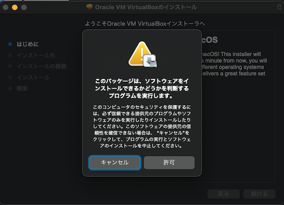
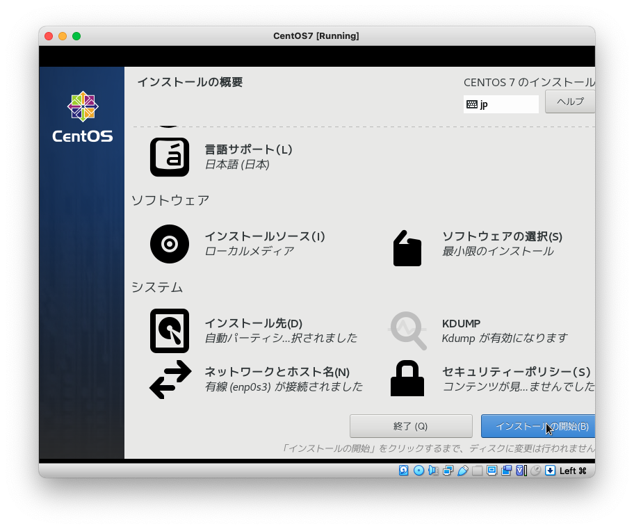

[toc]

# Linux入門

## Linuxとは

Linuxとは、Linus Torvals氏が開発したオペレーティングシステムです。Linuxは、アンドリュー・タネンバウムが教育用に執筆したOperating Systems: Design and Implementation の教材として開発されたMINIX(Mini-Unix)を参考に開発されました。

現在では、Linuxはサーバー環境を始め、IoTデバイス、Androidなどの身近な電子機器においても利用され我々の生活に欠かせない重要なソフトウェアとなっています。

また、Linuxのソースコードは公開されており、利用者の目的を問わずソースコードを使用・調査・再利用・修正・拡張・再配布が可能なソフトウェアです。このようにソースコードを一般公開して利用者による利用・修正・再頒布を許すようなソフトウェアを**オープンソースソフトウェア**と呼びます。現在のソフトウェアの多くは、オープンソースソフトウェアの恩恵を多大に受けています。

Linuxには、いくつかの系譜があり、RHEL(RedHat Enterprise Linux)が開発しているRedHat系、Ubuntuの源流となっているDebian系、日本ではあまり知られていませんがopenSUSEの源流となったSlackWare系などがあります。それぞれの系統における主要なOSを次に列挙します。

1. RedHat系

   - CentOS、RHEL、Fedora

2. Debian系

   - Ubuntu
   - Debian

3. Slackware系

   - openSuse

   

エンタープライズ向けのLinuxとしては、主にRedHat系OSが比較的多いです。また日本では、Debianの派生OSであるUbuntuもよく利用されています。

今回は、AmazonLinuxでも利用されているCentOSをベースに、CentOSのインストールし、Linuxを操作するための基本コマンドおよびターミナルで利用できるエディタVimの使い方を見ていき、SSHサーバーの構築を行います。

## 環境の構築

- VirtualBoxまたは実機でのインストール作業を行います。VirtualBoxを利用する場合は、以下の画像を参考にLinuxの仮想環境を構築します。





## CentOSのインストール

### 仮想環境の場合

VirtualBox上に作成した環境を起動します。

### 実機の場合

光学ドライブにCentOSのCDを挿入し、電源投入します。電源投入後、F12キー（機種によって異なる）を押し、BIOSを立ち上げます。ブート先を、光学ドライブに設定し、BIOSを閉じます。

### CentOSのインストール

CentOSのインストールガイドに従い、インストールをすすめます。設定内容は、次のスクリーンショットを参考にしてください。





## Linuxのディレクトリ構造

Linuxにはたくさんの派生OS（ディストリビューション）が存在しますが、Linuxのディレクトリ構造(File Hierarchy Standard、FHSと呼ばれます)は標準化されており、どのLinuxでもおおよそ共通の配置となっています。重要なディレクトリには、次のようなものがあります。

| パス | 意味                                                         |
| ---- | ------------------------------------------------------------ |
| /bin | シングルユーザモードで利用されるバイナリが配置されます。     |
| /dev | コンピュータに接続されているデバイス情報が配置されます       |
| /etc | Linuxオペレーティングシステム上で稼働しているサービスの設定ファイルが配置されます。 |
| /opt | 通常デフォルトインストールの一部ではないソフトウェアやアドオンパッケージ用に確保されています。 |
| /srv | システムが提供するサイト特有のデータが含まれています。       |
| /usr | ユーザインストールされたバイナリ、ライブラリ(.so)が配置されます。 |
| /var | ログやメールなどの可変データが配置されます。                 |
| /tmp | 一時ファイル領域です |

`演習（１）` ディレクトリを確認していきます。


## Linuxの主要コマンド

Linuxは、GUIでの操作も可能ですが、サーバー環境として選ばられることが多いため、CUIでの基本操作に慣れておくことが重要です。

### シェル

CUI環境でOSに処理を依頼するには、CUI(Character User Interface)つまりコマンドをつかってOSへ処理を依頼することになります。このOSと対話しながらコマンドを実行する環境のことを`シェル`と呼びます。代表的なシェルには`bash`や`zsh`・`tcsh`・`csh`・`fish`などがあります。

### ディレクトリ操作

#### ls

> ディレクトリの内容を一覧表示するためのコマンドです。

```sh
$ls
```

> 隠しファイルを表示するには、`a`オプションを使用します。

```sh
$ls -a
```

> ファイル名以外の属性も表示する場合は`l`オプションを使用します。環境によっては、llのエイリアスが定義されている場合もあります。

```sh
ls -l
```


#### mkdir

> mkdirコマンドは、ディレクトリを作成するコマンドです。

```sh
$mkdir target
```

>親ディレクトリも含めてディレクトリを作成したい場合は、`-p`オプションを指定します。

```sh
$mkdir -p parent/child
```


#### rmdir

> rmdirコマンドは、ディレクトリを削除するコマンドです。rmdirコマンドでは、ファイルの削除はできません。ファイルの削除には後述するrmコマンドを使用してください。

```sh
$rmdir target
```


#### cd

> cdコマンドは、ディレクトリを移動するコマンドです。

```sh
$cd ~
```

### ファイル操作

#### touch

>
touchコマンドは、ファイルの新規作成・ファイルの変更時刻などを変更するコマンドです。
>

```sh
touch ファイル名
```


#### mv

> mvコマンドはファイルの移動またはリネームをするコマンドです。

```sh
$mv somefile ~/tmp1/somefile
$mv somefile somfefile
```


#### cp

> cpコマンドは、ファイルのコピーを実行するコマンドです。

```sh
$cp somefile somefile_1
```

**【よく使用するオプション】**

| オプション | 意味                     |
| ---------- | ------------------------ |
| -r         | 再帰的にコピーを実行する |

#### rm

> rmコマンドは、ファイルの削除をするコマンドです。

```sh
$rm somfile 
```

**【よく使用するオプション】**

| オプション | 意味                   |
| ---------- | ---------------------- |
| -r         | 再帰的に削除を実行する |
| -f         | 強制的に削除する       |

#### less

>  lessコマンドは、ファイル中身の閲覧するコマンドです。

```sh
$less somefile
```

**【よく使用するオプション】**

| オプション | 意味                 |
| ---------- | -------------------- |
| +F         | ウォッチモードで開く |

`演習（２）` ファイルの作成と削除をしてください

### 圧縮・解凍

#### zip・unzip

> ZIP形式の圧縮するコマンドです。比較的あたらしいバージョンのOSではプリインストールされていることが多いですが古い環境だとサポートしていないことがあります。
>
> ZIP形式は通常ディレクトリまとめて圧縮することが多いので、`-r`オプションを付与して使うことが多いです。

```sh
$zip -r FILENAME.zip FILE_DIR 
```

> 解凍をするには`unzip`コマンドを使います。

```sh
$unzip FILENAME.zip 
```


#### tar

>  tar形式の圧縮・解凍するコマンドです。tar形式はディレクトリを一つのファイルにまとめるだけのため圧縮はされません。tarのオプション形式はやや複雑ですが、解凍するときにはxvf・圧縮するにはcvfのオプションを付けると覚えておけば良いです。

```sh
$ tar cvf dir.tar dir
$ tar xvf dir.tar
```

> tar形式それだけでは圧縮はされないのですが、tarコマンドはgzip形式の圧縮に対応しており、tarにアーカイブすると一緒にgzip形式の圧縮をかけることができます。オプション`z`をつけるとgzipとして処理することができます。

```sh
$ tar zcvf dir.tar.gz dir
$ tar zxvf dir.tar.gz
```


### 権限管理

#### chmod

> ディレクトリ・ファイルの権限を変更するコマンドです。

```sh
$chmod 600 dir
```

> `/etc/nginx`など設定ファイルのディレクトリの読み込み権限をまとめて変更する場合は`-R`オプションを使用します。

```sh
$chmod 600 -R dir
```


#### chown

> chownは、ディレクトリ・ファイルの所有者を変更するコマンドです。

```sh
$chown user:group dir
```


`演習（３）` 新規にファイルを作成しファイルの権限を600に変更してください。

### ユーザ・グループ管理

#### useradd

>useraddコマンドは新規ユーザーを作成し、ユーザーごとの設定を決めるコマンドです。作成されたユーザは、`/etc/passwd`に記載されます。

```sh
$useradd test
```


#### usermod

>usermodコマンドは、ユーザーのホームディレクトリやグループ、パスワードなどを変更するためのコマンドです

```sh
$usermod test
```


#### groupadd

>groupaddコマンドは新規グループを作成し、グループの設定を決めるコマンドです

```sh
$groupadd test
```

`演習（４）` 新しくユーザdeveloperを作成し、rootユーザグループに追加してください。


### プロセス管理

#### top

> topコマンドはプロセスの一覧を表示するコマンドです。

```sh
top
```

#### ps

> psは現在のプロセスを表示するコマンドです。

```sh
$ ps
```

> すべてのユーザのプロセスをすべて表示する場合は、auxのオプションを指定します。

```sh
$ps aux
```

**【psコマンドで表示される各列の情報】**

| USER    | 所有ユーザー名                                               |
| ---- | ---- |
| PID     | プロセスID                                                   |
| %CPU    | CPUの使用率                                                  |
| %MEM    | 使用しているメモリ量の割合                                   |
| VSZ     | 使用している仮想メモリのサイズ                               |
| RSS     | 使用している物理メモリのサイズ                               |
| TTY     | 制御端末の種類と番号                                         |
| STAT    | 状態`D`: 割り込み不可なスリープ中`I`: アイドル`N`: ナイス値が正`R`: 実行可能、実行中`S`: 割り込み可能なスリープ中`T`: 停止、またはトレース中`W`: スワップアウトしている`Z`: ゾンビプロセス |
| START   | プロセス開始の時刻                                           |
| TIME    | CPUの使用時間                                                |
| COMMAND | コマンド名                                                   |

### ディスク管理

#### du

>  duコマンドは、ディスクの使用量を集計して表示するコマンドです。ファイルを指定した場合は指定したファイルのサイズのみ、ディレクトリを指定した場合はそのディレクトリのサブディレクトリの使用量を集計します。

```sh
$du file
```


#### df

> dfコマンドは、ディスクの空き領域のサイズを集計して表示するコマンドです。

```sh
$df
```


### ネットワーク管理

#### ifconfig

> ifconfigは、ネットワークインタフェースを確認するためのコマンドです。

```sh
$ifconfig
```


#### traceroute

> tracerouteは、宛先IPまたはホストまでのルーティングを確認するコマンドです。

```sh
$traceroute google.com
```


#### nslookup

> nslookup コマンドはDNSサーバに名前解決する確認するコマンドです。

```sh
$nslookup google.com
```


#### ping

> pingは、ネットワークの疎通を確認するためのコマンドです。

```sh
$ping 192.168.2.1
```


### サービス管理

#### cron

> cronは、指定された時刻などに特定のプログラムなどを実行するためのスケジューラーです。
>
> cronを実行するためには、`/etc/crontab`ファイルを編集します。

```sh
$vim /etc/crontab
```


#### serviceｈ

> service コマンドは、SysVInitのデーモンプロセスを管理すためのコマンドです。

```sh
$service httpd start
```

```sh
$service httpd stop
```

```sh
$service httpd restart
```


#### systemctl

> systemctl コマンドは、systemd のデーモンプロセスを管理すためのコマンドです。

```sh
$systemctl start httpd
```

```sh
$systemctl stop httpd
```

```sh
$systemctl restart httpd
```

`演習（５）` sshdプロセスの状態を表示してください。


### パッケージ管理

#### yum

> yumコマンドは、rpm(redhat package manager)形式のパッケージを管理すためのツールです。パッケージを検索するには、searchサブコマンドを使用します。

```sh
$yum search mysql
```

> パッケージをインストールするには、install サブコマンドを使用します。確認を省略するときは、`-y`オプションを指定します。

```sh
$yum install -y mysql
```

> パッケージを削除するには、removeサブコマンドを使用します。

```sh
$yum remove -y mysql
```

> パッケージ情報を更新するには、updateサブコマンドを使用します。

```sh
$yum update
```

> パッケージを更新するには、upgradeサブコマンドを使用します。

```sh
$yum upgrade
```

### ヘルプ

#### man

> manコマンドは、コマンドのマニュアルを表示するためのコマンドです。

```sh
man ls
```


`演習（６）` manコマンドでyumコマンドの   ヘルプを表示してください。

## 標準入出力およびリダイレクションとパイプ

### 標準入出力

UNIX系システムではすべてのデバイスはファイル（デバイスファイル・スペシャルファイルなどと呼ばれる）として扱われます。これは、ファイルとデバイスが透過的に扱えるということを意味しています。このようなスペシャルファイルで特に重要なのが、**標準入力**（stdin)，**標準出力**(stdout)，そして**標準エラー**（stderr）の3つのデバイスファイルです。これらは通常、出力はターミナル（ディスプレイ）・入力はキーボードに紐付いています。

### リダイレクション

標準入出力の入力や出力を切り替える仕組みをリダイレクションと呼びます。

```sh
# 標準出力の出力先を、標準エラーへ変更
$echo 'hello' 1>&2

# 標準出力の出力先を、test.txtへ変更
$echo 'hello' > test.txt

# 標準出力の出力先を、test.txtへ追加
$echo 'hello' >> test.txt
```


### パイプ

前のコマンドの標準出力結果を後続のコマンドに引き渡し、複雑なコマンドを構築するための仕組みです。`xargs`や`tee`、`tail`、`head`、`cut`、`sed`といった入力を加工するコマンドを併用することでより高度な処理も可能になります。

```sh
# hello.txtの内容を出力し、出力した内容の先頭一行を出力する
cat hello.txt| head -1
```

## Vimエディタ

### 概要

Vi(Vim)は、BSDを開発するにあたりビル・ジョイがPascalコンパイラの作成を快適にするために作成されたエディタが始まりと言われています。Viは現在の一般的なGUIエディタ（スクリーンエディタ）と異なり、モードを切り替えることで複雑な操作を実現します。vi(Vim)には、ノーマルモード・挿入モード・ビジュアルモードがあります。それぞれのモードを切り替えながら操作することでキーボードのみで複雑な操作が実現できますが、覚えることが多く初学者の敷居が高いことが難点です。

### 基本操作

#### モードの切替

ESC

o

O

i

v

#### 移動

ijkl

gg Shift+g

#### クリップボード操作

pコマンド ー　ペースト

yyコマンド　ー　ヤンク（コピー）

ddコマンド　ー　切り取り

`演習（７）` ホームディレクトリ内で、Vimで保存し、index.htmlファイルを作成し、保存してください。

## SSH サーバーの構築

### 公開鍵暗号方式

公開鍵暗号方式は、暗号化と復号化で異なる鍵を使う暗号化技術です。公開鍵暗号のアルゴリズムには、RSA暗号などがあります。

暗号に使う鍵を公開鍵、復号に使う鍵を秘密鍵と呼びます。


### 公開鍵の作成

公開鍵を作成するには、ssh-keygenコマンドを使います。RSA暗号方式で、鍵を作成するには

```sh
$ssh-keygen -t rsa
```

とします。作成された鍵はデフォルトでは、~/.sshフォルダに置かれます。

所有権が間違っていると、えらーとなりますので権限を変更します。	

```sh
$chmod 600 ~/.ssh/id_rsa
```

sshdサーバーの認証用の鍵とするため、.sshフォルダに`authorized_keys`として保存します。

```sh
$cat ~/.ssh/id_rsa.pub > ~/.ssh/authorized_keys
```

安全な方法で作成した鍵を、クライアントPCへ送信します。VirtualBoxの場合、ホスト側のフォルダをマウント、実機の場合はUSBメディアなどで取り出すと良いと思います。

### sshdサーバーの設定

/etc/sshd.confを編集し、ポート番号・許可ユーザ・パスフレーズなどの設定を行います。

