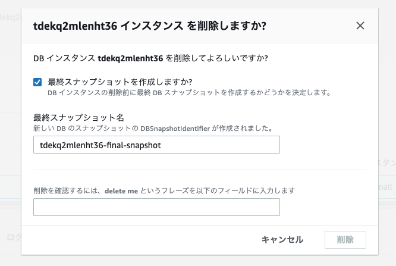
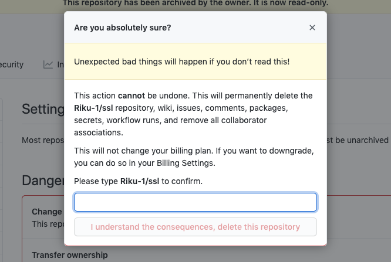

<style>
img[alt~="center"] {
  display: block;
  margin: 0 auto;
}
</style>

<!-- _class: lead invert-->

# 『とりあえず削除フラグ』をやめる

---

<!-- _class: lead -->

## 話すこと
- 論理削除の悪い点
- 『削除』を実現する色々な方法
- どう向き合っていくか

---

<!-- _class: lead -->

## はじめに 物理削除と論理削除

---

<!-- _class: lead -->

### 物理削除
DB上のデータを直接消す

---

<!-- _class: lead -->
```sql
DELETE FROM orders WHERE id = 1 
```

DB上からデータが消える → 復旧できない

---

<!-- _class: lead -->
### 論理削除
DB上のデータは消さない

---

<!-- _class: lead -->

```sql
UPDATE orders SET deleted_at = "2016-12-26 09:53:57" 
```

DB上にデータは残り続ける → 復旧できる

---

<!-- _class: lead -->

## 何が問題なのか？

---

<!-- _class: lead -->

## :thinking:

---

<!-- _class: lead -->

- クエリが複雑になる
- データが残り続ける
- 削除してよいと思い込んでしまう
- 削除でない操作に対してdeletedという単語が用いられてしまう


---
<!-- _class: lead -->

### クエリが複雑になる

---

<!-- _class: lead -->

```sql
SELECT * FROM orders WHERE deleted_at IS NOT NULL;
```

毎回whereが必要

---
<!-- _class: lead -->

### データが残り続ける

---

<!-- _class: lead -->

DB上のデータが消えずに残り続ける
→ データ増大によって検索などが遅くなる

---
<!-- _class: lead -->

### 削除してよいと思いこんでしまう

---

<!-- _class: lead -->

deleted_atカラムが存在することで
削除され得る値なんだなという印象を持ってしまう

---

<!-- _class: lead -->

### 削除でない操作に対してdeletedという単語が用いられてしまう

---

<!-- _class: lead -->

- 注文を「キャンセル」する
- 商品を「廃止」する
- 社員が「退職」する

ユーザーはその操作を「削除」と呼んでいるか？ 事実は消えない

---

<!-- _class: lead -->

## どうすればよいか
削除フラグやdeleted_at以外の選択肢を挙げてみます

---

<!-- _class: lead -->

- ドメインの言葉を使う
- 状態にする
- 削除しない
- 物理削除する

---

<!-- _class: lead -->

### ドメインの言葉を使う

---

<!-- _class: lead -->

- is_canceled
- is_active
- is_retired

正しい言葉、明確な言葉を使おう

---
<!-- _class: lead -->

### フラグではなく状態にする
status (cancel, complete)

そもそも二値で表せないことのほうが多い

---

<!-- _class: lead -->

### 削除しない 
CRUDのU(Update)とD(DELETE)はコストが高い

---
<!-- _class: lead -->

- 履歴テーブル
- [イミュータブルデータモデル](https://scrapbox.io/kawasima/%E3%82%A4%E3%83%9F%E3%83%A5%E3%83%BC%E3%82%BF%E3%83%96%E3%83%AB%E3%83%87%E3%83%BC%E3%82%BF%E3%83%A2%E3%83%87%E3%83%AB)

---
<!-- _class: lead -->

### 物理削除する
ただ物理削除したのでは「元に戻す」ことができない…
→ 削除前に念入りに確認する

---

<!-- _class: lead -->
#### AWSの場合


---

<!-- _class: lead -->

#### Githubの場合


---


<!-- _class: lead -->

## 物理削除にもデメリットはある
- 時間がかかる
- 戻せない

---

<!-- _class: lead -->

## どの方法も銀の弾丸ではない
どれが適切かちゃんと考えよう
よく考えた上での削除フラグ、論理削除ならOK

---
<!-- _class: lead -->

## まとめ
- 論理削除の悪い点
- 「削除」を実現するいろいろな方法
- どう向き合っていくか

どの方法が適切かちゃんと考えるといいシステムが作れるんではないでしょうか

---

<!-- _class: lead -->

---

<!-- _class: lead -->

### 参考
[SQLアンチパターン 幻の26章 「とりあえず削除フラグ」](https://www.slideshare.net/t_wada/ronsakucasual)