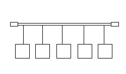
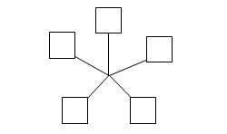
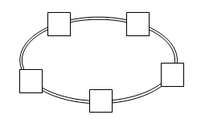
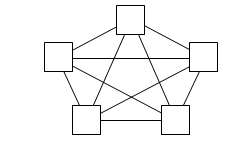
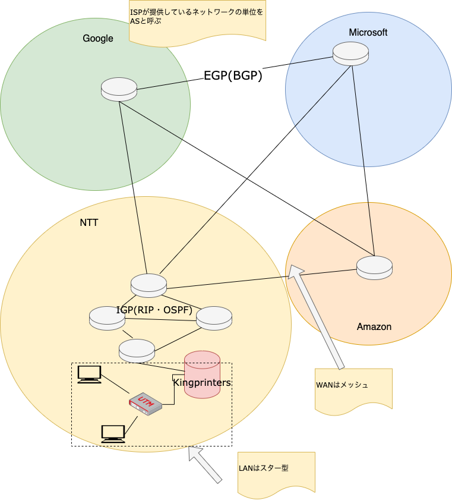
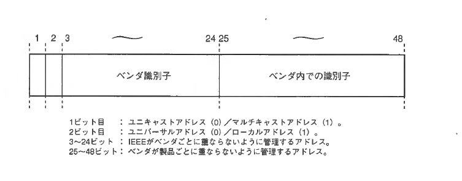
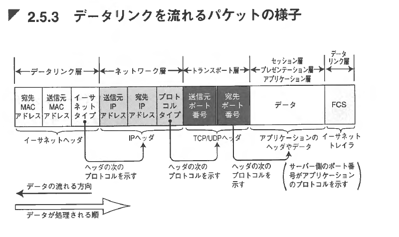
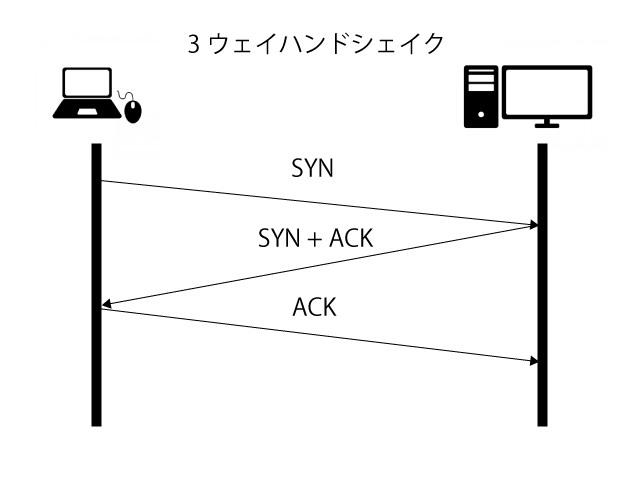

# コンピュータネットワーク入門

[toc]

## コンピュータネットワーク

我々の生活に欠かせない存在となったインターネットですが、その起源は意外にも古く1969年頃まで遡ることができます。当時のアメリカ国防総省高等研究計画局(ARPA、現在のDARPAの前身)が、戦争に耐えられる情報通信ネットワークの構築を目的に開発されたARPANETがインターネットの起源と言われています。ARPANETの開発に関連し電子メールやハイパーリンクの開発も行われてきました。

## 通信方式の種類

### コネクション型とコネクションレス型

コンピュータ同士が互いに接続を確立したい状態で通信を行う方式をコネクション型、接続は確立せずに通信を行う方式をコネクションレス型と呼びます。TCPはコネクション型、UDPはコネクションレス型です。各プロトコルについては後述します。

### ユニキャスト・マルチキャスト・ブロードキャスト

接続の仕方による分類のほか、通信単位による分類もできます。単一の送信相手にデータを送信することをユニキャスト、複数の端末にデータを送信することをマルチキャスト、すべての端末にデータを送信することをブロードキャストと呼びます。なお、ブロードキャストはIPv6では実装されていません。

## OSI参照モデルとTCP/IPモデル

### OSI参照モデル

ネットワークをきちんと階層化して定義したものに、OSI参照モデル（Open Systems Interconnection reference model）があります。これは、表に示すように7階層に定義されています。各階層は、次に示すような機能を規定しています。
|レイヤー|名称|役割|
| :--- | -------------------- | -------------------------------- |
| 7    | アプリケーション層   | アプリケーション間のやり取り     |
| 6    | プレゼンテーション層 | データの表現形式                 |
| 5    | セッション層         | 接続の手順                       |
| 4    | トランスポート層     | データ通信の制御                 |
| 3    | ネットワーク層       | インターネットワークでの通信     |
| 2    | データリンク層       | 同一ネットワーク上での通信       |
| 1    | 物理層               | ケーブルや電気信号やコネクタなど |

#### アプリケーション層

アプリケーションごとのデータの形式や処理の手順などを規定します。Web、電子メール、ファイル転送などのプロトコルは、この層で規定されます。

#### プレゼンテーション層

データの表現形式、例えば文字コードの種類や暗号化などを扱います。双方の機器の間で文字コードが違う場合の変換、通信の暗号化と復号といった処理はこの層で行われます。

#### セッション層

クライアントとサーバーなど、プログラム間の接続手順を規定します。この層により、2つのプログラムの間でデータ交換を行う論理的な通信チャネルが用意されます。

#### トランスポート層

実際にデータのやり取りを行うプログラムの間でのデータ伝送を実現します。エラーの訂正、データのブロックサイズの違いの吸収（大きなデータを小さなパケットに分割するなど）などはこの層で行います。

#### ネットワーク層

ネットワーク上の2台のコンピュータの接続を確立します。下位のデータリンク層と同じように見えますが、データリンク層が同じ方式を使った1つのネットワーク上の接続を確立するのに対して、ネットワーク層は相互に接続された複数のネットワークの間、つまりインターネットワークの接続を定めるものです。これらの複数のネットワークは、同じ形式のものであっても、異なるものであっても構いません。

#### データリンク層

イーサネット、無線LANなど、ネットワークの方式に基づいたメディアアクセス制御（MAC、Media Access Control）や実際のデータ伝送について規定します。つまり、それぞれのネットワーク方式が、どのように通信メディアを使ってデータを伝送するのかを定めています。これにより、LAN上やWAN上の機器の間の通信が実現されます。

#### 物理層

実際のネットワーク媒体（ケーブルなど）の上を流れる電気信号の形式やコネクタなど、個々のネットワーク方式ごとに、ハードウェアにもっとも近い部分を規定します。


### TCP/IP 4階層モデル

インターネットで使われているTCP/IPプロトコルは、OSIモデルに沿っていません。OSIモデルが構築される以前から、実用的なネットワークとして稼働していたということもありますし、ネットワークの普及期に様々な機種・OS・ネットワーク方式・アプリケーションが登場したから、OSIモデルのような詳細な階層分けが必要になったとも考えられます。

|レイヤー|名称|役割|
| :--- | -------------------- | -------------------------------- |
| 4    | アプリケーション層             | アプリケーション間のやり取り                     |
| 3    | トランスポート層               | プログラム間の通信、通信の制御                   |
| 2    | インターネット層               | インターネットワークでの通信                     |
| 1    | ネットワークインターフェイス層 | 同一ネットワーク上での通信、ハードウェア仕様など |

#### アプリケーション層

OSIモデルのセッション層からアプリケーション層に相当します。個々のプログラムの間で、どのような形式や手順でデータをやり取りするかを定めます。文字コードや画像などの形式、暗号化など、データの表現形式などもこの層で扱います。Webや電子メールなどのアプリケーションプロトコルはこの層に属します。

#### トランスポート層

OSIモデルのトランスポート層に相当します。通信を行うプログラムの間でのデータ伝送を実現します。必要に応じて、エラーの検出と回復や、双方向の通信路の確立なども行います。単にデータを伝送するだけのUDP（User Datagram Protocol）、信頼性のある双方向の通信を実現するTCP（Transmission Control Protocol）はこの層のプロトコルです。

#### インターネット層

OSIモデルのネットワーク層に相当します。複数のネットワークを相互に接続した環境（インターネットワーク）で、機器間のデータ伝送を実現します。IP（Internet Protocol）はこの層のプロトコルです。

#### ネットワークインターフェイス層

OSIモデルの物理層とデータリンク層に相当します。実際のネットワークハードウェアが通信を実現するための層で、各種イーサネット、無線LANなどがこの層に属します。また、モデムや光回線などを使って特定の相手と接続し、TCP/IPで通信するためのPPP（Point To Point）プロトコルなども、この層のプロトコルとなります。

### ネットワーク機器

OSI参照モデルとTCP/IPモデルを確認したところで、主要なネットワーク機器を確認します。

#### ハブ

リピーターハブ（ハブと略される）は、物理層（ネットワークインタフェース層）で動作するネットワーク機器です。リピータハブは、電気信号の増幅のみ行い、パケットのルーティングなどはできません。

#### スイッチ

スイッチングハブやスイッチは、データリンク層（ネットワークインタフェース層）で動作するネットワーク機器です。MACアドレスによるルーティングやARP・RARPといったプロトコルに対応します。

#### ルーターおよびL3スイッチ

ルータは、ネットワーク層（インターネット層）で動作するネットワーク機器です。ネットワーク層のプロトコルであるIPやOSPFなどのEGP(Exterior Gateway Protocol)、インターネット制御プロコトル(ICMP)やトンネリング(GRE)といった機能を提供します。

## ネットワークの接続形態

同軸ケーブルやトークンリングが普及していた頃はバス型やリング型といった接続形態が存在していましたが、現在ではLANではスター型、WANではメッシュ型の構造がほとんどです。

| 名称       | 模式図                                        | 説明                                                         |
| ---------- | --------------------------------------------- | ------------------------------------------------------------ |
| バス型     |  | 一つの回線に複数のノードが接続される形<br/>10Base-2や10Base-2同軸ケーブルに接続する場合に使われる。 |
| スター型   |  | 中央の集線装置に全てのノードが接続される形<br/>ノードの追加、削除が容易な形態で、現在のLANの主流形態<br/>ツイストペアケーブルや光ファイバケーブル接続に使われる。 |
| リング型   |  | リング状にノードを配置した形LANトークンリング接続に使われた。 |
| メッシュ型 |  | 多くのノードが相互接続する形態で、WAN、インターネットで使われる。一つの接続が切れても、迂回した接続があれば動作可能で、冗長性が高い。 |


### インターネットの構造

インターネットの構造自体は単純で、語弊を恐れずに言うとメッシュ型ネットワークとスター型ネットワークの入れ子構造です。ルーターやL2スイッチを使ってLANを構成し、ルーターはISP(Internet Service Provider)が提供するWANへ接続されています。単一のISPが提供しているネットワークは、`自律システム(Autonomous System）`と呼ばれます。またISP内のネットワークは`IGP`と呼ばれるルーティングプロトコルで接続されています。ISP同士は異なるASを相互接続するプロトコルである`EGP(BGP)`で接続されています。概念図は次のとおりです。



## データリンク層

 実際の通信においては、Ethernetに代表される物理媒体を使って行われます。データリンク層では、通信媒体で直接接続された機器同士で、データのやり取りをできるようにする役割を持ちます。

### MACアドレス

Ethernetで接続された機器同士を識別するための情報を、`MAC(Media Access Control)`アドレスまたは、物理アドレスと呼びます。このアドレスは、L2スイッチなどデータリンク層で動作するネットワーク機器で利用され、Ethenetに流れる`データ（フレーム）`はかならず宛先MACと送信元MACが付与されます。そのため、Ethernetにおいて、MACアドレスのない機器は通信できません。MACアドレスは次のように48bitで構成されており、NICに焼き込まれています。このアドレスは全世界で重複することのないユニークなアドレスです。



### カプセル化

パケットがEthernetなどの物理媒体を流れるときには、次の図のような形式になります。ただし、この図はヘッダに含まれる情報などをかなり簡略化されています。

上位レイヤのデータは、下位のレイヤで宛先・送信先・ポート番号など各レイヤに関連する付加情報としてヘッダが付与されていき、データリンク層で最終的に物理媒体に流すためのフレームになります。このように上位レイヤの情報をかいレイヤの情報で包み込んでいくことを、カプセル化と呼びます。受信するときは逆の手順で下位レイヤのヘッダから順に外されていき最終的な受信データとなります。



## IPプロトコル

IPはIPアドレスに基づいて、データの塊（パケット）を宛先ネットワークやホストに届けるプロトコルです。IPネットワークでは、IPアドレスをコンピュータやネットワーク機器に付与し、ルータがルートテーブルに従っての宛先に送り届けます。

### アドレス方式とCIDR

IPv4アドレスの割り当てや運用で用いられていた方針で、アドレス空間全体をサイズの異なるクラスに分割し、組織の大きさなどに応じて発行する仕組みを**クラスフルアドレス方式**と呼びます。クラスフルアドレスでは、32ビットのIPv4アドレス全体をクラスAからクラスEまで5つの**アドレスクラス**に分割し、それぞれのクラス内で固定された数ごとに割り当てを行う。通常用いられるのはクラスA、B、Cの3種類で、クラスDとクラスEは実験用に予約された特殊な領域で一般的な用途での割り当てでは使われません。

上記のクラスフルアドレッシングでは、割当の効率が悪いため現在ではブロック単位で割り当てができる**クラスレスアドレス方式**が使われています。このクラスレスアドレッシングで使用するブロックの表記方法が**CIDR**です。

```
192.168.2.0/24
```

```
10.1.0.0/16
```

### ルーティング[^routing]

ルーティングとは、`異なるネットワークにパケットを送信するときに最適な経路を求める`ことです。ルーティングは、ネットワーク層のネットワーク機器の役割です。これには、ルーターやL3スイッチなどが含まれます。これらの機器が宛先までのネットワーク間のガイドをしてくれることで宛先へパケットが到達します。

L3ネットワーク機器には、ルートテーブル（経路表）と呼ばれる、どこにパケットを送るかということが定義された情報を持っています。

ルートテーブルには、宛先ネットワーク・ゲートウェイ・インタフェース・種別・付加情報といった情報が定義されています。ルートテーブルに含まれる主な情報は次のとおりです。

| 情報             | 意味                                                         |
| ---------------- | ------------------------------------------------------------ |
| 宛先ネットワーク | パケットの宛先となるネットワーク                             |
| ゲートウェイ     | パケットを次に転送する先                                     |
| インタフェース   | パケットを転送するルーター自身のインタフェース               |
| 種別             | ルーティングの種類です。静的ルーティングの場合は static、動的ルーティングの場合は RIP、ルーター自身が管轄するネットワークの場合は implicit と表示 |
| 付加情報         | ルーティングの種類ごとに使用する情報です。                   |

### ARPとRARP

ARP (Address Resolution Protocol）は、`IPv4アドレスからMACアドレス`を得られるプロトコルです

LANに接続されたコンピュータ間で通信するためには、IPパケットは下位のレイヤでL2ヘッダが付加された上で伝送されることからMACアドレスの情報が必要となります。しかしこれらのIPアドレスとMACアドレスは自動的な関連づけがないので、ARPでMACアドレスを得る必要があります

RARP (Reverse Address Resolution Protocol) とは、`MACアドレスからIPv4アドレス`を得ることのできるプロトコルです。ARPとは逆の動きのこのプロトコルは、現在ほぼ使用されていません。どのような場合に使用されるかというと、IPアドレスを持たないと通信できない機器であるにも関わらずIPアドレスの設定ができない（またはIPアドレスの設定が保存できない）機器がある場合に使用されます。

### ICMP

　ICMP（Internet Control Message Protocol）は、IP通信をサポートするプロトコルです。IP自体はベストエフォート型のプロトコルのため宛先に届くという保証はありません。ICMPは、IPパケットが宛先に正しく届いているかを確認したり、その結果を送信元に知らせたりする仕組みを提供し、TCP/IPが正常に通信できることを補助するためのプロトコルがICMPです。

ICMPを使用するコマンドには、`dig`、`ifconfig`、`traceroute`などがあります。変わり種としては、`tcptraceroute`などTCPレイヤで実装されるICMPコマンドもあります。

## IP関連技術

### DHCP [^dhcp]

DHCP (Dynamic Host Configuration Protocol) は、 `IPv4ネットワークにおいてIPアドレスの割当を動的`に行うためのプロトコルです。

IPv4での通信を行う際には、個々のホストにIPv4アドレス・サブネットマスク・デフォルトゲートウェイ・DNSサーバのアドレスを設定する必要があります。 このような設定は煩雑であるため設定ミスが起こりやすく、また台数が増えてくると手動での対応はできなくなります。 このような問題を解決するのがDHCPとなります。

DHCPを利用すると、個々のホストはDHCPサーバに問い合わせをすることで、 各種設定に必要な情報を入手して、自動的に設定してくれます。便利ですね。

DHCPでは、一定の範囲から自動的に割り当てたり、各ホストの識別子(MACアドレスなど)に対応した静的なアドレスを割り当てたりといった運用が可能です。 

### NATとNAPT[^nat]

NAT（Network Address Translation）は、`ネットワークの内部と外部で通信する際、送信元や宛先のIPアドレス`を書き換える技術です。

通常イントラネット内のIPv4アドレスには、プライベートIPv4アドレスを使われていますが、インターネット上では、グローバルでユニークなIPアドレスで運用されています。そこで必要となるのがNATです。

ルーターのNAT機能は、ネットワーク内部の端末が外部ネットワーク（インターネット）のサーバーにアクセスするとき、送信元プライベートIPアドレスを、自身が保持しているグローバルIPアドレスに書き換えて送信します。

逆に外部ネットワークからルーターが保持するグローバルIPアドレスにアクセスがあった場合、ルーターはNATテーブルを参照し、宛先IPアドレスをネットワーク内部にある端末のプライベートIPアドレスに書き換えて送信します。

IPアドレスを1対1で変換する技術をNATと呼ぶのに対して、`IPアドレスと併せてポート番号も変換する技術`はNAPT（Network Address Port Translation）と呼ばます。

### VPNとトンネリング[^tunneling]

　VPN接続は、トンネリングと暗号化によって実現されています。トンネリングを行えるプロトコルには
　PPTP、L2F、L2TP、IPsec、GRE などがあります（プロトコルの詳細については割愛します）。一方、これらのうち暗号化を行えるプロトコルはIPsecだけとなります。従って、VPN接続のためにIPsecを使用すればこのプロトコルだけで暗号化とトンネリングを行うことができます。我々がリモートワーク中に使っているL2TP over IPSecは、L2TPでトンネリングしてIPSecで暗号化するタイプのVPN接続方式です。

## TCP プロトコル

### 概略

冒頭で述べたとおり、信頼性のあるコネクション型通信を実現するためのプロトコルが`TCP(Transmission Cntrol Protocol)`になります。SSHやFTPなど、通信の信頼性が要求されるプロトコルで利用されます。

TCPは、通信先とのコネクション確立のほか、通信フローの制御やウィンドウ制御といった通信にかかる細かな制御も行います。

### TCPセッションの確立

IPアドレス＋ポート番号の組み合わせにより**「仮想経路（バーチャルサーキット）」**を確立し、論理的な伝送経路とする。 接続要求→受信側からの確認応答→送信側からの確認応答により最終的にコネクションを確立する（**３ウェイハンドシェイク**）[^handshake


 

### ポート

IPネットワークは、IPアドレスに従って宛先へ送信されると前述しましたが、使用するアプリケーション例えばメーラーとブラウザといったアプリケーションの違いを識別するにはポートと呼ばれる追加の情報使います。ポート番号のうち**0~1023のポートはウェルノウンポート(Welknown Port)**とよばれ、IANAによって管理されており用途が決められています。

| TCP/UDP | ポート  | プロトコル           |
| ------- | ------- | -------------------- |
| TCP     | 20      | FTP（データ）        |
| TCP     | 21      | FTP（制御）          |
| TCP     | 22      | SSH                  |
| TCP     | 23      | Telnet               |
| TCP     | 25(587) | SMTP                 |
| UDP     | 53      | DNS                  |
| UDP     | 67      | DHCP（サーバ）       |
| UDP     | 68      | DHCP（クライアント） |
| TCP     | 80      | HTTP                 |
| TCP     | 110     | POP3                 |
| TCP     | 123     | NTP                  |
| TCP     | 443     | HTTPS                |

**1024〜49151まではユーザポート(User Port)** と呼ばれ、アプリケーションによって登録済みのポート番号となります。**49152-65535まではエフェメラルポート(Ephemeral Port、あるいはローカルポート)と呼ばれ**、IP通信をするためにTCP/IPスタックから事前に定義されている範囲の値を自動で割り当てるためのポートです。

## 情報セキュリティ

### 情報セキュリティの3要素

1. 機密性
2. 完全性
3. 可用性

### 暗号化[^encryption]

`暗号化`とは、データを正規の権限のない人が読めないように、一定の計算手順に基いて元の状態が容易に推定できない形に変換することです。データを保存したり誰かに伝送する際、意図せず第三者に盗み見られたり改竄されたりしないために行われます。

暗号化には、大きく分けて暗号化と復号化で同じ鍵を用いる`共通鍵暗号方式`と暗号化と復号化で異なる鍵を使用する`公開鍵暗号方式`があります

### WAF[^waf]

WAFとは、Webサーバへの外部からの攻撃を検知・防御するシステム。一般的には、Webサーバとインターネットなど外部との中間に設置され、サーバと外部との通信を監視して攻撃とみなしたアクセスをブロックします。

### UTM[^utm]

`UTM`とは、企業などの情報セキュリティ対策として、複合的・網羅的な機能を持ったセキュリティ機器やソフトウェアを導入して包括的・統合的に対策を実施すること。

そのために用いられる専用の製品を`UTMアプライアンス`というが、一般的にはこれを指してと呼ぶ。当社では、UTMにSOPHOS-XG136を使用しています。


[^dhcp]:https://www.nic.ad.jp/ja/basics/terms/dhcp.html
[^nat]:https://www.infraexpert.com/study/ip10.html
[^napt]:https://atmarkit.itmedia.co.jp/aig/06network/napt.html
[^tunneling]:https://www.infraexpert.com/study/ipsec2.html
[^routing]:https://network.yamaha.com/knowledge/routing
[^waf]:[WAF（Webアプリケーションファイアウォール）とは - IT用語辞典 e-Words](https://e-words.jp/w/WAF.html)
[^encryption]:[暗号化（エンクリプション）とは - IT用語辞典 e-Words](https://e-words.jp/w/暗号化.html)
[^utm]:[UTM（統合脅威管理）とは - IT用語辞典 e-Words](https://e-words.jp/w/UTM.html)

[^nat]:[IPアドレスを変換する「NAT」と「NAPT」、2つは何が違うのか | 日経クロステック（xTECH） (nikkei.com)](https://xtech.nikkei.com/atcl/nxt/column/18/01900/121700004/)
[^handshake]:http://software-engineering-lab.com/network/tcp.html

[^tcp-ip]:[マスタリングTCP/IP](https://www.amazon.co.jp/%E3%83%9E%E3%82%B9%E3%82%BF%E3%83%AA%E3%83%B3%E3%82%B0TCP-IP%E2%80%95%E5%85%A5%E9%96%80%E7%B7%A8%E2%80%95-%E7%AC%AC6%E7%89%88-%E4%BA%95%E4%B8%8A-%E7%9B%B4%E4%B9%9F/dp/4274224473/ref=sr_1_1?__mk_ja_JP=%E3%82%AB%E3%82%BF%E3%82%AB%E3%83%8A&crid=1JFN2OZCEL0HG&keywords=%E3%83%9E%E3%82%B9%E3%82%BF%E3%83%AA%E3%83%B3%E3%82%B0tcp%2Fip&qid=1643092360&sprefix=%E3%83%9E%E3%82%B9%E3%82%BF%E3%83%AA%E3%83%B3%E3%82%B0tcp%2Fip%2Caps%2C318&sr=8-1)
