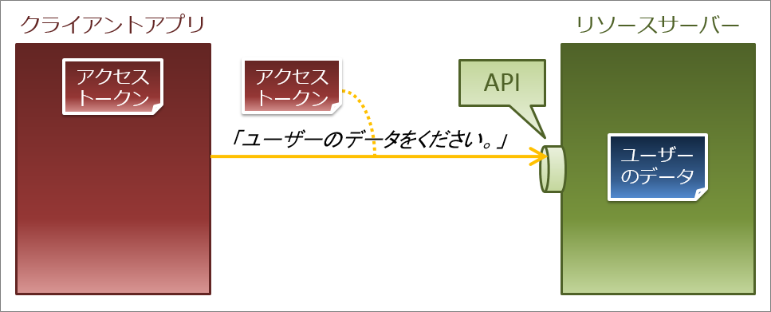

<style>
img[alt~="center"] {
  display: block;
  margin: 0 auto;
}
</style>

<!-- _class: lead invert-->

# なんとなく理解するOAuth

---
<!-- _class: lead -->

## はじめに
- 雑な理解で資料作ってます
- 簡単のためにわざと省略している部分、厳密には異なるがざっくり解説している部分も多いです
- 間違っていても笑って許してください
(指摘自体はありがたいのでください)

---
<!-- _class: lead -->

## 何を話すか
- OAuthとは
- 認可とは
- OAuthの仕組みについてざっくり解説

---
<!-- _class: lead -->
## 話さないこと、もしくは次回以降話すこと
- アクセストークンの詳しい仕様
- トークンの脆弱性とそれを防ぐ方法
- Oauth認証はやめよう
- OpenID Connectの詳しい中身

---
<!-- _class: lead -->

# そもそもOAuthとは

---
<!-- _class: lead -->

## OAuthの例
Googleのアレ(いわゆるGoogle認証)


---
<!-- _class: lead -->
## OAuthの概要
ざっくり言うと…

Google認証とか、LINE認証みたいに、使用したいアプリとは
別のサーバーのリソースを利用したいときの許可(認可)を行う仕組みの仕様を標準化したもの

---
<!-- _class: lead -->

## 類似の概念(覚えなくていいです)
OAuth, OpenID, OpenID Connectは兄弟

歴史的経緯
OAuth(1.0) ≒ OpenID  
-> OAuth(2.0)  
-> OpenID Connect

ややこしい :tired_face:  
<!--とりあえずOAuthとOpenID,OpenID Connectっていう似たサービスがあるんだなっていうことだけなんとなく覚えておいてください-->

---
<!-- _class: lead -->
## ここまでのまとめ
- Google使って住所情報をこのアプリに渡していいですか？とか聞かれるアレだよ
- 動いてるアプリとは別の認可サーバーで認可を行うよ
- OpenID, OpenID Connectっていう兄弟がいるよ

---
<!-- _class: lead -->
# 認可の仕組み
<!--まず認可について説明します-->

---
<!-- _class: lead -->

## 認可機能がないとき


<!--一見、問題ないように見えます
しかし世の中のすべてが安全なアプリというわｋではありません
アプリ側に悪意があった場合はどうなるでしょうか？
-->

---
<!-- _class: lead -->

## アプリ側にアプリがあった場合…


誰でもデータを取得できちゃう

---
<!-- _class: lead -->

# そこで認可機能

---
<!-- _class: lead -->

## 認可とは
> 情報セキュリティおよびコンピュータセキュリティに関わるリソースへの、とりわけアクセス制御へのアクセス権限を特定する機能である
by Wkipedia

認証(ログイン)とよく比較される  
認証された相手にどういう操作を許可するか？の許可の部分

---
<!-- _class: lead -->

## 認可のしくみ アクセストークン
認可ではアクセストークンと呼ばれる認可情報を取り扱います

```json
{
  "user_id": "11111",
  "authentication": [
    "get_mail_address",
    "send_mail",
  ]
}
```

---
## 認可のしくみ
<!-- _class: lead -->


予めクライアントアプリにアクセスアプリに持たせておきます

---
## 認可のしくみ
<!-- _class: lead -->


クライアントアプリはリクエストの送信時にアクセストークンも送信します

---
## 認可のしくみ
<!-- _class: lead -->


サーバーはアクセストークンの正当性と要求された操作が許可されているかを検証します

---
## 認可のしくみ
<!-- _class: lead -->


検証の結果ただしく認可されている場合はリクエストに従ってデータを返します。

ここまでがアクセストークンを使った認可の仕組みです。

---
## 認可のしくみ
<!-- _class: lead -->


この『どうやってアクセストークンを渡しておくか？』の部分がOAuthです
このOAuthの部分をこの後説明しますsimasu

---
<!-- _class: lead -->
## ここまでのまとめ
- 認可とは何かを許可することだよ
- 一般的な認可にはアクセストークンが使用されるよ
- どうやってクライアント側にアクセストークンを渡すのかを規定するのがOAuthだよ

---
<!-- _class: lead -->
# アクセストークンの受け渡し(OAuth)

---
<!-- _class: lead -->


クライアントアプリはリクエストの送信前にアクセストークンを認可サーバーから取得します

---
<!-- _class: lead -->


簡単のためにアクセストークンの発行部分だけ考えます

---
<!-- _class: lead -->


まずクライアントアプリは認可サーバーにアクセストークンを要求します

---

<!-- _class: lead -->


認可サーバーはユーザーに権限を許可してよいかを問い合わせます

---
<!-- _class: lead -->


---

<!-- _class: lead -->


ユーザーが許可した場合、認可サーバーはアクセストークンを生成し…

---
<!-- _class: lead -->


ユーザーが許可した場合、認可サーバーはアクセストークンを生成し…

---
<!-- _class: lead -->


クライアントアプリにアクセストークンを渡します
ここまでがアクセストークンの発行です

---
<!-- _class: lead -->


この部分がOAuth

---
<!-- _class: lead -->

## ちなみに一応補足
OAuthは『アクセストークン要求と発行の仕様を標準化したもの』
つまりただの仕様でOAuthというツールとかライブラリがあるわけではないです

認可の仕組みを作るときにOAuthに則っておくといいよみたいな感じ

---
<!-- _class: lead -->

## まとめ
- OAuthを使うことで外部のサービスと連携して情報へアクセスできるよ
- 認可にはアクセストークンと呼ばれる情報を使用するよ
- OAuthは仕様であって実装ではないよ
---
<!-- _class: lead -->

# 次回予告

---
<!-- _class: lead -->

## OAuthは認可だけで認証はできない…

- ではなぜ世の中でOAuth認証という言葉がはびこっているのか
- OAuthで認証するとセキュリティがヤバイ
- そのへんの問題を解決するOpenID Conenct

このへんについてお話しますsimasu

---
