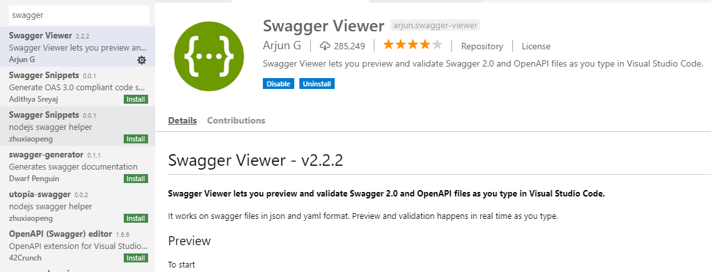

# API ドキュメントツール
---

* 仕様を基にドキュメント生成できる
* モック立てたりできる
* コードに記載したコメントからドキュメント生成できる

などなど...

# OpenAPI Specification
---

仕様は[ここにあります](https://github.com/OAI/OpenAPI-Specification)。

# Swagger と OpenAPI の違い
---

> [What Is the Difference Between Swagger and OpenAPI?](https://swagger.io/blog/api-strategy/difference-between-swagger-and-openapi/)

全て公式の記事に書いてありますが、かいつまんで書くと（たぶん）下記のような感じになります。

* OpenAPI: 仕様
* Swagger: 仕様（OpenAPI）をもとにした実装

もともとSwagger SpecificationだったものがOpenAPI Specificationに改名されたものの、実装の方はもとのブランドを維持したまま残した。といことらしいです。OpenAPIに沿った実装はほかにも存在します。

# Swagger
---

以下、今回の説明ではSwaggerを使います。Swaggerは[Swagger Editor](https://editor.swagger.io/)というオンラインのサービスで手っ取り早く試すことができます。

ただし、実際には手元で確認したいと思いますのでVSCodeの拡張の[Swagger Viewer](https://github.com/arjun-g/vs-swagger-viewer)を利用します。



## 小さい構成のサンプル

いきなり大きいサンプルではじめても大変なので、小さいサンプルから始めます。

Swagerのサンプルがペットショップなので、それにあやかってリカーショップのAPIドキュメントを作成してみましょう。

とりあえず指定したIDのお酒を返すGETメソッドのみを記述してみます。

```yaml
openapi: 3.0.2
info:
  title: Liquors Store API
  description: サンプルAPI
  version: 1.0.0
servers:
- url: /
paths:
  /liquors/{liquorId}:
    get:
      summary: 指定されたidのお酒を取得します
      parameters:
      - name: liquorId
        in: path
        description: 取得したいお酒のID
        required: true
        schema:
          type: integer
          format: int32
      responses:
        200:
          description: 成功時のレスポンス
          content:
            '*/*':
              schema:
                type: object
                properties:
                  id:
                    type: integer
                    format: int32
                  name:
                    type: string
                    example: ビール
components: {}
```

先ほどのVSCode拡張のSwagger Viewrで確認してみましょう。

上記のyamlをVSCodeで開いた状態で、`Ctrl + Shift + P`で`Swagger`と入力すると`Preview Swagger`というメニューが表示されます。選択すると別のペインでAPIのプレビューが確認できます。

## お酒を登録できるようにする

次にPOSTメソッドを追加してみましょう。`paths`以下に次のように記述します。

```yaml
paths:
  /liquors:
    post:
      summary: お酒を新規登録します
      requestBody:
        required: true
        content:
          application/json:
            schema:
              properties:
                category:
                  type: string
                  description: お酒の種別
                name:
                  type: string
                  description: 銘柄
```

次に必要なのはレスポンスです。成功時・失敗時の2つのレスポンスを記述します。

```yaml
paths:
  /liquors:
    post:
      summary: お酒を新規登録します
      requestBody:
        required: true
        content:
          application/json:
            schema:
              properties:
                category:
                  type: string
                  description: お酒の種別
                name:
                  type: string
                  description: 銘柄
      # こっから下を足す
      responses:
        201:
          description: リクエストに成功し、お酒が作成された場合のレスポンス
          content:
            application/json:
              schema:
                type: object
                properties:
                  id:
                    type: integer
                    format: int32
                  category:
                    type: string
                    example: ビール
                  name:
                    type: string
                    example: 黒ラベル
        400:
          description: ペイロードが不正だった場合のレスポンス
          content:
            application/json:
              schema:
                type: object
                properties:
                  message:
                    type: string
                    example: エラー内容
```

こんな感じでしょうか。

## 共通箇所を切り出す

さて、ここまでで`GET`と`POST`のレスポンス（`schema`）が重複していることに気づいたと思います。

```yaml
content:
  application/json:
    schema:
      type: object
      properties:
        id:
          type: integer
          format: int32
        category:
          type: string
          example: ビール
        name:
          type: string
          example: 黒ラベル
```

この重複箇所を切り出します。切り出すには`components.schemas`というキーを記述し、そこに共通化したい`schema`を記述します。Swaggerのサンプルでは下部に書いてあるので、そちらを参考にしてyamlの下部に書きます。

```yaml
components:
  schemas:
    liquor:
      type: object
      properties:
        id:
          type: integer
          format: int32
        category:
          type: string
          example: ビール
        name:
          type: string
          example: 黒ラベル
```

後はこの切り出した`schemas`を参照します。例えば`POST`のレスポンスから参照するには下記のようになります。

```yaml
responses:
  201:
    description: リクエストに成功し、お酒が作成された場合のレスポンス
    content:
      application/json:
        schema:
          $ref: '#/components/schemas/liquor'
```

後はエラーメッセージなども同様に切り出しておいた方が楽になったりするんじゃないでしょうか。

## Enumを使う

さて、カテゴリーですが`string`よりは`enum`の方が適切でしょう。

```yaml
liquor:
  type: object
  properties:
    id:
      type: integer
      format: int32
    category:
      type: string
      example: ビール
    name:
      type: string
      example: 黒ラベル
```

`type`は`string`のままで`enum`を追加します。下記のような感じです。

```yaml
category:
  type: string
  description: お酒の種別
  example: ビール
  enum:
    - ビール
    - 日本酒
    - ワイン
    - ウイスキー
```

## 配列を使う

一件ずつidを指定して`GET`するわけにもいかないので、まとめて全部取得できるAPIが欲しいですね。

`type`に`array`を指定して`items`キーを記述します。

```yaml
schema:
  type: array
  items:
    $ref: '#/components/schemas/liquor'
```

これを`response`のキーに指定すると下記のようになります。

```yaml
/liquors:
  get:
    summary: お酒の一覧を取得します
    responses:
      200:
        description: 成功時のレスポンス
        content:
          application/json:
            schema:
              type: array
              items:
                $ref: '#/components/schemas/liquor'
```

## 認証を扱う

実際のAPIには認証が必要な場合があるかと思います。認証を指定するには`components.securitySchemes`に認証方法を記述します。

```yaml
securitySchemes:
  OAuth2:
    type: oauth2
    description: 
    flows:
      authorizationCode:
        scopes:
          write: 登録・更新
          read: 取得
```

`POST`時に認証が必要という想定で、記述した`securitySchemes`をもちいて認証を表現すると下記のようになります。

```yaml
post:
summary: お酒を新規登録します
requestBody:
  required: true
  content:
    application/json:
      schema:
        properties:
          category:
            type: string
            description: お酒の種別
            enum:
              - ビール
              - 日本酒
              - ワイン
              - ウイスキー
          name:
            type: string
            description: 銘柄
security: # これを指定する
  - OAuth2:
    - write
```

また、認証失敗の場合のレスポンスも追記するのが良いと思います。

```yaml
401:
  description: 認証に失敗した場合のレスポンス
```

## ブラッシュアップ

もう少しだけドキュメントをブラッシュアップしたいと思います。

### 説明の追記

説明をもう少し充実させてみます。yamlは`|`で改行できます。また、後述するReDoc（OpenAPIのyamlからHTML生成してくれるツール）はイイ感じにやってくれるのでMarkdownの見出しとかも記述できます。

```yaml
description: |
  # 前書き
  このAPI仕様書はOpenAPI形式で記述したものを[ReDoc](https://github.com/Rebilly/ReDoc)を用いてHTML生成しています。
  # 概要
  本ドキュメントではリカーショップの登録・取得についての仕様を記します。
```

### 外部リソースの指定

下記を追記することで外部リソースへのリンクを記述することが可能です。

```yaml
externalDocs:
  description: ソースコード
  url: 'https://github.com/YoshinoriN/monooki/tree/master/tools/open-api-v3-with-redoc'
```

### ベースURL

APIのベースURLも細かく指定します。サブディレクトリないしサブドメインでバージョンを分けるのが一般的だと思われるので、下記のような記述をしてみます。

```yaml
servers:
  - url: http://example.com/v1
```

# Redoc
---

さて、記述したyamlからドキュメントがきれいな感じで生成されるのが好ましいので、今回は[ReDoc](https://github.com/Rebilly/ReDoc)を用いて生成を行います。

今回はcliを使用するとして、まず`package.json`を準備します。

```json
{
  "name": "openapi-v3-with-redoc",
  "version": "1.0.0",
  "description": "Open API Example with Redoc",
  "main": "index.js",
  "scripts": {
    "build": "./node_modules/.bin/redoc-cli bundle ./docs/v1/example.yml -o ./dist/index.html",
  },
  "author": "YoshinoriN",
  "devDependencies": {
    "redoc-cli": "^0.8.3"
  },
  "dependencies": {}
}
```

後は`npm install`して`scripts`にyamlと出力先を指定して実行すればイイ感じにドキュメントを生成してくれます。