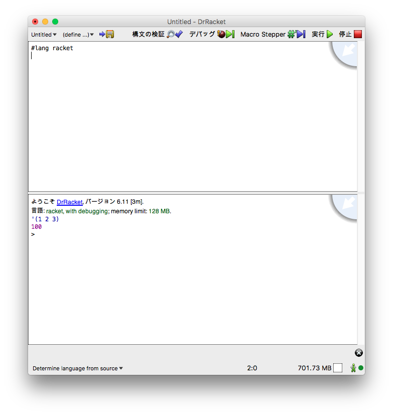

---
html:
  embed_local_images: true
  embed_svg: true
  offline: false
  toc: true

print_background: false
---

S式で学ぶプログラミング言語基礎
====

## はじめに
本稿では、S式の字句解析器と構文解析器を作成することで、プログラミング言語への理解を促すことを主眼におく。本稿で提供するソースコードは、C++言語で書いているためC言語またはC++言語の使用経験を有することが望ましいが、使用経験がなくても他の汎用言語（C#・JAVA・PHPなど）の使用経験があれば問題ないと考える。また、基礎的なデータ構造とアルゴリズム（特に木構造）へ理解しているを前提とする。

### 準備
各自の環境に、以下のソフトウェアをインストールしておくこと。
- [Racket (DrScheme)](https://download.racket-lang.org/)

### S式とは
まず、S式(S-Expression)から見ていく。S式は()を使ったリスト構造を表記法であり、論理表現についての推論の形式化として発明された。S式は、考案者であるJohn Mccarthyの「Recursive Functions of Symbolic Expressions and Their Computation by Machine」に基づいている。S式はSchemeに代表されるLisp処理系のデータ構造として採用されている。

S式の基本構造は以下の通りである。

```
<S式>  ::= <List> | <Atom> 
<List> ::= (<S式>*) 
<Atom> ::= <Symbol> | <Number> | <String> | nil
```

S式を構成するための基本要素としてアトム(Atom)があり、これには数値・文字列・nilなどのリテラルやSymbolと呼ばれる関数名・変数名が含まれる。S式はリストまたはアトムから構成され、リストはS式を並べたものである。

さて、S式の概要を述べたところだが、理解するには実際に処理系を触ることが理解が早い。実際にSchemeの処理系を利用してS式がどういうものかを見ていく。事前にインストール済みのRacket(DrScheme)を立ち上げると次の画面が表示される。



Racketの画面構成初のようになっている。


以下のコードを画面上部のエディタ領域に入力し、実行ボタンを押すと、画面下部にHello Scheme!と出力される。

```lisp
(print "Hello, Scheme!")
```

まず、S式では、通常の中置記法ではなく前置記法で命令を書く。

```lisp
(<operator> <arguments>)
```

例えば、加減乗除は以下のように書く。

```lisp
(+ 1 2)
(- 1 2)
(* 1 2)
(/ 1 2)
```

ネストされた計算もできる。

```lisp
(- (+ 1 2) (* 3 3))
```

S式はリストであるから、次にリスト操作から見ていくのが順当であろう。リストを作るには、括弧の前にシングルクオートをつける。

```lisp
(print '(1 2 3 4))
```

list関数を使ってもリストが作成できる。

```lisp
(list 1 2 3 4 5)
```

リストを結合するには **_cons_** を使う

```lisp
(cons '(1 2 3 4) '(1 2 3 4))
```


なお **_list_** 関数は以下と等価である。
```lisp
(cons 1 (cons 2 (cons 3 (cons 4  null))))
```

また、他の代表的な操作として、**_car_** と **_cdr_** がある。**_car_** はリストの先頭要素を取り出す操作、**_cdr_** はリストの残り要素を取得する操作である。

```lisp
(car '(1 2 3 4))
(cdr '(1 2 3 4))
```

シンボルを定義するには **_define_** を使う。
```lisp
(define x 256)
```

関数もシンボルなので、**_define_** で定義される。

```lisp
(define (square x) (* x x))
(print (square 5))
```

defineは、名前に値を束縛する。処理系はこの名前を記憶しているのは自明であるからこの記憶している領域のことを **_環境(environment)_** という。また、defineは名前と値を紐付けるだけであり、defineされた時点では対象を評価しない。これを **_スペシャルフォーム(spescial form)_** と呼ぶ。


**課題（１）**
次のS式の値を計算せよ。

1. (* 2 3)
1. (+ (* 2 3) (/ 4 2))
1. (/ (+ (* 2 11) (* 3 16))  5)

**課題（２）**
次のリスト操作の結果を箱矢印記法で表記せよ。

1. (car '(1 2 3 4))
1. (cdr '(1 2 3 4))
1. (list '(1 2 3 4) '(4 5 6))
1. (cdr (list '(1 2 3 4) '(7 8 9) '(4 5 6)))

### 木構造について
S式の解釈に入る前に、重要なデータ構造の一つである木について簡単に触れておく。木は閉路（ループ）がないグラフである。グラフは頂点と辺から構成され、以下のような構造である。


木は、グラフの一種であるから同様に頂点と辺から構成される。


ただし、次の構造は、ループがあるためグラフではあるが木構造ではない。


#### 代表的な木構造
木構造を用いた代表的なデータ構造は、２分木、B＊、赤黒木、などがある。B*などは、MySQLなどのデータベースのインデックスのデータ構造として採用されている。

#### 木の走査
木の頂点をどの順番で訪ねていくということを **走査(traverse)** という。これは木のノードを訪問する順番によって、行きがけ順・通りがけ順・帰りがけ順に分類できる。またこれは一般に **深さ優先探索** とも呼ばれる。深さ優先探索は、再帰手続きによって容易に実装できる。以下に、再帰をつかったそれぞれの走査を記載する。

```cpp
/*
 * 行きがけ順の走査
 */
template <typename T>
void pre_order_traverse(const std::shared_ptr<node<T>> &n, std::function<void(T)> callback)
{
    callback(n->_value);

    if (n->_left != nullptr)
    {
        pre_order_traverse(n->_left, callback);
    }
    if (n->_right != nullptr)
    {
        pre_order_traverse(n->_right, callback);
    }
}
```

```cpp
/*
 * 通りがけ順の走査
 */
template <typename T>
void in_order_traverse(const std::shared_ptr<node<T>> &n, std::function<void(T)> callback)
{
    if (n->_left != nullptr)
    {
        in_order_traverse(n->_left, callback);
    }
    callback(n->_value);
    if (n->_right != nullptr)
    {
        in_order_traverse(n->_right, callback);
    }
}
```

```cpp
/*
 * 帰りがけ順の走査
 */
template <typename T>
void post_order_traverse(const std::shared_ptr<node<T>> &n, std::function<void(T)> callback)
{

    if (n->_left != nullptr)
    {
        post_order_traverse(n->_left, callback);
    }
    if (n->_right != nullptr)
    {
        post_order_traverse(n->_right, callback);
    }

    callback(n->_value);
}
```

### S式の解釈
S式はリスト構造であると同時に構文木そのものでもある。例えば、次のS式は文字が出現した順にそのまま構文木に書き下せる。

```lisp
(+ (* 2 3) (/ 4 2))
```


この書き下した構文木を行きがけ順で走査すると、

```
((2 * 3) + 4 / 2))
```
が得られる。同様にして演算子と値を評価すれば与えられたS式の実行ができるようになる。


話（実装も）を簡単にするために、ここで扱うS式は演算子と数値のみから構成されているものに焦点を当てる。

S式を解釈するためには、まず入力された文字列を意味のある単位に分解する。これを **字句解析** と呼び、軸解析を行うプログラムは **字句解析器** と呼ばれる 字句解析では、入力された文字列を意味のある単位（トークン）に分解して、トークンの意味情報を付与する。

字句解析の結果、入力された文字列からトークンの列が得られる。得られたトークン列と構文規則から構文木を作成する処理を **構文解析**と呼ぶ。構文解析を行うプログラムは **構文解析器** と呼ばれる。 

構文解析器から得られた構文木を適切に訪問することで、入力されたS式を評価して実行することができる。式を評価をするプログラムを **評価器** と呼ぶ。我々が普段使っているREPL(Read-Eval-Print-Loop)は、上記の処理をインタラクティブに行う実行環境である。


**課題（３）**
次のS式を木構造で表記せよ。
1. (* 2 3)
1. (+ (* 2 3) (/ 4 2))
1. (define (square x) (* x 2))

**課題（４）**
以下の仕様を満たす字句解析器tokenizeを作成せよ。言語は自由に選択して良い。

**入力**
 １行からなる文字列。改行コードは含まれないとする。
 また入力文字列に含まれる文字と種別は次のとおりとする。

|文字|種別|
|:---|:----|
|(|左括弧|
|)|右括弧|
|+|加算演算子|
|-|減算演算子|
|*|乗算演算子|
|/|除算演算子|
|数値|アトム|
|文字列|アトム|
|半角空白|区切り文字|


**出力** 
トークンの値と種別を表示。表記は自由で良い。

**入出力例**
【入力例】
```txt
(/ 3 1)
```

【出力例】
```txt
TokenType:LeftBracket (
TokenType:DivideOperator /
TokenType:Atom 3
TokenType:Atom 1
TokenType:RightBracket )
```


**課題（５）**
課題４で作成したtokenizeのトークン列から、以下の構文規則を満たす構文解析器parseを作成せよ。言語は自由に選択して良い。

**構文規則**
式：（演算子　左辺値　右辺値）
演算子：+ | - | * | /
左辺値：式　| アトム
右辺値：式　| アトム

**入力**
 トークンの配列。トークン情報は、課題４のとおりとする。

**出力** 
入力されたトークン列から、S式を中置記法に置換して表示する

**入出力例**
【入力例】
```txt
(+ (+ 2 1) (* (+ 3 1) 4))
```

【出力例】
```txt
2 + 1 + 3 + 1 * 4
```

**課題（６）**
課題５で作成したparserで得られた構文木を評価し、実行結果を表示するプログラムevalを作成せよ。言語は自由に選択して良い。

**入力**
 parserで得られた構文木のデータ構造

**出力** 
構文木を評価し、計算結果を表示する。

**入出力例**
【入力例】
```txt
(+ (+ 2 1) (* (+ 3 1) 4))
```

【出力例】
```txt
19
```