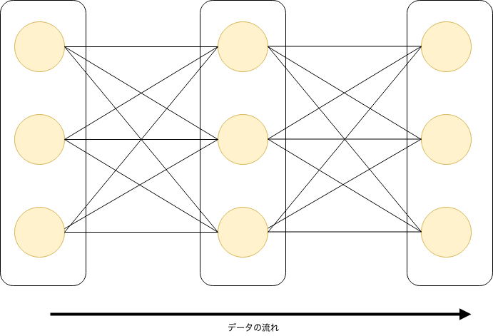
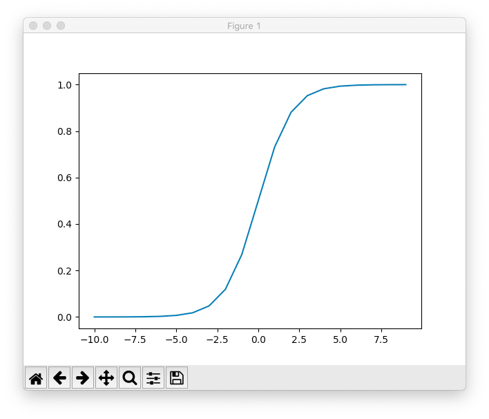
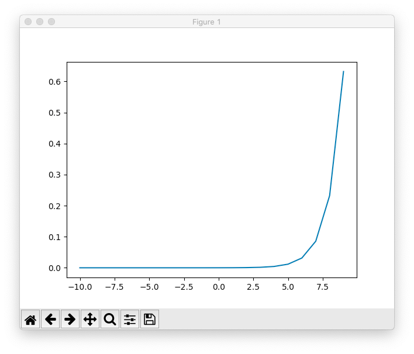

Pythonによる手書き文字認識
====

### Pythonの環境構築
まずは、Pythonの環境構築をします。 Linux/macOSであれば、パッケージマネージャからインストールすれば良いでしょう。Windowsもパッケージマネージャはありますが、どれも一長一短なので素直にインストーラーをダウンロードして使うのが良いと思います。

環境構築には、`venv`または`pyenv`を使って環境を構築する場合と、科学計算に特化した`anaconda`を使う方法があります。科学計算主体であれば`anaconda`から入れると良いと思います。今回は、`anaconda`を使って環境を構築する前提で話を進めます。

#### Windows
公式サイトの[Windows版Anacondaのインストール](https://www.python.jp/install/anaconda/windows/install.html) に従ってインストールをします。

#### macOS
Homebrewを使います。brewコマンドで、`anaconda`をインストールする場合は以下のようにします。

```sh
brew install pyenv
brew cask install anaconda
```

以下のスクリプトをシェルプロファイルに追加し、ターミナルを再起動
```sh
export PYENV_ROOT="$HOME/.pyenv"
export PATH="$PYENV_ROOT/bin:$PATH"
eval "$(pyenv init -)"
```

- 以下のコマンドを実行し、anacondaを有効にする

```sh
pyenv install anaconda3-4.3.1
pyenv global anaconda3-4.3.1
```
### conda コマンド
#### 仮想環境の構築
anacondaには、`conda`と呼ばれるコマンドが内蔵されています。`conda`コマンドにはpyenvのような環境分離ツールが含まれているので、condaを使っておけばpyenvはなくても環境を分離できます。

`conda`コマンドから、環境を構築するコマンドは次のとおりです。

```bash
conda create -n <ENVNAME> python=<VERSION> anaconda=<VERSION>
```

`<ENVNAME>`は必須ですが、`<VERSON>`は任意です。では、mnist用の環境を構築しましょう

```bash
conda create -n mnist
```

これで、環境が作成されます。環境を作成しただけでは、有効にならないので、作成した環境を有効化します。仮想環境を有効化するのは、`activate`コマンドを実行します。`zsh`を使っているとうまく動かないので、`zsh`を使っている場合は`bash`に切り替えます。

```sh
bash
source activate mnist
```

`activate`されると、プロンプトの前に、仮想環境名が表示されるようになります。

```sh
(mnist) bash-3.2$ 
```

仮想環境を無効化するには、`deactivate`をします

```sh
source deactivate
```

#### パッケージの操作
`conda`コマンドには、pip相当のコマンド群がが用意されています。基本的には、condaで仮想環境を作ってそこへインストール作業を行って仮想環境を管理するのが一般的かと思われます。

- 現在の仮想環境で、インストール済みのパッケージの一覧を表示する

```sh
conda list
```

- 現在の仮想環境に、パッケージをインストールする

```sh
conda install <package-name>
```

- 現在の仮想環境から、パッケージをアンインストールする

```sh
conda remove <package-name>
```

では、mnistで必要な`keras`と`matplotlib`を`conda`コマンドからインストールします。おそらくデフォルトのchannelのみだとkeraｓがインストール出来ないので、インストールチャンネルに`conda-forge`を足してます。

```sh
conda config --append channels conda-forge
conda install keras
conda install  matplotlib
```

kerasは機械学習ライブラリのフロントエンド(裏ではtensorflowが動いています)で、matplotlibは描画用のライブラリです。他にも、`scikit-learn`や`pandas`などの科学計算ライブラリがありますが今回は使用しません。

### Jupyter Notebookについて
ついでなので、JupyterNotebookについても触れておきます。JupyterNotebookは、Pythonで使える実行環境であり執筆環境です。 `Visual Studio Code`の拡張でもありますが、今回はlocalhostで動かしてみます。

Anaconda Navigatorのアプリをクリックして、JupterNoteを起動します（デフォルトでインストール済みだと思いますが、後付でインストールすることもできます）。


Markdown記法でメモを取りつつ、Pythonの実行もできます。カーネルを追加すれば、Python以外の言語を動かすこともできます。

### 機械学習チュートリアル
#### MNISTデータの取得と表示
ようやく本題です。では早速Pythonのコードを書いてみましょう。まず、mnistのデータセットのダウンロードをして表示を試みます。

```py
from keras.datasets import mnist
import matplotlib.pyplot as plt

# download mnist
(train_images, train_labels), (test_images, test_labels) = mnist.load_data()

# show label and image element num
print("画像データの要素数", train_images.shape)
print("ラベルデータの要素数", train_labels.shape)

# show label and image
for i in range(0, 10):
    print("ラベル", train_labels[i])
    plt.imshow(train_images[i].reshape(28, 28), cmap='Greys')
    plt.show()
```

かんたんですね。

表示ができたところで、MNISTについて説明します。MNISTは、`Mixed National Institute of Standards and Technology database`の略で、0〜9までの手書き数字画像が7万枚パックになったデータセットです。

mnistはには、画像データとそれに対応するラベルのセットで、学習用と検証用のセットがあります。
`mnist.load_data`の戻り値が学習用と検証用のセットとなります。

kerasでは、[mnist](https://keras.io/ja/datasets/#mnist)のラベルと画像データはshapeのuint8配列で取得されます。
ロード後は、学習用イメージとラベルの総数を表示して、0~10までの画像トラベルをfor文で表示しています。

#### 手書き文字認識モデルの作成
一般に、`機械学習(Machine Learning)`では、（1）データの準備（2）データの前処理（3）モデルの推定（4）モデルの学習のステップで機械学習モデルを構築します。構築された学習モデルを使って「入力がなにか推論」することを`認識(Recognition)`と呼びます。最近の玉石混交なネットの記事では同一というふうに扱われている場合もありますが異なる概念です。

次に、機械学習のモデルには大きく分けて3つあります。`教師あり学習`・`教師なし学習`・`強化学習`の3つです。教師ありが正解データとそれに対応するラベルを学習用データとして与え、与えられたデータから学習を行うモデルです。教師なし学習は、正解ラベルが事前にわからない対象に対して学習を行う手法です。強化学習は、入力データからモデル自身が学習を行うモデルです。

今回は、MNISTを使うので教師あり学習となります（MNISTには訓練用の画像と正解ラベルがセットになっているため）。


[サンプル記事](https://shirakonotempura.hatenablog.com/entry/2018/12/26/081140)を参考に、学習モデルの構築を行います。サンプル記事のコードをまとめたものを、`mnist.py`としてまとめてあります。

```py
from keras.datasets import mnist
from keras.utils import to_categorical
from keras.layers import Dense
from keras.models import Sequential
from keras.callbacks import TensorBoard
import numpy as np

#-------------------------------------------------------
#(1) データの準備
# データの取得をする。発展的にはこのload_dataを自作する
#-------------------------------------------------------
# MNISTデータのロード
(x_train, y_train), (x_test, y_test) = mnist.load_data()

# データの初期状態の確認
print("訓練用データのshape 　: {}".format(x_train.shape))
print("テスト用データのshape : {}".format(x_test.shape))
print("訓練用ラベルのshape 　: {}".format(y_train.shape))
print("テスト用ラベルのshape : {}".format(y_test.shape))

#-------------------------------------------------------
#(2) データの前処理
# データの前処理では、データの正規化・欠損値の補填などを行う
#-------------------------------------------------------
# データの形状変更
x_train = x_train.reshape(60000, 784)
x_test = x_test.reshape(10000, 784)
print()

# データの標準化
raw_max_num = max(x_train[0])
print("標準化前データ内の最大数 : {}".format(raw_max_num))
x_train = x_train / raw_max_num
x_test = x_test / raw_max_num
new_max_num = max(x_train[0])
print("標準化後のデータ内の最大数 : {}".format(new_max_num))
print()


# one_hot_encoding
raw_label = list(set(y_train))
print("エンコード前のラベル・バリエーション : {}".format(raw_label))
y_train = to_categorical(y_train, 10)
y_test = to_categorical(y_test, 10)
new_label = [min(y_train[0]), max(y_train[0])]
print("エンコード後のラベル・バリエーション : {}".format(new_label))
print()

#-------------------------------------------------------
#(3) モデルの作成
# モデルの作成する。活性化関数の指定
#-------------------------------------------------------
# モデルの全体を定義
model = Sequential()

# 一つ目の層を追加
model.add(
    Dense(
        units=50,
        input_shape=(784,),
        activation='sigmoid'
    )
)

# 二つ目の層を追加
model.add(
    Dense(
        units=30,
        input_shape=(784,),
        activation='sigmoid'
    )
)

# 三つ目の層を追加
model.add(
    Dense(
        units=10,
        activation='softmax'
    )
)

#-------------------------------------------------------
#(4) モデルの学習
# 訓練用データからモデルの学習を行う
#-------------------------------------------------------
model.compile(
    optimizer='sgd',
    loss='categorical_crossentropy',
    metrics=['accuracy']
)

tsb = TensorBoard(log_dir='../logs')

history_adam = model.fit(
    x_train,
    y_train,
    batch_size=32,
    epochs=20,
    validation_split=0.2,
    callbacks=[tsb]
)


#-------------------------------------------------------
#(5) 推論
#-------------------------------------------------------
predict_result = model.predict(x_test)

print(x_test)

idx = [1001, 5010, 7701]

for i in idx:
    print("現在のインデックス : {}".format(i))
    print("正解ラベル : {}".format(np.argmax(y_test[i])))
    print("推測値 　　: {}".format(np.argmax(predict_result[i])))

```

(1)については、説明は省略します。(2)では、データの標準化を行っています。データを標準化する理由としては、データの種類・大きさを揃えるためです。データ大きさや種類を揃えておくことで、極端な入力がないようにします。また入力がない場合も、欠損値処理でデータの補填を行います。最後のonehot_encodingですがこれはベクトルの正規化の一つで、ベクトルの要素を一つだけ1にしてそれ以外を0にする変換です。

次にモデルの構築ですが、今回は隠れ層が3つある線形モデル（直列に層を積み重ねる）を作成しています。



入力の活性関数に1層目と2層目にsigmoid関数を3層目にsoftmax関数を適用しています。sigmoid関数と、softmax関数の動きをmatplotで確認すると次のような図が得られます。





このような性質があるため、sigmoid関数で入力を近似し、softmax関数で出力値を決定します。

あとは、この構築したモデルに訓練用データを与え、学習させればモデルが完成します。（発展的には複数のモデルを作成し評価を行って適切なモデルを選択する過程が必要です）

最後に、訓練データを学習したモデルに対して、検証用データを与えれば推論を実施できます。今回は、検証データの推論を行っていますが任意の画像データをMNIST形式に変換することで、任意の画像の手書き画像を識別することができるようになります。