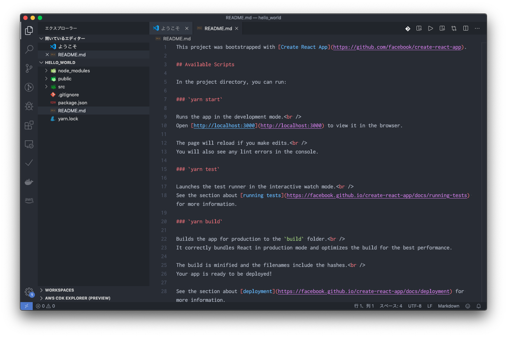
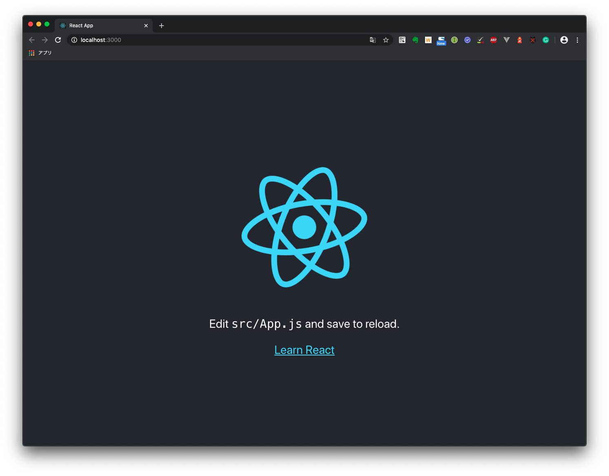
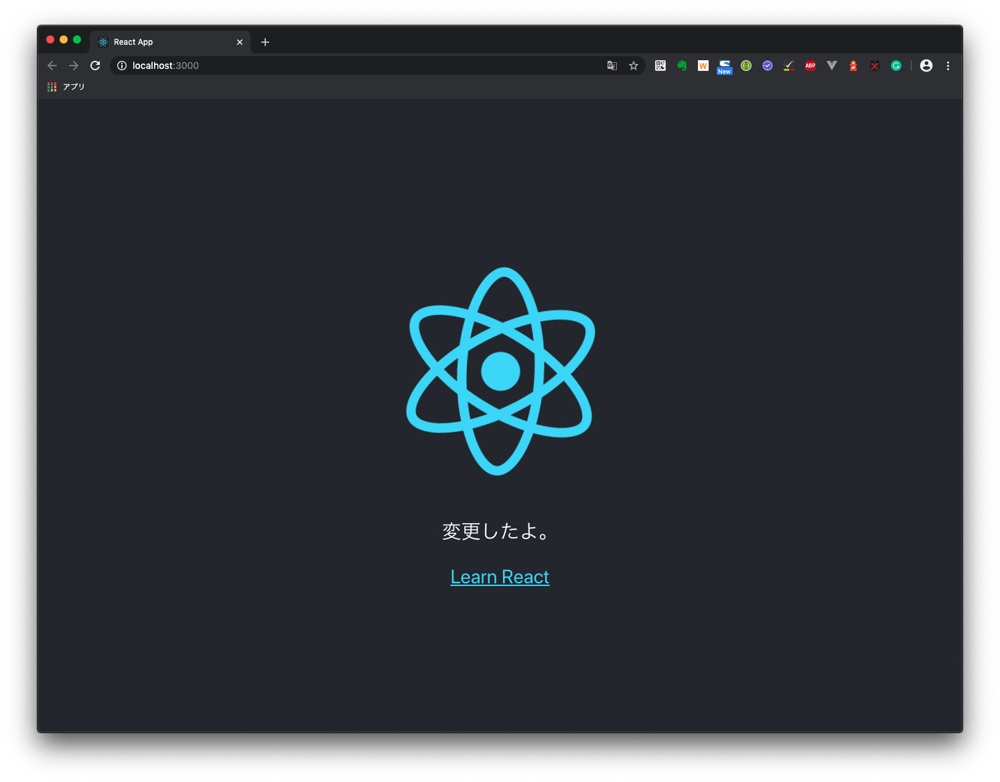
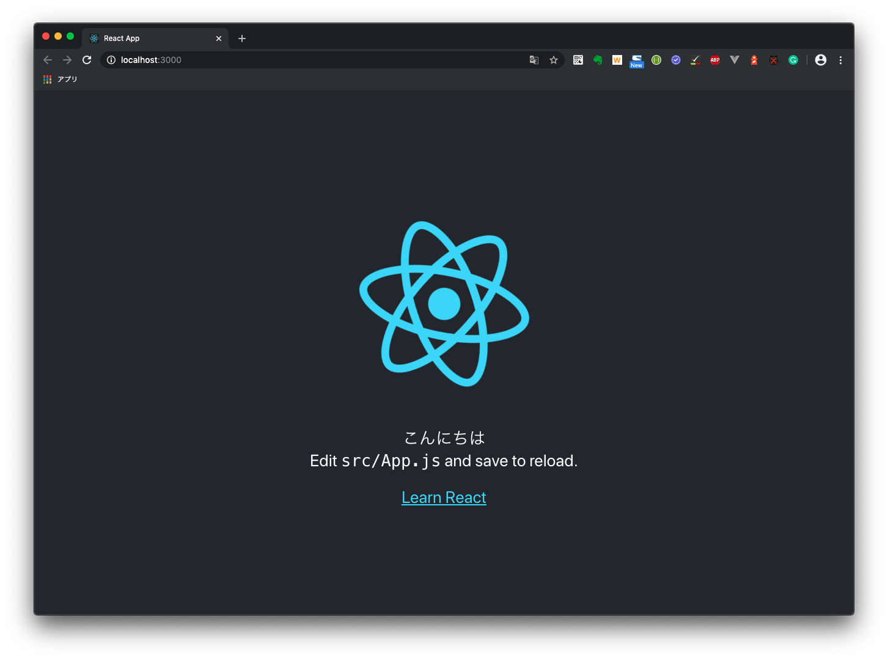
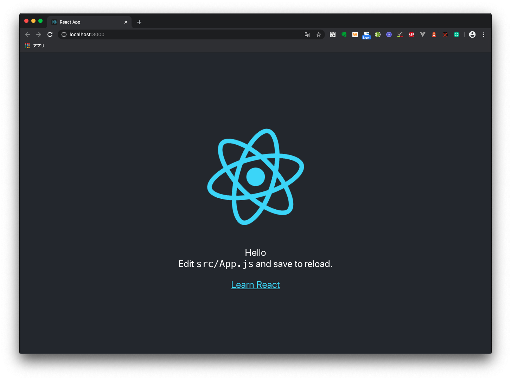
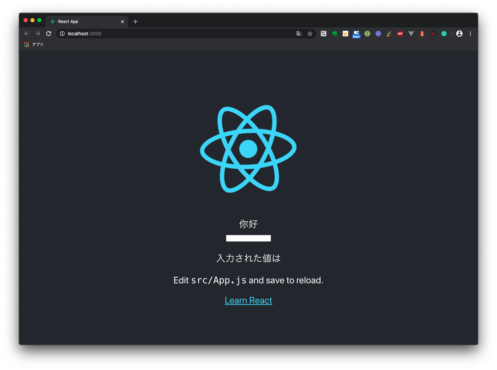
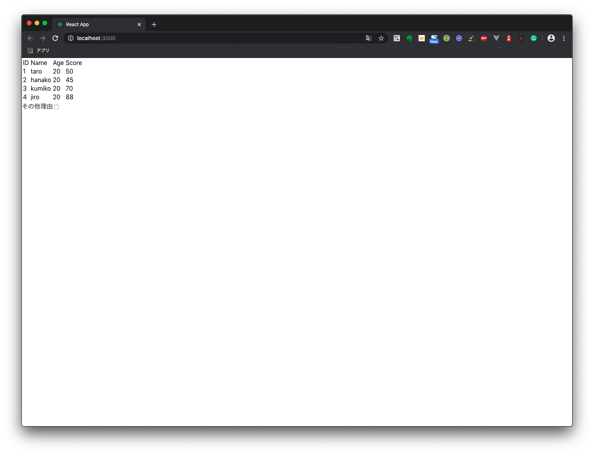
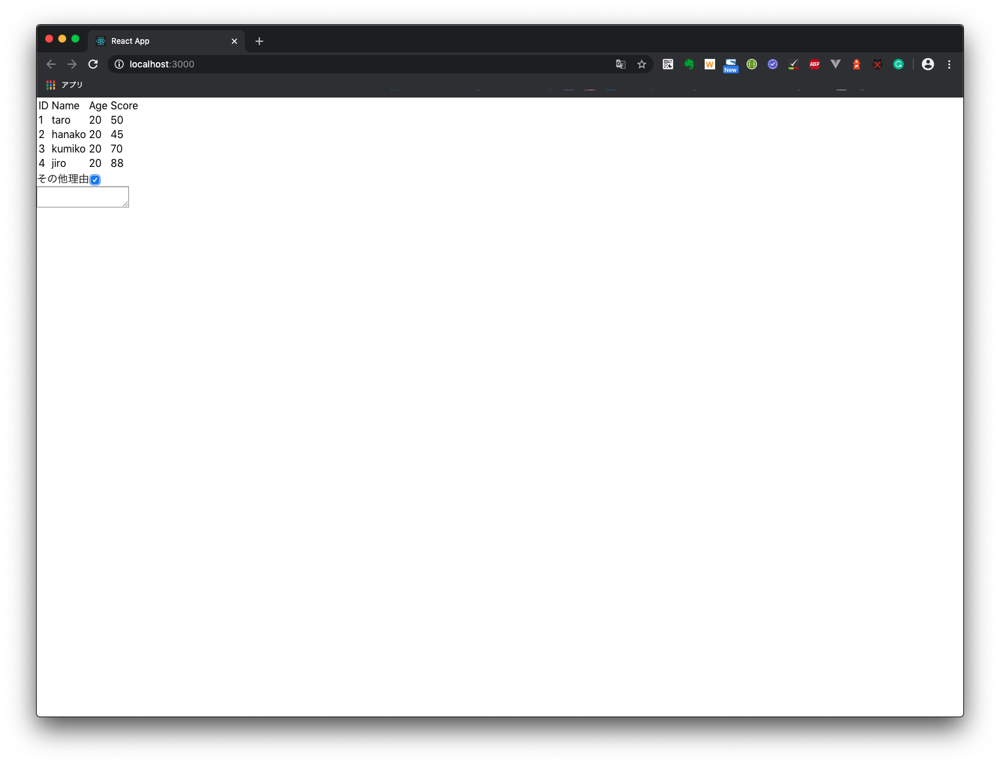

# Reactハンズオン資料

## イントロダクション

### Reactとは

__React__ は、米Meta社(旧Facebook社)が開発したビューをサポートするライブラリです。フルスタックのフレームワークとは異なり、ビューだけをサポートするため軽量です。

Reactの大きな特徴は仮想DOMをサポートしている点です。ReactはDOMを直接操作するのではなく、__仮想DOM__ を作成し、仮想DOMを元に実際のDOMを構築します。そのため1度DOMが構築されれば、前回の仮想DOMとの差分を描画するだけでよくなるため高速にDOMを構築できます。

しかし、状態管理やルーティングの処理が必要であれば、ReduxやReact-Routerなどのライブラリを用意する必要があります。

### 環境設定

本節では、Reactを用いたプロジェクトの開発環境の構築手順について記載します。

#### 開発環境の用意

Reactを使ったプロジェクトの開発には、エディターとNode.jsが必要です。
エディターには、Atom・Visual Studio Code・IntelliJ IDEA・ WebStormなどがあります。本稿では、以下のツールを入れておきます。

- Visual Studio Code
- Node.js

<div style="page-break-before:always"></div>

#### Visual Studio Codeの拡張機能のインストール

下記の拡張機能を入れておくと作業効率が良くなります。インストールしておくとよいでしょう。

- Code Metrics
- Document This
- ESLint
- Git Blame
- Git History
- Git History Diff
- GitLens
- React/Redux Snippets

#### create-react-appのインストール

create-react-appは、Reactのプロジェクトの雛形を生成するためのnpmパッケージです。   以下のコマンドでインストールすることができます。

```sh
$npm install -g create-react-app
```

## Hello, World

### プロジェクトを準備する

先にインストールしておいた、create-react-appを使ってReactのプロジェクトを立ち上げます。

create-react-app [プロジェクト名] でプロジェクトを作ることができます。

```sh
$npx create-react-app hello_world

Creating a new React app in /Users/user-name/Documents/scripts/externals/log_notes/handson/react/src/hello_world.

Installing packages. This might take a couple of minutes.
Installing react, react-dom, and react-scripts with cra-template...

yarn add v1.19.1
[1/4] 🔍  Resolving packages...
[2/4] 🚚  Fetching packages...
info There appears to be trouble with your network connection. Retrying...
info There appears to be trouble with your network connection. Retrying...
info There appears to be trouble with your network connection. Retrying...
[3/4] 🔗  Linking dependencies...
warning "react-scripts > @typescript-eslint/eslint-plugin > tsutils@3.17.1" has unmet peer dependency "typescript@>=2.8.0 || >= 3.2.0-dev || >= 3.3.0-dev || >= 3.4.0-dev || >= 3.5.0-dev || >= 3.6.0-dev || >= 3.6.0-beta || >= 3.7.0-dev || >= 3.7.0-beta".
[4/4] 🔨  Building fresh packages...
success Saved lockfile.
warning Your current version of Yarn is out of date. The latest version is "1.21.1", while you're on "1.19.1".
info To upgrade, run the following command:
$ curl --compressed -o- -L https://yarnpkg.com/install.sh | bash
success Saved 35 new dependencies.3
```

プロジェクトを作ると同時に、パッケージのインストールも行われます。

### 作成したプロジェクトを確認する

create-react-appで作成したプロジェクトのディレクトリ構成は、treeコマンドで確認します。

```sh
$tree . -L 3 -I node_modules
.
├── README.md
├── package.json
├── public
│   ├── favicon.ico
│   ├── index.html
│   ├── logo192.png
│   ├── logo512.png
│   ├── manifest.json
│   └── robots.txt
├── src
│   ├── App.css
│   ├── App.js
│   ├── App.test.js
│   ├── index.css
│   ├── index.js
│   ├── logo.svg
│   ├── serviceWorker.js
│   └── setupTests.js
└── yarn.lock
```

publicディレクトリにmanifestやhtml、srcディレクトリにはreactのソースが配置されていることがわかります。

次に作成したプロジェクトを、Visual Studio Codeで開きます。

```sh
$code hello_world
```



#### プロジェクトを実行する

まずは、雛形を動かします。Visual Studio Codeの統合ターミナルを開いて下記のコマンドを実行します。

```sh
npm run start
Compiled successfully!

You can now view hello_world in the browser.

  Local:            http://localhost:3000/
  On Your Network:  http://x.x.x.x:3000/

Note that the development build is not optimized.
To create a production build, use yarn build.

```

コマンドを実行すると、トランスパイルが実行され、ローカルにHTTPサーバーが立ち上がりブラウザ上に表示されます。



#### コードを変更する

App.jsを編集してみます。

```jsx
import React, { Component } from 'react';
import logo from './logo.svg';
import './App.css';

class App extends Component {
  render() {
    return (
      <div className="App">
        <header className="App-header">
          
          <p>
            Edit <code>src/App.js</code> and save to reload.
          </p>
          <a
            className="App-link"
            href="https://reactjs.org"
            target="_blank"
            rel="noopener noreferrer"
          >
            Learn React
          </a>
        </header>
      </div>
    );
  }
}

export default App;
```

p要素の中身を編集します。

```jsx
<p>
  変更したよ
</p>
```

保存すると自動でトランスパイルが実行され、ブラウザ上に反映されます。    



## コンポーネントを作る

### JSX記法

Reactは、HTMLを使ってビュー記述するのではなく __JSX__ と呼ばれるHTMLによく似た記述でビューを記述します。これは、JavaScriptでDOMを構築するためのDSL（Domain Specific Language、ドメイン特化言語）です。JSXはトランスパイル時に、`React.createElement`関数に変換され、実行時にDOM要素をレンダリングします。

```jsx
import React, { Component } from 'react';
import logo from './logo.svg';
import './App.css';

class App extends Component {
  render() {
    return (
      <div className="App">
        <header className="App-header">
          
          <p>
            Edit <code>src/App.js</code> and save to reload.
          </p>
          <a
            className="App-link"
            href="https://reactjs.org"
            target="_blank"
            rel="noopener noreferrer"
          >
            Learn React
          </a>
        </header>
      </div>
    );
  }
}

export default App;
```

<div style="page-break-before:always"></div>

### JSXの注意点

JSXの記法はHTMLに類似しているため、HTMLを書いた経験があれば理解するのにはさほど時間はかからないと思います。ただし、いくつかの点でHTMLと異なり、注意のいる点があります。

- スタイリング
  - class属性を使うときはclassNameと書く
  - スタイルをJSX内にインラインで記述するときは`{{attrbiute:value}}`で記述する
  - スタイルの属性は、ケバブケースではなくキャメルケースに置き換える
- コメント
  - HTMLコメントは使えないので、コメントを記述するときはJSコメント`{/**/}`として記述する
- 繰り返し要素
  - JSXでは要素の繰り返しが表現できないため、`map`や`forEach`を使って要素を生成する

### コンポーネントの種類

JSXについて説明したところで、コンポーネントの作り方を見ていきます。コンポーネントの実装には、大きく分けて関数で記述する関数コンポーネント（Function Components）と`React.Component`クラスを継承して実装するクラスコンポーネントが（Class Components）あります。まずは基本となるクラスコンポーネントから見ていきます。

### クラスコンポーネントを作成する

クラスコンポーネントは、`React.Component`を継承します。まずはサンプルとしてこんにちはと表示するコンポーネントを作成します。

```jsx
import * as React from 'react'

export class Welcome extends React.Component {
  constructor(props) {
    super(props);
    this.state = {};
  }

  render() {
    return <div>こんにちは</div>
  }
}
```

`App.js`を編集し`Welcome`コンポーネントを`App`コンポーネントに接続します。

```jsx
import { Welcome } from './Welcome' 
...
<p>
  <Welcome />
  Edit <code>src/App.js</code> and save to reload.
</p>
export default App;
```



ブラウザで確認すると、こんにちはと表示されていることがわかります。さて、`Welcome`コンポーネントを見ていきます。`Welcome`コンポーネントを見ると、まずコンストラクターで`props`と`state`を初期化していることが読みとれます。

Reactでは、`props`と`state`を使ってデータを管理します。それぞれのデータの役割は以下のとおりです。

- props
  - コンポーネントを生成するときに親コンポーネントから渡されるデータ
  - コンポーネントが破棄されるまで不変
- state
  - コンポーネント内に保持されるデータ
  - コンポーネントの状態に応じて可変

 次に、`render`メソッドを見るとでdivのJSXエレメントを返していることがわかります。`render`メソッドは`props`と`state`を元にJSXオブジェクトを返す関数です。

<div style="page-break-before:always"></div>

#### propsを使って、データをやりとりする

`props`を使って`Welcome`コンポーネントに`App`から表示データを渡してみます。
まず、`Welcome`コンポーネントの`render`メソッドを以下のように書き換えます。

```jsx
render() {
  return <div>{this.props.message}</div>
}
```

次に、Appコンポーネントの部分を以下のようにします。

```jsx
<Welcome message="Hello" />
```

保存すると次のように表示されるはずです。


    `App`コンポーネントで記述した`message`の値が`Welcome`コンポーネントに描画されていることがわかります。このように親コンポーネントから子コンポーネントに渡されるデータがPropsです。

#### stateを使って、データを管理する

`state`を使ってデータを保持するやり方を見ていきます。今度は入力したテキストを表示する`Message`というコンポーネントを作成してみます。`state`を使うにはコンストラクターで`state`の初期値を用意し、`setState`メソッドを使って`state`を更新します。

```jsx
import * as React from 'react'

export class Message extends React.Component {
    constructor(props) {
        super(props);
        this.state = { message: '' };
    }

    render() {
        return <div>
            <input type="text" value={this.state.message} onChange={this.handleChange} /><br />
            <p>入力された値は{this.state.message}</p>
        </div>
    }

    handleChange = (e) => {
        this.setState({ message: e.target.value })
    }
}
```

これをAppコンポーネントに表示します。

```jsx
import { Message } from './Message.jsx'
....
<p>
  <Welcome message="Hello" />
  <Message />
  Edit <code>src/App.js</code> and save to reload.
</p>
```

`Message`コンポーネントは、コンストラクターで`state`の`message`プロパティが空文字で初期化されています。

`render`メソッドでは`input`要素の`value`属性に`state`の`message`というプロパティが割り当てられており、`onChange`属性にはクラス内に定義した`handleChange`が割り当てられています。`handleChange`は`onchange`イベントをハンドリングしており、`onchange`イベントで更新した`input`要素の値を`setState`メソッドを使って更新しています。



このように、コンポーネントが管理している状態を`state`と呼びます。

### 関数コンポーネントを作成する

関数コンポーネントは、`jsx`エレメントを返す関数です。先に定義した、`Welcome`コンポーネントと`Message`コンポーネントを関数コンポーネントに書き換えてみます。

```jsx
import * as React from 'react'


export function Welcome() {
    return <div>こんにちは</div>
  }
}
```

`App.js`を編集し`Welcome`コンポーネントを差し替えます。

```jsx
import { Welcome } from './Welcome' 
...
<p>
  <Welcome />
  Edit <code>src/App.js</code> and save to reload.
</p>
export default App;
```


ブラウザで確認すると、クラスコンポーネント版と同様にこんにちはと表示されていることがわかります。

<div style="page-break-before:always"></div>

#### propsを使って、データをやりとりする

クラスコンポーネント版と同様に`props`を使って`Welcome`コンポーネントに`App`から表示データを渡してみます。`Welcome`コンポーネントの`render`メソッドを以下のように書き換えます。

```jsx
import * as React from 'react'

export function Welcome(props) {
    return <div>{props.message}</div>
  }
}
```

次に、`App`コンポーネントの部分を以下のようにします。

```jsx
<Welcome message="Hello" />
```

保存すると次のように表示されるはずです。


クラスコンポーネント同様に`App`コンポーネントで記述した`message`の値が`Welcome`コンポーネントに描画されていることがわかります。

### Hooksを使って、データを管理する

関数コンポーネントでコンポーネントの状態を定義するにはHooksを使います。関数コンポーネントでは`state`プロパティと`setState`メソッドが存在しませんが、Hooksを使うことで、クラスコンポーネントのstate相当のことが実装できます。

クラスコンポーネントで定義した`Message`というコンポーネントを、関数コンポーネントに書き換えてみます。

```jsx
import * as React from 'react'

export function Message() {
    const [message, setMessage] = React.useState("")
    return <div>
        <input type="text" value={message} onChange={(event) => {
            setMessage(event.target.value)
        }} /><br />
        <p>入力された値は{message}</p>
    </div>
}
```

これをAppコンポーネントに表示します。

```jsx
import { Message } from './MessageFunc'
....
<p>
  <Welcome message="Hello" />
  <Message />
  Edit <code>src/App.js</code> and save to reload.
</p>
```

関数版の`Message`コンポーネントは、`render`関数の中で`useState`メソッドを呼んでいます。`useState`を実行すると、`[value, updater]`という値と更新用の関数が返ってくるのでこれに`message`および`setMessage`とそれぞれ名前をつけています。

`render`メソッドでは`input`要素の`value`属性に`useState`メソッドで定義した`message`というプロパティが割り当てられており、`onChange`属性にはインラインで定義したハンドラーが割り当てられています。`onchange`イベントハンドラーで、`onchange`イベントで更新した`input`要素の値を`setMessage`関数を使って更新しています。


## JSX

本章では、JSXで条件によるコンポーネントの切り替えや繰り返し要素の生成について解説します。

JSXの詳細については、[jsx-in-depth](https://ja.reactjs.org/docs/jsx-in-depth.html)を参照してください。

### 繰り返し要素の生成

JSXは、繰り返しを表現する構文は存在しませんが、`{}`でくくった部分にJavaScriptのコードが記述できるため、繰り返し対象の配列のmapやfilterなどを記述することで、繰り返しを記述できます。

```jsx
{
  items.map(e=> {
    reutrn JSX //生成したいjsxエレメント
  })
}
```

- サンプルコードとしてテーブルを生成するコードを示します。
  
```jsx
import * as React from 'react'

export function Students() {
    const students = [
        { id: 1, name: 'taro', age: 20, score: 50 },
        { id: 2, name: 'hanako', age: 20, score: 45 },
        { id: 3, name: 'kumiko', age: 20, score: 70 },
        { id: 4, name: 'jiro', age: 20, score: 88 }]

    return (<div>
        <table>
            <thead>
                <tr >
                    <td>ID</td>
                    <td>Name</td>
                    <td>Age</td>
                    <td>Score</td>
                </tr>
            </thead>
            <tbody>
                {
                    students.map(e => {
                        return (<tr>
                            <td>{e.id}</td>
                            <td>{e.name}</td>
                            <td>{e.age}</td>
                            <td>{e.score}</td>
                        </tr>)
                    })
                }
            </tbody>
        </table>
    </div>)
}
```



### 条件分岐による表示・非表示の切り替え

JSXでは`{}`で囲った部分には、JavaScriptのコードが記述できます。

また、JavaScriptにおいて式の評価は、短絡評価であり評価された式は最後に評価した値が返ってくる仕様となっているため、この仕様を以下のように記述ができます。

```jsx
{
  (条件Aがtrue) && <div />
  //条件Aがtrueのときに描画する内容
  </div>
}
{
  (条件Bがtrue) && <div />
  //条件Bがtrueのときに描画する内容
  </div>
}  
```

- サンプルコード、その他のチェックボックスを選んだときにその他理由の入力エリアを表示するコードを示します。

```jsx
{
  (checkbox.checked) && <div>
    <textarea> 

    </textarea>
  </div>
}
```



## Tailwind.cssを組み込む

せっかくなので、前回大森さんが発表してくれた`tailwindcss`をReactコンポーネントに組み込んでみようと思います。

tailwindcssをNodeJSのプロジェクトから利用するには、次のようなシェルコマンドを実行します。
今回配布しているプロジェクトはすでにインストール済みのため、以降の作業は不要です。

```sh
npm install -D tailwindcss postcss autoprefixer
npx tailwindcss init
```

インストールできたら、cssファイルを次のように編集します。

```css
@tailwind base;
@tailwind components;
@tailwind utilities;
```

編集したら、ReactコンポーネントのclassName属性に適当にtailwindcssのクラスをあてます。

```jsx
        <table className='border-separate border accecent-slate-400'>
            <thead>
                <tr >
                    <td className='border border-slate-300'>ID</td>
                    <td className='border border-slate-300'>Name</td>
                    <td className='border border-slate-300'>Age</td>
                    <td className='border border-slate-300'>Score</td>
                </tr>
            </thead>
            <tbody>
                {
                    students.map(e => {
                        return (<tr>
                            <td className='border border-slate-300'>{e.id}</td>
                            <td className='border border-slate-300'>{e.name}</td>
                            <td className='border border-slate-300'>{e.age}</td>
                            <td className='border border-slate-300'>{e.score}</td>
                        </tr>)
                    })
                }
            </tbody>
        </table>
```

npm run startコマンドで実行してみます。

```sh
npm run start
```


tailwindcssを使うと効率的にコンポーネントを再利用できるようになります。
