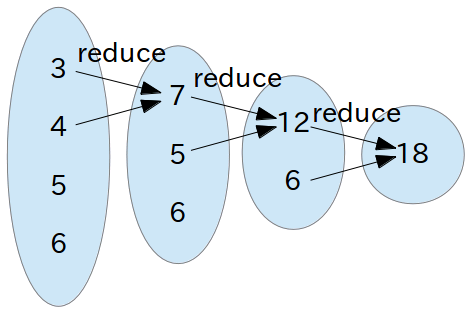
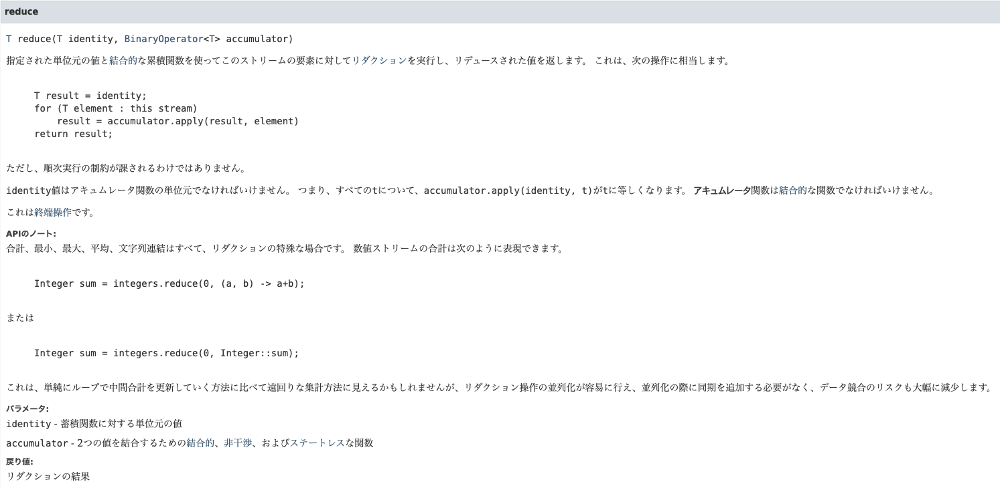

# わかる？reduce と monoid！
<br />


<br />

**string 型の配列を number 型とかに変換するのは今日はやらないです。型の変換はなしで。**
<br />

## はじめに
<br />

お疲れ様です。
<br/>

みなさんの好きな関数はなんでしょうか？

私は「抽象化してるぜ！」って感じがして `reduce` が結構好きです。
<br />

しかし、秋田調べによると reduce は抽象的で、少しわかりにくいような印象を持たれているように思えます。
<br />

以下、ネットの記事。
<br />

> forではなくreduceを無理やり使ったような、パズル構文で「こんな変な構文使いこなせる俺すげー」的な人気記事を、両手の指の数くらいは見てきたと思います。ループでは数行かかるけど、reduce使えば1行で短いぜ、みたいな記事も多いです。
>
> for を避ける意味がわかりません。for も forEach も、for of でもなんでも、読みやすいだろうと思われる方を採用するほうがよいでしょう。reduceは結構やばい部類で読みにくいですよ。
>
> [[JavaScript] reduceは可読性が悪くループで置き換え可能なので使うべきではない - Qiita](https://qiita.com/standard-software/items/3254c19ed5229f3aba9a)
<br />

> たまに新入社員の方がアサインすることもあり「まずはJSやTSを知ろう」といったレベルから教えることもあります。
> 皆さん配列に関しては最初「forやforEachをグルグル回して処理する」というアプローチを取り、そこから段々とmapやfilterなどを用途に合わせて覚えていきますが、大概reduceでつまづきます。
>
> なぜなんだろう？と考えた時「filterやsomeに比べてreduceという名前が直感的でない」や「reduceは何でもできてしまうが故に取っ付きにくい」など色々と理由が浮かびます。
> 要するに 「何をやっているのか分かりにくい」 のだと思います。
>
> [【TS】今さら聞けないreduce](https://zenn.dev/nekoniki/articles/07c09eb6811c85a753de)
<br />

また、社内においてもわかりにくいとの意見を聞いたことがあります。
<br />

なので本日の勉強会では reduce と、それに付随して **「モノイド」** という概念についても紹介されていただきます。
<br />

## reduce とは
<br />


<br />

早速ですが、reduce は以下の値（レシーバーや引数）を用いてコレクションを 1 つの値に **減らす** 関数です。（「畳み込み」ともいいます）
<br />

- 対象となるコレクション（`[1, 2, 3]`）
- コレクションの各要素を結合する操作（`(x, y) => x + y`）
- 初期値（`0`）
<br />

数値のリストの合計値を得るには以下のような書き方になります。
<br />

```ts
[1, 2, 3].reduce((x, y) => x + y, 0) // => 6
```
<br />

【質問】

ここの重要なポイントは初期値が 0 であることです。

なぜ 0 なのでしょうか？（なおリストの要素を掛け算したい場合は `1` が初期値になります）
<br />

## モノイドとは
<br />

[Wikipedia](https://ja.wikipedia.org/wiki/%E3%83%A2%E3%83%8E%E3%82%A4%E3%83%89) によると
<br />

> 数学、とくに抽象代数学における単系（たんけい、英: monoid; モノイド）はひとつの二項演算と単位元をもつ代数的構造である。
>
> （中略）
>
> 集合 S とその上の二項演算 •: S × S → S が与えられ、以下の条件
>
> - 結合律
> 　S の任意の元 a, b, c に対して、(a • b) • c = a • (b • c).
> - 単位元の存在
> 　S の元 e が存在して、S の任意の元 a に対して e • a = a • e = a.
>
> を満たすならば、組 (S, •, e) をモノイドという。
<br />

:rage: 「俺はプログラミングの話が聞きたいんだ！」

:tired_face: 「これは reduce と一体何の関係があるのか？」
<br />

このように思われた方もいるかもしれませんが少し単語の意味を調べていきましょう！
<br />

### 二項演算
<br />

> 数学において、二項演算（にこうえんざん、英: binary operation）は、数の四則演算（加減乗除）などの 「二つの数から新たな数を決定する規則」 を一般化した概念である。二項算法（にこうさんぽう）、結合などともいう。
>
> https://ja.wikipedia.org/wiki/%E4%BA%8C%E9%A0%85%E6%BC%94%E7%AE%97
<br />

`1 + 2` における `+` だったり、`1 * 2` における `*` が該当します。
<br />

では、`1 - 2` における `-` はどうでしょう？
<br />

### 単位元（たんいげん）
<br />

> 数学、とくに抽象代数学において、単位元（たんいげん, 英: identity element）あるいは中立元（ちゅうりつげん, 英: neutral element）は、二項演算を備えた集合の特別な元で、ほかのどの元もその二項演算による単位元との結合の影響を受けない。
>
> https://ja.wikipedia.org/wiki/%E5%8D%98%E4%BD%8D%E5%85%83
<br />

二項演算より多少難易度は上がりましたが、初期値の話を思い出してください。
<br />

「二項演算による単位元との結合の影響を受けない」というのがポイントです。
<br />

### 性質
<br />

以下の 2 つの性質を満たしている場合にモノイドであるとされます。
<br />

- 結合律
  - 項目の順序が保たれている限り、どんなに好きなようにグループ化しても必ず同じ結果を返す
- 単位元の存在
  - 空の項目、つまり同じ型のどんな他の項目と結合しても、同じ項目を必ず返す
<br />

例として数値の加算を考えてみます。
<br />

```
1 + 2 + 3 = (1 + 2) + 3 = 1 + (2 + 3)
```
<br />

括弧の位置を変えても同じ計算結果を返し、
<br />

```
1 + 0 = 1
2 + 0 = 2
```
<br />

単位元である 0 は結合した値を返しているため、数値の加算はモノイドを形成しているといえます。
<br />

```ts
// TypeScript のコード例

interface Semigroup<A> {
    concat(a1: A, a2: A): A
}

interface Monoid<A> extends Semigroup<A> {
    empty: A,
}

const m: Monoid<number> = {
    concat: (a1: number, a2: number) => a1 + a2,
    empty: 0
}

console.assert(
    m.concat(1, m.concat(2, 3)) === m.concat(m.concat(1, 2), 3)
)

console.assert(m.concat(m.empty, 1) === 1)
console.assert(m.concat(m.empty, 2) === 2)
```
<br />

【質問】

では、減算（`1 - 2`）はモノイドであるといえるでしょうか？
<br />

## reduce と monoid
<br />

それでは、reduce のことを思い出しましょう。
<br />

reduce とモノイド、どこか似ていませんか？
<br />

|reduce|モノイド|
|---|---|
|コレクションの各要素を結合する操作|二項演算|
|初期値|単位元|
<br />

```ts
// TypeScript のコード例

interface Semigroup<A> {
    concat(a1: A, a2: A): A
}

interface Monoid<A> extends Semigroup<A> {
    empty: A,
}

const m: Monoid<number> = {
    concat: (a1: number, a2: number) => a1 + a2,
    empty: 0
}

console.assert([1, 2, 3].reduce(m.concat, m.empty) === 6)
```
<br />

このようにモノイドを使って reduce を抽象化することができました。

以下は Java の `Stream#reduce` の API ですが、引数がモノイドであることを前提に設計されていると思われます。
<br />


<br />

他のモノイドの例としては `論理積（&&）` や `エルビス演算子（?:）` があります。
<br />

- 論理積（&&）
  - 結合律
    - `true && (true && false) === (true && true) && false`
  - 単位元（true）
    - `true && true === true`
    - `false && true === false`
- エルビス演算子（?:）
  - 結合律
    - `a ?: (b ?: c) === (a ?: b) ?: c`
  - 単位元（null）
    - `a ?: null === a`
    - `b ?: null === b`
<br />

## おわりに
<br />

モノイドを知ることで reduce をより深く理解できたはず(？)
<br />

少しエモい話ですが、こうした抽象的な概念・考え方を一般のプログラミングに適用できたときってちょっと感動しますよね。
<br />

## 参考
<br />

- [Stream#reduceが分かる記事 - Qiita](https://qiita.com/sparklingbaby/items/f6f3ce92dc13a9d8fc07)
- [「モノイド」マジックでRubyとRailsをパワーアップしよう（翻訳）｜TechRacho（テックラッチョ）〜エンジニアの「？」を「！」に〜｜BPS株式会社](https://techracho.bpsinc.jp/hachi8833/2020_08_13/92483)
