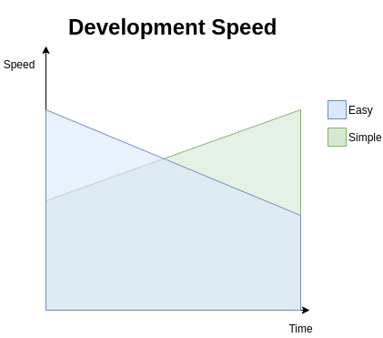
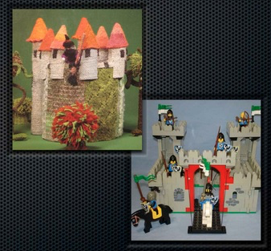

# "Simple Made Easy"

 

2021-07-27 あきたひろまさ

---

※エモい話になるかも :bowing_man:

---

## Motivation

 

- Clojure界隈（関数型言語界隈？）では超有名なワード

    - ClojureはJVMで動くLisp :alien:

    - 最近また触り出したので布教したい

---

## "Simple Made Easy"とは

 

- Clojureの作者であるRich Hickeyが発表したプレゼン

- "simple"と"easy"について語ってる

    - シンプルの必要性

---

以下はRichの主張なので私をあまり追求しないでください

---

## "simple"と"easy"という言葉

---

みなさん、"simple"と"easy"をごっちゃにしてませんか？

---

Google翻訳によると

 

- simple ...... 「単純」

- easy ...... 「簡単」

---

:man: 「だいたい一緒だろ！！！！」

:woman: 「ReactもVueもシンプルで最高だわ！」

---

あなたの「シンプル」って本当に「シンプル」ですか？

---

Clojure界隈では"simple"と"easy"を明確に区別し、"simple"を追求しようとしています

---

### "simple"の意味

 

- ラテン語の"simplex"（sim- + plex）が由来

    - 原義 ...... 「一折り」「一編み」

    - 「単一の責務」「単一の役割」「単一の概念」

    - 絶対的・客観的な概念

- 対義語として"complex"（com- + plex）

    - 原義 ...... 「絡まり合った」「折り重なった」

---

### "easy"の意味

 

- これまたラテン語の"adjacens"が由来

    - 原義 ...... 「近くにある」「隣接した」

    - 「親しみがある」（自分の理解に近い）「易しい」（できることに近い）

    - 相対的・主観的な概念

- 対義語として"hard"

    - 原義 ...... 「強い」「手強い」

---

### "simple"と"easy"は違う

 

- "easy"だけど"complex"なものはたくさんある

    - IDE

    - Web Framework（Laravel・Rails・Spring Boot etc.）

- 1つのことに複数のことを混ぜ込まないことこそ"simple"

    - 例えば「実装が隠蔽されている」ことはテクニックとしては優れているが、"simple"とは関係ない

---

## "simple"と"easy"の関係

---

- 「simple/complex」と「easy/hard」は異なる2軸

    - 二者択一の関係ではない

    - 「"easy"ではなく"simple"を選択しよう！」という話でもない

- "complex"になりうるものを避けて、"simple"を追求しようというのがRichの主張

- 選択するのは「simple or complex」であって「simple or easy」ではない

---

### "easy but complex" vs "simple but hard"

 

- "easy"だが"complex"であるもの

    - 短期的には"easy"であるため生産性が高いが、中長期的には"complex"であるため生産性が急速に低下する

- "simple"だが"hard"であるもの

    - 短期的には"hard"であるため生産性が低いが、中長期的には"simple"であるため生産性を高い水準で維持することができる

---

---

## なぜ"simple"を重視するのか

---

### 人間の力には限界がある

 

- 理解することなく信頼できるものは作れない

- 一度にごく僅かなことしか理解できない

- 絡まってしまったものは一緒に考えるしかない

- 複雑さは理解を損なわせる

---

### "simple"であることのメリット

 

- 理解しやすい

- 変更しやすい

- デバッグしやすい

- 柔軟（置き換えやすい）

---

## どうやって"simple"にするのか

---

- "simple"なものを見極める

    - 物事を"complex"にするものを避ける

    - "complect"という自動詞をRichは提案している

- 抽象化（abstract）する

    - abstractの原義は「引き離す」

    - 詳細を隠すのではなく分離させること、役割を分割しそれ自体を独立したものにすること

    - 5W1Hの観点から考えるといい？ :thinking:

---

## "complect"している例

---

|対象|何が|
|---|---|
|状態（state）|状態を変更するすべてのもの|
|オブジェクト|状態と一意性と値|
|継承|複数の型|
|変数|状態と時間|

---

## "Simple Made Easy"

---

### 毛糸の城とLEGOの城

 

---

参考

 

- ["simple"と"easy"はどう違う？　Simple Made Easyを解説 Part1 - ログミーTech](https://logmi.jp/tech/articles/321962)

- [Clojureと「Simple Made Easy」 - 紙箱](https://boxofpapers.hatenablog.com/entry/simple_made_easy)
