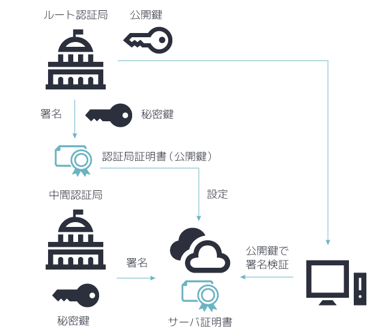

## sslについて

### アジェンダ
- sslのしくみ
- csr（証明書署名要求）（ハンズオン）
- 今回のメンテナンスの話

### sslのしくみ
#### 平文通信の場合どのような問題があるか


平文で通信を行う場合以下のリスクがあります。
1. 盗聴
1. 改ざん
1. なりすまし

これを防ぐためにssl通信では以下で説明する3つの技術を用いて通信の安全性を担保しています。

#### 暗号化


通信データを暗号化することでデータの盗聴を防ぐことができます。
暗号化の方法などについてはここでは割愛します。

なお実際のssl通信ではハイブリッド暗号方式が使われているが、ここでは簡略化のため公開鍵暗号式で通信が行われるものとします。  
(ハイブリッド暗号方式については後で説明します。)

公開鍵暗号方式にでは暗号化に用いる鍵と復号化に用いる鍵が異なるため、公開鍵を公開しても秘密鍵の情報さえ漏れなければ盗聴を防ぐことができます。  
暗号化と復号化に同一の鍵を使用する共通鍵暗号方式と違って、公開鍵暗号方式ではどうやってクライアント側に鍵を渡すか（鍵配送問題）に悩まされることがありません。

#### 電子署名

暗号化で盗聴は防ぐことができたが、まだ改ざんとなりすましのリスクは残っています。

改ざんを防ぐには電子署名の技術を用います。  
サーバーは送信するデータをハッシュ化し、秘密鍵で暗号化して送信データに添付して送信します。

この暗号化されたハッシュを公開鍵で復号化したものと、受信したデータをハッシュ化したものが一致するかどうかを検証することでクライアントは受信データが改ざんされていないかを判断することができます。

#### 証明書
ここまで暗号化と電子署名を用いて盗聴と改ざんを防止してきましたが、まだなりすましのリスクが残っています。  
なりすましの防止には証明書の技術が使われています。  
証明書はそのサーバーが本当に正しいものなのか検証するものですが、まずは正当性を証明するために認証局と呼ばれる機関に認証を受ける必要があります。  
このとき認証の申請に必要なのがCSR（証明書署名要求）と呼ばれるものになります。

##### CSR


CSRには公開鍵の情報、証明を受けるサーバーの情報（企業情報など）が含まれています。  
CSRの作成方法については後で説明します。

申請者はCSRを作成し、それを以て認証局に証明書取得の申請を行います。  
証明局はCSRを受け取ったらその内容を審査します。  
審査終了後、証明局は公開鍵、証明情報に自身の電子署名を加えて申請者に渡します。  
これが証明書になります。

##### 証明書による通信


証明書を使った通信では、まずサーバーはデータを送る前にクライアントに証明書を送信します。
証明書を受け取ったクライアントはまずこの証明書の正当性を確認します。

証明局が作成した証明書にはサーバーが送信した公開鍵とサーバー情報、そしてこれらをハッシュ化して『証明局の秘密鍵で』暗号化した電子署名、つまり証明局の電子署名が含まれています。  
この電子署名を利用して本当にその認証局が作成した証明書なのかを検証します。  
認証局から認証局の公開鍵を受け取り、電子署名が改ざんされていないことを確認します。

電子署名の項で説明したとおり証明書のハッシュと電子署名を復号化したものが一致すればこれはその認証局によって作成された証明書であるということが確定します。  
これによって証明書に含まれる公開鍵の正当性が担保されるので、以後はこの公開鍵を使って通信を行います。

##### 中間証明書

実はこれだけでは証明書を作成した証明書が本当に正当な認証局なのかというのは検証できていません。  
悪意を持った第三者が自分を認証局だと偽って証明書を作成している可能性があるからです。

これを防ぐためにクライアントは認証局の証明書を受け取り、認証局の正当性も確認しています。  
この認証局の証明書を中間証明書と呼びます。

認証局はより上位の認証局によって認証されており、より上位の認証局はさらに上位の認証局によって認証されています。  
では最終的には誰が正当性を担保するのかという話になりますが、これはルート証明局と呼ばれる証明局によって担保されます。  
ルート証明書を正当かどうか判断するためにPCには予めルート証明書がインストールされており、このルート証明書から連鎖的に証明書をたどってssl通信が行われています。

#### ハイブリッド方式
ここまで暗号方式は公開鍵暗号方式を使うと仮定して話をしてきました。  
では公開鍵暗号方式を使った場合、ユーザーからサーバーにデータを送信するケースを見てみましょう。


公開鍵は全世界に対して公開が行われているので誰でも改変したメッセージ、ハッシュの暗号化ができてしまい、改ざんのリスクがあります。  
また、ユーザーひとりひとりが認証局に認証を受けることなど不可能ですので、なりすましの対策もできていません。  
そこで、実際のssl通信ではハイブリッド暗号方式と呼ばれる暗号化方式でクライアント、サーバー間双方向の通信の安全性を担保しています。

ハイブリッド暗号方式


ハイブリッド暗号化方式は共通鍵暗号方式、公開鍵暗号方式の2つの技術を組み合わせることで成り立っています。  
クライアントはサーバーから証明書（公開鍵）を受け取った後適当な共通鍵（セッション鍵）を作成し、これを公開鍵で暗号化します。  
暗号化されたセッション鍵はサーバーの持つ秘密鍵でしか復号化することができないため、これによってクライアントとサーバーしか知らない世界にたった一つの鍵ができるわけです。  
以後はこのセッション鍵を用いてデータをやり取りします。

これによりユーザー、クライアント双方向のデータ通信において盗聴、改ざん、なりすましを防ぐことができました。

#### ハイブリッド方式の補足
##### セッション鍵について
セッション鍵の名の通りこの鍵は一時的に使用されます。  
セッションが切れたらクライアントはまた新しくセッション鍵を生成し、暗号化してサーバーに送信します。  
こうすることによって仮にセッション鍵が盗まれてもその鍵は永続的には使えないようにしています。

##### ハイブリッド暗号方式の利点
前項で説明したとおりハイブリッド暗号方式はユーザー、クライアント双方向のデータ通信のセキュリティを担保する利点がありますが、それ以外にも暗号化・復号化が高速であるという利点があります。

公開鍵暗号方式は公開鍵から秘密鍵を算出させることを防ぐため、どうしても鍵のサイズが大きくなります。  
しかし共通鍵暗号方式の場合鍵を公開しないので極端な話ビットを1ずらすぐらいの単純なアルゴリズムでもよいわけです（流石にこれだと推察されそうなので例えです）。  
鍵が大きいほど暗号化・復号化には時間がかかりますから、公開鍵暗号方式を用いる通信はどうしても時間がかかってしまいます。  
しかし、ハイブリッド暗号方式ではデータの暗号化・復号化に用いる実際の鍵は共通鍵なので高速な通信を行うことができます。

つまりハイブリッド暗号方式には
- 共通鍵暗号方式であった鍵配送問題の解消
- 暗号化・復号化の高速化

以上の利点が存在しているわけです。

ですので、実際のssl通信において時間がかかる公開鍵暗号方式が用いられるのは証明書が正しいか検証する際と初回のセッション鍵を暗号化・復号化する部分のみであり、以降はハイブリッド暗号方式を用いて高速な通信が行われていくという形になっています。

### csrの作成方法（ハンズオン）
#### 秘密鍵の作成
csrは秘密鍵と認証情報から作成されます。  
(厳密には秘密鍵から公開鍵を作成し、認証情報を加えたものがcsrになります。)

したがってまずは秘密鍵を作成します。
```
openssl genrsa -out ./test.key 2048
```

なお、これは秘密鍵を暗号化しない場合です。  
秘密鍵をそのまま平文で保存しておくことは危険なため、基本的には暗号化することが多いようです。

暗号化する場合は以下のようにします。
```
// des3方式で暗号化する場合
openssl genrsa -des3 -out ./test.key 2048
```

ちなみに復号化したい場合は以下を実行します。
```
openssl rsa -in ./encrypted.key -out ./decrypted.key
```

#### csrの作成
秘密鍵からcsrを作成します。

```
openssl req -new -key ./test.key 2048
```
国名とかを聞かれるので申請したい情報を入力してください。  
これが証明書に記載される情報そのままになるので本番では正確な値を入力してください。

#### csrと証明書の比較
以下のコマンドでCSRの中身を見ることができます。
```
openssl req -text -noout -in file_name
```
レポジトリ直下に実際にうちの証明書を作るときに使用したCSRがあるので、サイトの証明書情報と比較してみてください。

### 今回のメンテナンスの話
時間が余ったら