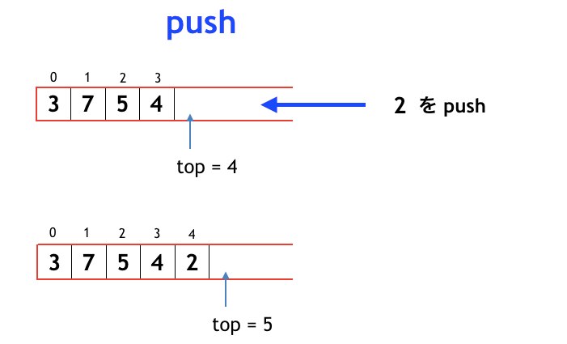
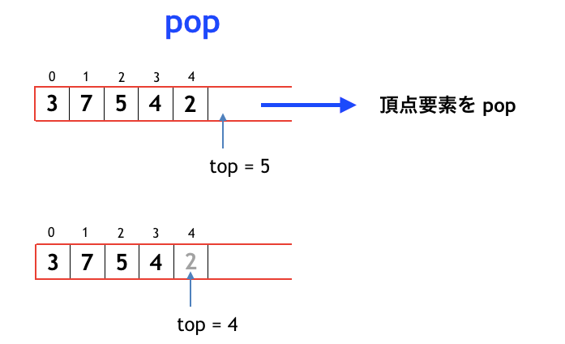
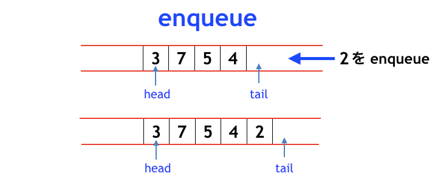
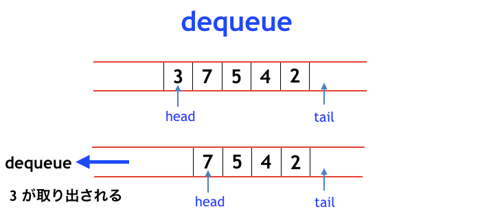
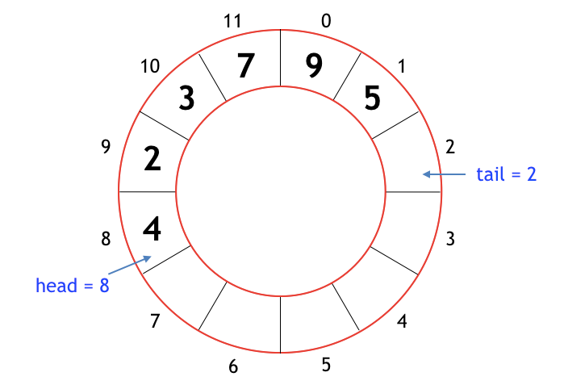

# データ構造入門 - スタックとキュー

## はじめに

「スタック」と「キュー」

みなさんも一度はこの単語を聞いたことがあるのではないでしょうか？

今回の勉強会ではスタックとキューの概要と実装、そして、それを用いたアルゴリズムを通じて理解を深めていきたいと思います

## スタックとキューとは

一般的に言われていることとして

- スタック
  - LIFO（Last-In-First-Out・後入れ先出し）
- キュー
  - FIFO（First-In-First-Out・先入れ先出し）

日常生活でいうと

- スタック
  - 積ん読している本を上から読む


- キュー
  - スーパーのレジで最初に並んだ人から先に会計される


とすればイメージしやすいかと思います

## 実装してみた

スタックとキューの動作について理解を深めていきたいと思います

いずれも配列を用いて実装することができます（簡易実装なのでエラー処理や配列サイズを超えて要素を追加しようとしたときのアロケーションはしません！！）

### スタック

スタックは **最後に追加した要素を最初に取り出す** 、つまり新しいデータから先に処理していくデータ構造です

典型的な用途しては

- 再帰関数の再帰呼び出し
- ブラウザでの「戻る」ボタン

といったものが挙げられます

#### 実装の詳細

スタックは要素を追加する push と、要素を取り出す pop の 2 つの関数を持っています

また、わかりやすくするためにサンプル実装では最後に追加された要素の次のインデックスを示す変数 top を定義しています
（このとき top はスタックに格納されている要素数でもあります）

push はスタックに要素を追加して、top をインクリメントします



一方で、pop するときは top をデクリメントし、top の位置にある要素を取り出します



↓ サンプル実装 ↓

```js
class Stack {
  data = [];
  top = 0;

  isEmpty() {
    return this.top === 0;
  }

  push(x) {
    this.data[this.top] = x;
    this.top = this.top + 1;
  }

  pop() {
    this.top = this.top - 1;
    return this.data[this.top];
  }
}
```

↓ 実行結果 ↓

```js
const stack = new Stack();

stack.push(1);
stack.push(2); 

console.assert(stack.pop() === 2);
console.assert(stack.pop() === 1);
```

### キュー

キューは **最初に追加した要素を最初に取り出す** 、つまり古いデータから先に処理していくデータ構造です

典型的な用途しては

- ジョブスケジューラ
- 予約のキャンセル待ち

といったものが挙げられます

#### 実装の詳細

スタックは「左端が閉じている」「行き止まりのトンネルに要素を突っ込んでいる」ようなイメージでしたが、それに対してキューは「両端が開いている」イメージとなります

キューはスタックの push と pop に対応するものとして enqueue と dequeue の 2 つの関数を持っています

スタックでは、新たに要素を push するときの index として変数 top を定義しましたが、キューも同じように以下の 2 つの変数を定義します

- head
    - 最初に追加された要素の index を表す
- tail
    - 最後に追加された要素の index を表す

enqueue はキューに要素を追加して、tail をインクリメントします



dequeue はキューから要素を取り出し、head をインクリメントします



しかし、ここで 1 つ問題が発生します！

キューで enqueue と dequeue を繰り返していると、tail だけでなく head もどんどんインクリメントされ大きくなることで途方もない配列サイズが必要となってしまいます

これを解決する仕組みとして「リングバッファ」というものがあり、後ほど紹介したいと思います

↓ サンプル実装 ↓

```js
class Queue {
  data = [];
  head = 0;
  tail = 0;

  isEmpty() {
    return this.head === this.tail;
  }

  enqueue(x) {
    this.data[this.tail] = x;
    this.tail = this.tail + 1;
  }

  dequeue() {
    const x = this.data[this.head];
    this.head = this.head + 1;
    return x;
  }
}
```

↓ 実行結果 ↓

```js
const queue = new Queue();

queue.enqueue(1);
queue.enqueue(2);

console.assert(queue.dequeue() === 1);
console.assert(queue.dequeue() === 2);
```

## スタックとキューを利用したアルゴリズム

### 逆ポーランド記法（スタック）

逆ポーランド記法とは、数式の記法の一種であり

`(3 + 4) * (1 - 2)`

といった演算の順序の解析が複雑な数式に対して

`3 4 + 1 2 - *`

という風に、演算子をオペランドの後に記述する方法であり、括弧が不要になったり演算子の優先順位を気にしなくてもいいというメリットがあります

処理は以下のような流れとなります

| 処理順序 | 処理内容                                                      | スタック状態 |
| -------- | ------------------------------------------------------------- | ------------ |
| 初期状態 |                                                               | {}         |
| 3      | スタックに 3 を push する                                     | {3}        |
| 4      | スタックに 4 を push する                                     | {3, 4}     |
| +      | スタックの後尾の 2 要素を pop して、その計算結果 7 を push する  | {7}        |
| 1      | スタックに 1 を push する                                     | {7, 1}     |
| 2      | スタックに 2 を push する                                     | {7, 1, 2}  |
| -      | スタックの後尾の 2 要素を pop して、その演算結果 -1 を push する | {7, -1}    |
| *      | スタックの後尾の 2 要素を pop して、その演算結果 -7 を push する | {-7}       |

では、上記の計算を実装してみましょう！（[src/rpn.js](src/rpn.js)）

### リングバッファ（キュー）

キューのところで名前のあがったやつです、といっても通常の配列とさほど変わりません

通常の配列は、配列サイズが `N` の場合に index が `0, 1, 2, ..., N - 1` と表されます

これに加えてリングバッファでは `tail = N - 1` からインクリメントすると `tail = N` ではなく `tail = 0` に戻ります
（head についても同様です）

これにより、キューに追加された要素数が配列サイズを超えない限り、head や tail をいくらでもインクリメントしても大丈夫です

リングの中で要素がぐるぐる回転するようなイメージです



[サンプル実装](src/ring_buffer.js)はこちら

## おわりに

いかがでしたでしょうか？
あなたのタスク処理はスタック型ですか？それともキュー型ですか？

スタックとキューはどのアルゴリズム入門書にも載っているほど基本的かつポピュラーなデータ構造です

今後も機会があればもっと面白いデータ構造やアルゴリズムを紹介していきたいと思いますので乞うご期待を！

## 参考

- [スタックとキューを極める！ 〜 考え方と使い所を特集 〜 - Qiita](https://qiita.com/drken/items/6a95b57d2e374a3d3292)
