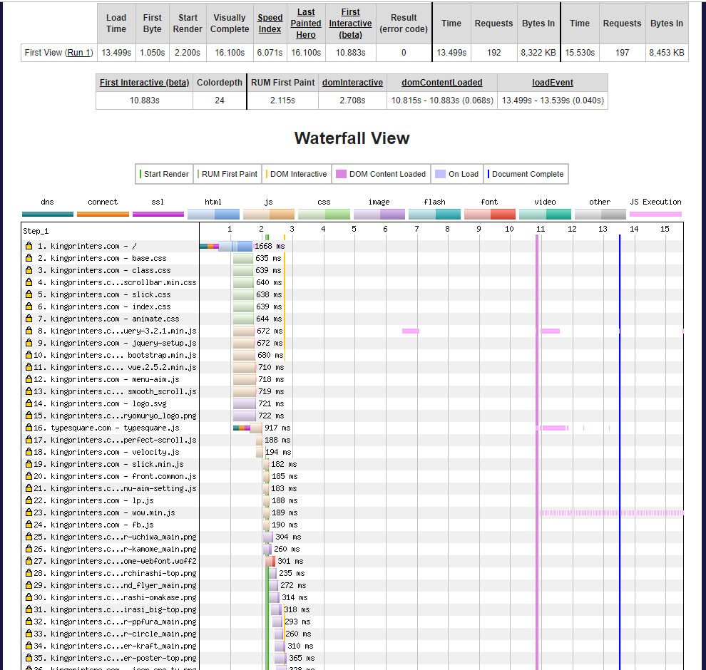
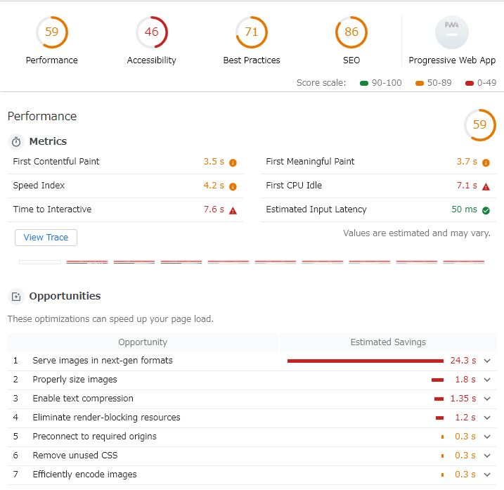
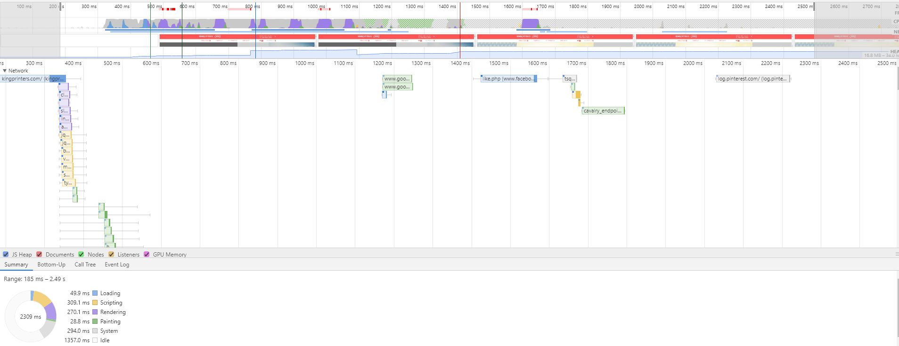
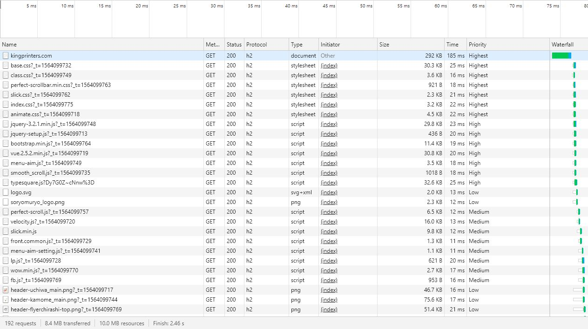
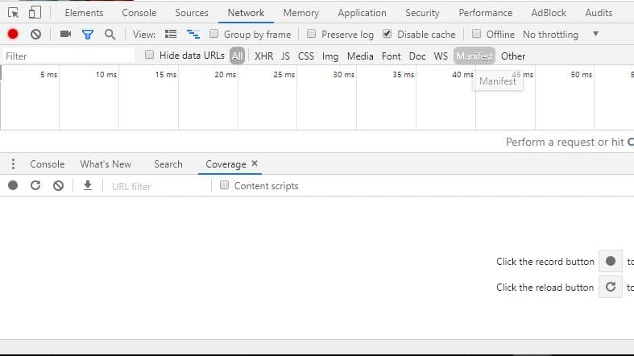
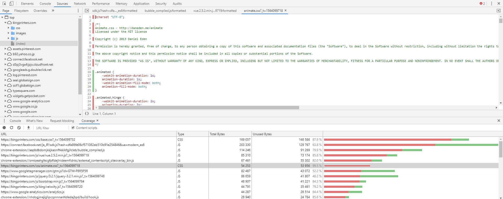

# Web（フロント）パフォーマンスについて

# 扱う対象
----

Webサイトのパフォーマンスは様々な要素が関わってきますが、今回は下記のものを対象に説明します。

* フロント的な要素
* HTML, CSS, 画像 などのリソース

# 扱わないもの
----

逆に下記のものは扱いません。

* ネットワークの速度
* HTTP2
* データベースうんぬん etc...

などのインフラやバックエンド的（HTML,CSS, JSなどのリソース以外でどうしようもできない）なもの。

# 遅くなる原因
---

ページが遅くなる原因はさまざまですが...

* リソース（CSS,JS,画像）など重い
* 回線が遅い
* リクエスト数が多い

など、さまざまです。

# WEBPAGE TESTを用いた計測
---

実際のページの速度を計測するのには後述するLighthouseよりも[WEBPAGE TEST](https://www.webpagetest.org)を用いるのが（たぶん）一般的です。Lighthouseはただのプラクティスのリストなので、スコアが高いから必ずしも速いというわけではないです。

WEBPAGE TESTを用いると下記のように（後述する）DNSの問い合わせやTCPの接続確立も確認することができます。以下の画像は弊社トップページをWEBPAGE TESTで計測したものです。



また、結果は一定期間（？）キャッシュされています。上記は今朝実行したもので次のURLで確認することができます。

> [今朝実行したもの](https://www.webpagetest.org/result/190726_0K_c5d3bbc07a1130f0feb97f74eff773bb/)

[webpagetest](https://github.com/WPO-Foundation/webpagetest)はOSSでもあるので、自前でインスタンスをたてれば定期的に計測することも可能だと思います。

また、計測の注意点ですが人さまのサイトで試さないようにしましょう。

# Lighthouseを用いた改善項目の確認
---

計測はともかく、実際にどういった項目を改善すればよいのか確認する方法の一つにGoogleが開発しているLighthouseを使う方法があります。

* Lighthouse
    * Google謹製なのでChromeの拡張のセキュリティ心配な人もたぶん大丈夫
    * 開発者ツールか右上で使えるようになる
    * [ソースコード](https://github.com/GoogleChrome/lighthouse)

Lighthouseでどういった評価項目があるのか、現状どういった評価なのか調べてみましょう。Chrome拡張でLighthouseを検索してインストールしてください。


インストールすると開発者ツールの右に`Audit`が表示されLighthouseが使えるのがわかります。これで対象ページを開いた状態で「Run audits」すればそのページの改善項目を確認できます。あるいは右上の拡張一覧から「Generate report」を行っても同様です。


実際に計測してみます。弊社のページを開いてLighthouseで計測を行ってみてください。

計測すると下記のような結果が得られると思います。



また、ViewTraceを押すと下記のようにページが表示されるまでの経過等を確認することができます。こちらの説明は割愛します。



余談ですがLighthouseの評価項目は[PageSpeedInsight](https://developers.google.com/speed/pagespeed/insights/?hl=ja)とおそらく同じだと思います。以前は異なっていましたが、Lighthouseがリリースされてから（？）はLighthouseベースになってるようです。こちらは結果が日本語で表示されるのでPageSpeedInsightを用いた方が解りやすいかもしれません。

実際には全ての項目について確認するのがよいのですが、フロント以外の項目もあるのと、全部の項目で問題を発生させる例を準備するのが手間なのと、なにより全ての項目を私も理解できているわけではないので、以降大きくリクエスト数, CSS, JS, 画像, フォントの改善の方法を雑に説明していきます。以降の説明ではブラウザはGoogleChromeを用います。

また、後述しますがLighthouseは実測値でないので注意です。実際には[WebPage Test](https://www.webpagetest.org)などを用いて継続して計測するのが好ましいと思います。たぶん。

# どのブラウザが対応しているのか
---

今回の説明する改善方法はものによっては対応していないブラウザもあります。どのブラウザが対応しているか確認するにはCan I use ?を使うのが良いと思います。

> [Can I use ?](https://caniuse.com/)

# リクエスト数
---

リクエスト数を確認するには開発者ツールのNetworkタブで確認するのが手っ取り早いです。弊社ページを開いて確認しましょう。



リクエスト数が多いと（特にHTTP/1では）パフォーマンスが悪くなります。これは対象のサーバの名前解決、TCP接続確立を行う必要が発生するためです。

これを解決するにはいくつか方法がありますが、一つにまとめてしまうか、ページ内で必要なもののみに分割してページごとに読み込むリソースを分けるなどがあります。最近は後者の流れだと思います。たぶん。

# CSS
---

### 一つにまとめる

最近はあまりやらないと思うのですが、リクエストを減らすために一つにまとめるという方法があります。

### 分割する

前述の一つにまとめるとは逆になりますが、そのページで必要になるものごとにCSSを分割してそれぞれのページで個別に読み込むのが最近のやり方だと思います（たぶん）

### インラインと非同期

ブラウザはHTMLからDOMを構築するのに併せてCSSを解析してCSSOMを構築します。両方を用いる必要があるのでCSSはレンダリングをブロックすることになります。これを避けるために、最近はユーザが初回で目にする範囲をインラインで記述して、それ以外の部分は非同期で読み込むケースが主流になりつつあります（たぶん）

CSSを非同期で読み込むには下記のように記述します。

```html
<link rel="preload" href="test.min.css" as="style">
<link rel="stylesheet" href="test.min.css">
```

### サイズを減らす

サイズを減らすといってもいくつかに分けられます。まずminifyですが、これらは一般的にフロント周りの開発用のツールで行うことが多いです。minifyする際はライセンス表記を残すなどの配慮をする必要があります（webpack等のツールで設定できます）例えばMITライセンスの場合著作権表示とライセンス全文（リンクが記述してあるケースが多い）を記述する必要があります。

次にBootStrapなどのCSSフレームワークを使う場合でもだいたいのケースでは必要なコンポーネント毎にSCSSなどにわかれて提供されているケースが多いので、必要なものだけ選択するなという方法もあります。

後は使ってないコードを消しましょう。調べ方は後述します。

# JavaScript
---

JavaScriptがあるとレンダリングがブロックされます。これはJavaScriptがDOMの変更が可能であるため、ブラウザはJavaScriptによってDOMが変更される可能性を想定して先にJavaScriptを実行するまで待つためです（たぶん）

ですので、JavaScriptはbodyの最後に書くというのが一般的です。ただし、Analyticsのような（DOMに変更が加わらない）ものだとhead最下部に書いたりすること（Googleはhead最下部に書けといってる）もあります。これは訪問者数を即時に計測するためだとおもわれます。

JavaScriptが外部にある場合はそちらを取得するのを待つのでなおさら遅くなります。ただし、JavaScriptをその場で実行する必要がない（JavaScriptでDOMの変更を行わない場合）非同期で読み込むことができます。非同期で読み込むには`async`を付与します。

```html
<script async src="test.js"></script>
```

その他、基本的にCSSと同様でサイズを小さくします。JavaScriptは構文解析、コンパイル、実行する必要があるのでコストが大きいです。そのため使ってないコードはできる限り消しましょう。調べ方は後述します。

# 未使用のCSS, JavaScriptを調べる
---

未使用のCSS,JavaScriptを調べるにはChromeの開発者ツールを使う方法があります。開発者ツールを開いた状態で`Esc`を押します。

下部に新しいペインが表示されます。そちらに`Coverage`というタブがあるのが確認できると思います。



調べたいページを開いた状態で左側の更新ボタンを実行するとそのページで読み込まれているCSS, JavaScriptの一覧と何パーセント使用されているかが確認できます。どこが使用されていないかは上部に表示されます。



ただし、ページ遷移すると再度実行して計測しなおさないといけないので全てのページで使用されていない部分を洗い出すことはできませんが目安にはなります。

# 画像
---

サーバから送信されるデータ量はページの速度に大きく影響します。画像に関してはこれらを少なくすることが主な改善ポイントになります。特に全画面表示して4Kのモニターでみるようなことをしないのであればそこまで高画質である必要はないです。たぶん。なお、以下のサンプルで使用する画像の著作権は私に帰属します。

### 圧縮する

サンプルページの画像を準備しました。`images`配下に`hi1.jpg`を準備しました。これを圧縮するとどれくらい変わるでしょうか。

[squoosh](https://squoosh.app)というGoogleが提供している圧縮サイトでこの画像を圧縮してみます。画像をsquooshで圧縮して見てください。デフォルトの設定だと約1/6までサイズが減るのではないかと思います。

### リサイズする

表示サイズに応じてリサイズすることも重要です。先ほどの画像ですが例えばCSSで下記のように`166px * 250px`の指定を行ったとします。これはつまりどんだけ大きなモニターを利用しても`166px * 250px`しか表示されないことを意味します。

```html

```

ところがサンプルの画像は`1000px * 1500px`であり、サイズに対して大きいです。これを表示サイズに応じたものにリサイズします。リサイズすると約1/23までサイズが減ると思います。

さらにリサイズしたものを圧縮すると約1/100まで圧縮できると思います。

### WebP

Googleが開発しているフォーマットのWebPが主流になる可能性がありますが、ブラウザによっては対応してないです。

### 遅延読み込み

いわゆるlazyloadとよばれるものです。Mediumとかのが有名です。初回の転送速度を上げるためにあらかじめ解像度の低い画像（要するに軽い画像）を表示しておいて後でJavaScriptで差し替えます。最近はブラウザの方に実装されるような流れになっているので、将来的にJavaScriptで対応する必要はなくなるかもしれません。

### その他

画面のサイズに応じて表示する画像を変える方法があります。例えばモバイルだと回線速度が遅いので小さい画像を表示するなどです。あんまり詳しくないので省略します。

他にはbase64にエンコードして埋め込むという方法もあります。

# フォント
---

Webフォントなどで綺麗なフォントを使用したりすることができます。Webフォントは端末にインストールされていればにフォントを持っていればそちらを使いに行きますが、そうでない場合は取得しに行く（はず）です。存外重いので可能であれば使わないという選択をするのもありです。

日本語のようにサイズが大きいものはサブセットと言って必要なものだけ抽出するといった方法があります。JIS第1水準漢字・第2水準漢字だけとか。後は有名なFontawesomeなどであれば使用するフォントのみ抜き出してフォントファイルを再作成するのもこれにあたります。（Fontawesomeは5系でSVGが用意されていますが）

その他、アイコンのように簡素な形状のものはSVGにして埋め込むなどの対応も可能です。

# その他の改善方法など
---

### プリフェッチ

最近のものはリンク先にカーソルを持っていくとプリフェッチ（事前に対象のURLのリソースを取得して）してユーザがクリックすると即座に表示できるようになどもありますが、個人的にクリックするかどうか未確定のものを勝手に通信して取得するのはのはどうなのか疑問です。

### ServiceWorker

ブラウザが通常実行するJavaScriptとは別のスレッドで実行して初回アクセス時に指定したリソースを指定した期間キャッシュするようなもの。あんまり詳しくないので割愛。

# 参考とか
---

> [オブジェクト モデルの構築](https://developers.google.com/web/fundamentals/performance/critical-rendering-path/constructing-the-object-model?hl=ja)
> [レンダリング ツリーの構築、レイアウト、ペイント](https://developers.google.com/web/fundamentals/performance/critical-rendering-path/render-tree-construction?hl=ja)